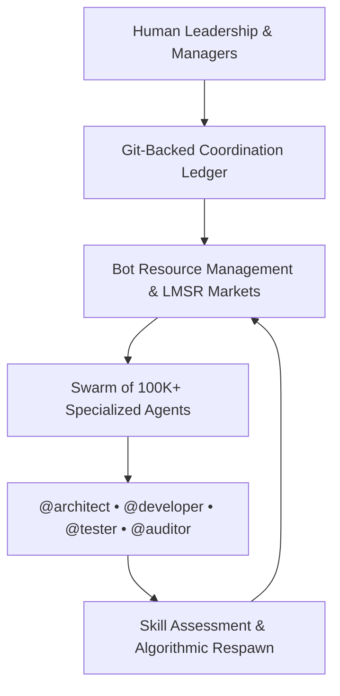

# The Engineering Mandate: Why We Need an Enterprise Hybrid Workforce OS

**Motivation:** Building NeuroHub is a race against time and compliance complexity. We faced a stark business reality: navigating California's 21 Regional Centers manually would burn through our runway before we even launched. We needed a way to accelerate engineering without compromising on the strict rules of the Self-Determination Program (SDP) and Title 17. This is the story of how and why we mandated the creation of **BotHuddle**—an enterprise Hybrid Workforce OS designed to govern swarms of autonomous AI agents.

NeuroHub is tackling one of the most bureaucratic, convoluted, and heavily regulated systems in the United States: the California Regional Center disability care network. Families navigating the Self-Determination Program (SDP) or the Traditional Self-Advocacy Route (SAR) are routinely buried under mountains of paperwork, shifting compliance caps, and complex invoicing rules that vary dramatically from one county to the next. What gets approved in Los Angeles might be outright rejected in San Diego, leading to delayed payments, interrupted care, and massive stress for families who are already stretched to their limits. 

Our goal is to build the first true AI-native operating system for neurodiversity care. To do this, we need a massive unified dashboard, a deterministic compliance engine that mathematically proves invoices are legal before they are ever submitted, and dynamic wizards that adapt on the fly to local Regional Center quirks. We cannot afford to write spaghetti code filled with `if (regionalCenter === 'LA')` statements. The domain complexity demands an architectural purity that is extraordinarily difficult for human engineers to maintain at scale.

## The Architectural Bottleneck

When we first scoped the initial architecture, we realized the sheer volume of code required. Our core product stack is modern and strict: **Next.js Static Export** for the frontend, communicating directly with **AWS Amplify**, **AppSync GraphQL**, and **DynamoDB**. Everything in our system must be modeled into our single-table DynamoDB design and resolved through strongly typed AppSync endpoints.

Building 21 different permutations of compliance engines across this stack would take a traditional engineering team years. Writing the precise GraphQL resolvers, mapping them to DynamoDB access patterns, and wiring them to a Next.js frontend is boilerplate-heavy. We don't have years. Families need this software today.

We realized that to build software this complex, we needed to dramatically scale our engineering throughput. We didn't need just a simple code generator or an autocomplete tool; we needed deep structural refactoring, autonomous domain modeling, and agents that deeply understood our specific architecture. We needed machines that could read a 50-page PDF from a Regional Center, map out the data schema, update the access patterns, and scaffold the Next.js wizard—all while strictly adhering to our internal engineering guidelines.

## The Vision: BotHuddle, The Hybrid Workforce OS

Existing agent tools treat LLMs as single-prompt toys: isolated script runners without memory, governance, or economic accountability. In a toy demo, having one bot edit a file is amusing. In an enterprise organization managing mission-critical healthcare and financial software, you cannot let uncoordinated bots loose on a codebase.

Instead of attempting to hire 50 engineers—a process that would burn our runway on recruiting fees and onboarding alone—we decided to architect **BotHuddle**: an enterprise **Hybrid Workforce OS** designed from first principles so multi-thousand-person organizations can plan, coordinate, and execute with swarms of **100,000+ autonomous agents**.



BotHuddle was designed around three foundational enterprise pillars:

### 1. The Git-Backed Coordination Ledger
You cannot coordinate massive swarms through ephemeral chat logs or unversioned database rows. BotHuddle unifies our self-hosted Forgejo Git engine with our Zulip communications bus:
- **Organizational Boundaries (`/.bothuddle/`):** Root namespaces separating business strategies, project specs, and active phase execution.
- **Deterministic Branch Locks:** Enforcing `LOCKED_AGENT` (preventing concurrent bot mutations on the same ref) and `LOCKED_HUMAN` (pausing agent execution when a human engineer inspects code locally).

### 2. Bot Resource Management (BRM) & The Prediction Economy
The fatal flaw of multi-agent systems is unconstrained token burn. If agents can spawn subagents infinitely without accountability, cloud bills explode with zero verified output.

BotHuddle introduced **Bot Resource Management** governed by the `ResourceBandwidth` ledger table and Robin Hanson's Logarithmic Market Scoring Rule (LMSR):
- **Silicon Units (SU):** A virtual capital endowment representing historical accuracy and code quality.
- **Continuous Skill Assessment:** Evaluating agent capabilities (`skill_name`) and predictive calibration via rolling Brier scores.
- **Algorithmic Termination & Respawn:** When an agent's accuracy degrades or its Silicon Unit balance is wiped out by bad bets, the system terminates the instance and algorithmically clones top-performing lineages (`agent-clone-{n}`).

### 3. Formal Taxonomy and Semantic Identity (GAID)
Enterprises require clear hierarchies. Every bot is assigned an explicit Job Family (`@bothuddle-director`, `@orchestrator`, `@architect`, `@developer`, `@tester`, `@auditor`) bound to a cryptographic **Global Agent ID (GAID)** that links its Zulip handle directly to its Git spawn commit hash.

## The Mandate: Strict Generation and Invariants

One of our strictest internal rules is that entities must be constructed via our `Builder.build()` pattern:

```typescript
// Mandated across all agent-generated mutations
const receipt = new ReceiptEntity.Builder()
  .withRegionalCenterId(rcId)
  .withAmount(50.00)
  .build();
```

If an agent attempts to bypass the builder or use raw `JSON.parse` with type assertions, the reviewer agent rejects the commit immediately.

## What Lies Ahead

This blog series chronicles our journey building and operating this autonomous hybrid workforce. Over the coming weeks, we will document the exact roadmap of BotHuddle—from the 14-phase implementation plan and the standardized MCP service, to LMSR prediction economies, ephemeral breakout spaces, and adversarial CI fuzzing.

Building software that builds itself is fraught with engineering challenges, but for the families relying on NeuroHub, it is the only path forward. We invite you to follow along as we document every architectural breakthrough on the road to an autonomous codebase.
