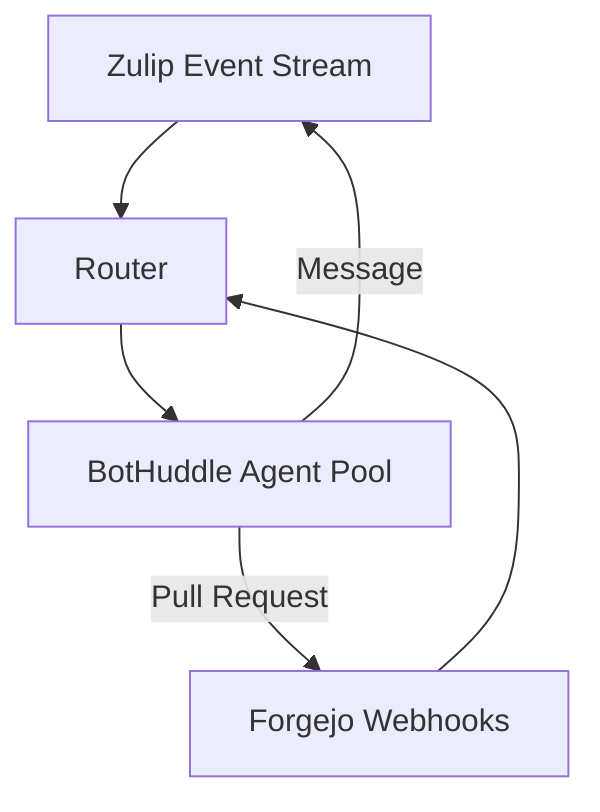
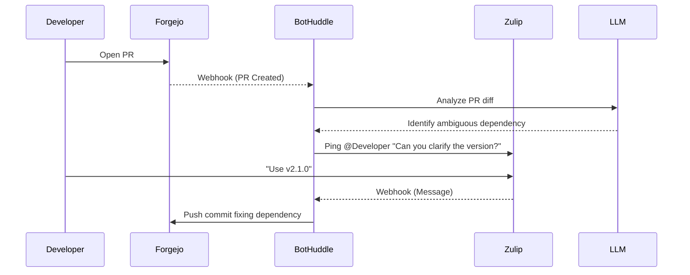

# Introduction

May is all about bootstrapping **BotHuddle**, our custom in-house orchestration matrix for AI agents. At NeuroHub, as we scale our engineering operations, the sheer volume of code generation, automated review, and cross-team coordination has necessitated a new approach to agentic workflows. BotHuddle is built to bridge our **Forgejo Git Ledger** with our **Zulip communications bus**, acting as the connective tissue that allows autonomous agents to listen, reason, and act across our infrastructure.

This post is a massive, highly technical deep-dive into our 14-phase roadmap for BotHuddle. We will cover the inception, MVP, scaling, bridging, security protocols, alternative approaches considered, and deep dives into the TypeScript and Python implementations.

# The 14-Phase Roadmap

Our journey to a fully autonomous, orchestrator-driven matrix is broken down into 14 distinct phases.

## Phase 1: Inception and Theoretical Underpinnings

Before writing a single line of code, we needed to define the calculus of agent interactions. An AI agent in our context is a stateful entity $A_i$ capable of observing state from Forgejo ($F$) and Zulip ($Z$), and emitting actions $a \in \mathcal{A}$.

We modeled the orchestration matrix as a bipartite graph connecting event streams to agent capabilities.



## Phase 2: Evaluating Alternatives

Before committing to a custom orchestration matrix, we evaluated several alternatives:

1. **Off-the-shelf CI/CD (GitHub Actions / Jenkins):**
   * *Rejected because:* CI/CD pipelines are highly deterministic and state-machine driven. AI agents require non-linear execution, human-in-the-loop interventions (via Zulip), and persistent conversational state.
2. **Standard message brokers (Kafka/RabbitMQ) + standalone scripts:**
   * *Rejected because:* While scalable, it lacked the semantic routing required for multi-agent collaboration. We needed an orchestration layer that understood *what* the agents were doing, not just passing bytes.
3. **Temporal.io:**
   * *Considered deeply:* Temporal offers fantastic durable execution. However, we found its typing system and workflow paradigms slightly rigid for the highly dynamic, sometimes non-deterministic nature of LLM interactions. We opted for a custom, lightweight, event-sourced matrix over PostgreSQL.

## Phase 3: The MVP - Basic Webhook Ingestion

The MVP focused purely on ingesting Webhooks from Forgejo and routing them to a simple Python worker.

```python
# bothuddle/ingest/forgejo.py
from fastapi import APIRouter, Header, Request, HTTPException
import hmac
import hashlib

router = APIRouter()

SECRET = b"super_secret_forgejo_token"

@router.post("/webhook/forgejo")
async def handle_forgejo_webhook(
    request: Request,
    x_forgejo_signature: str = Header(None)
):
    payload = await request.body()
    
    # Verify signature
    mac = hmac.new(SECRET, msg=payload, digestmod=hashlib.sha256)
    if not hmac.compare_digest(mac.hexdigest(), x_forgejo_signature):
        raise HTTPException(status_code=401, detail="Invalid signature")

    event_data = await request.json()
    # Route to internal Kafka topic or Redis Stream
    await dispatch_to_matrix("forgejo_events", event_data)
    
    return {"status": "accepted"}
```

## Phase 4: Connecting the Zulip Communications Bus

Zulip's topic-based threading is the perfect medium for agent-to-human and agent-to-agent communication. We implemented a continuous listener using the Zulip Python API.

## Phase 5: The Agent State Machine

Agents need to know what they are doing. We implemented a robust state machine in TypeScript for the agents.

```typescript
// src/agents/core/StateMachine.ts
export type AgentState = 'IDLE' | 'ANALYZING' | 'CODING' | 'AWAITING_REVIEW' | 'ERROR';

export interface AgentContext {
  ticketId: string;
  forgejoRepo: string;
  zulipStream: string;
  zulipTopic: string;
}

export class AgentStateMachine {
  private state: AgentState = 'IDLE';
  private context: AgentContext;

  constructor(context: AgentContext) {
    this.context = context;
  }

  public async transition(newState: AgentState, payload?: any): Promise<void> {
    console.log(`Transitioning: ${this.state} -> ${newState}`);
    // Pre-transition logic (e.g., locking)
    this.state = newState;
    
    // Broadcast state change to Zulip
    await ZulipClient.sendMessage({
      stream: this.context.zulipStream,
      topic: this.context.zulipTopic,
      content: `*Agent State Update*: Now entering \`${this.state}\``
    });
  }
}
```

## Phase 6: Orchestration and Routing

How does an event find the right agent? We built the `HuddleRouter`.

## Phase 7: Bridging Forgejo and Zulip

The true power of BotHuddle is the bridge. An agent can read a PR in Forgejo, encounter an ambiguous requirement, ping the author in Zulip, wait for clarification, and then continue coding.



## Phase 8: Scaling the Agent Pool

To handle hundreds of concurrent PRs, we scaled the agent pool using Kubernetes and KEDA (Kubernetes Event-driven Autoscaling) tied to our internal queue length.

## Phase 9: Memory and Context Injection

LLMs are stateless. We built a Vector Database (Milvus) sidecar to inject relevant context (past PRs, architectural decision records) into the agent's prompt.

## Phase 10: Security Protocols & Guardrails

Security is paramount. An autonomous agent with push access to Forgejo is a massive risk. We implemented strict guardrails:
- **No Direct Push to Main:** Agents can only push to branches matching `bothuddle/*`.
- **AST Whitelisting:** Code generated by agents is parsed (AST) to ensure no sensitive files (e.g., `.env`, `secrets.yml`) are read or modified.
- **Human-in-the-loop (HITL) for destructive actions:** If an agent decides a service needs to be restarted or a database migration run, it *must* receive a `!approve` command from a Senior Engineer in Zulip.

## Phase 11: Multi-Agent Collaboration

Why have one agent when you can have a huddle? We implemented specialized roles:
- `CoderBot`: Writes the code.
- `ReviewerBot`: Critiques `CoderBot`'s code before the human sees it.
- `QA_Bot`: Writes E2E Playwright tests.

## Phase 12: Telemetry and Observability

Every API call to the LLM, every Forgejo interaction, and every Zulip message is traced using OpenTelemetry.

## Phase 13: Self-Correction Loops

If `QA_Bot`'s tests fail, the stack trace is fed back into `CoderBot`. We implemented a maximum retry loop of 3 iterations to prevent infinite burning of GPU cycles.

## Phase 14: General Availability and the Future

Phase 14 represents the GA release to the entire NeuroHub engineering team. Future plans include expanding the matrix to JIRA, PagerDuty, and ultimately, self-hosted local models to reduce latency.

# Conclusion

BotHuddle is not just a tool; it is a new paradigm for how we build software at NeuroHub. By bridging our Git Ledger (Forgejo) and our communication bus (Zulip), we have created an orchestration matrix that amplifies our engineering capabilities an order of magnitude.
