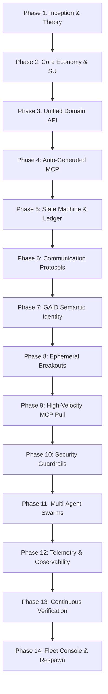

# The 14-Phase Roadmap for BotHuddle: The Hybrid Workforce OS

When building desktop-class healthcare and financial software at NeuroHub—where our platform automates California Regional Center spending plans ($50,000 to $150,000+ budgets), tracks Individual Program Plans (IPPs), and enforces strict Title 17 compliance—human engineering velocity alone isn't enough. We recognized early on that scaling across California's 21 Regional Centers required an autonomous workforce.

However, existing AI agent frameworks treat agents as novelty toys: single-prompt script runners operating in isolation without governance, memory, or accountability. They lack the primitives required for **enterprises where human teams and swarms of agents must collaborate as a hybrid workforce**.

We designed **BotHuddle** from the ground up to solve enterprise-scale agent coordination. BotHuddle is not a chatbot; it is a **Hybrid Workforce OS** designed to scale to multi-thousand-person organizations managing swarms of 100,000+ autonomous agents. It is built on three foundational pillars:
1. **The Coordination Ledger**: A Git-backed state machine (bridging Forgejo with Zulip) providing an immutable audit trail for every intention, proposal, and commit.
2. **Bot Resource Management (BRM)**: A closed-loop prediction economy powered by **Silicon Units (SU)**, continuous skill assessment, and LMSR (Logarithmic Market Scoring Rule) markets, governing resource allocation, agent termination, and automated respawning.
3. **Strict Bot Naming Conventions & Role Hierarchy**: A formal agent taxonomy with cryptographic identity (GAID) ensuring every bot has clear responsibilities, verifiable lineage, and strict execution boundaries.

Here is the unvarnished 14-phase roadmap of how we designed, architected, and rolled out BotHuddle across our enterprise fleet.

---

## The Enterprise Architectural Pillars

### 1. The Coordination Ledger
In an enterprise running dozens of concurrent agents, you cannot coordinate state through ephemeral memory or unversioned database records. We built the **Coordination Ledger** directly on top of Git (via our self-hosted Forgejo engine) and Zulip:
- `/.bothuddle/`: Root boundary for enterprise organization realms and authorization (`bothuddle-[org-id]`).
- `/.bothuddle/strategies/`: High-level business goals, regulatory constraints, and compliance invariants (`strat-[id]`).
- `/projects/[id]/`: Private workspaces for assigned project fleets (`proj-[id]-[name]`).
- `/phases/[id].json`: Active task execution state and dependency graphs (`#phase-[id]-[name]`).

To prevent race conditions between human developers and autonomous swarms, the Coordination Ledger enforces strict **Branch Locks**:
- `LOCKED_AGENT`: The branch is actively being mutated by an autonomous worker; external pushes are rejected.
- `LOCKED_HUMAN` / `LOCKED_CTO`: A human developer has checked out the branch locally (e.g., in Xcode or VS Code) for inspection; cloud agent runners pause until the pull request is approved.

### 2. Bot Resource Management (BRM) & Scaling to 100K+ Agents
In a 5,000-person enterprise running 100K+ bots, human managers cannot conduct 1-on-1 performance reviews or micromanage prompt outputs. Scaling requires a systemic, market-driven operating model.

BotHuddle introduced **Bot Resource Management** governed by the `ResourceBandwidth` ledger and an internal prediction economy:
- **Silicon Units (SU)**: A fixed-endowment virtual currency representing an agent's historical accuracy, code quality, and token efficiency.
- **Continuous Skill Assessment**: Tracking assessed capability profiles (`skill_name`) and empirical task benchmarks across specialized domains (e.g., Title 17 Auditing, AST Scanning, API Synthesis).
- **LMSR Prediction Markets**: Before an agent swarm writes code, agents must evaluate the project's SMART goal and stake Silicon Units on the probability of success using Hanson's LMSR.
- **Algorithmic Fleet Termination & Respawn**: When an agent's predictive calibration (Brier score) degrades or its Silicon Unit balance is wiped out by bad bets, the system terminates the instance. High-ROI, top-calibrated agents are algorithmically cloned and respawned (`agent-clone-{n}`), ensuring the fleet continuously evolves and self-heals without human intervention.
- **Guidelines-as-Code Lifecycle**: Roles are tied to versioned guideline documents. When engineering leadership publishes an updated role guideline, the system triggers a rolling, staggered respawn across all active instances.

### 3. Formal Bot Naming Conventions & Taxonomy
Enterprises require clear organizational hierarchy. We instituted a strict naming convention and role taxonomy:
- **Strategic Director (`@bothuddle-director`)**: The executive escalation point. Interfaces directly with human leadership to align high-level `@strategy` and `@project` boundaries.
- **Orchestrator (`@orchestrator`)**: Project governance, DAG scheduling, and task dependency resolution.
- **Architect (`@architect`)**: Solution architecture, system boundaries, and exploration.
- **Builder / Developer (`@developer` / `@builder-bot`)**: Core TypeScript implementation, ORM builder creation, and unit testing.
- **Reviewer / Tester (`@tester` / `@reviewer-bot`)**: QA validation, AST scanning, and automated verification.
- **Challenger (`@challenger`)**: Empirical stress testing, edge-case probing, and adversarial inputs.
- **Compliance Auditor (`@auditor`)**: Forensic regulatory audit, Title 17 verification, and HIPAA boundary checks.

Every agent is bound to a **Global Agent ID (GAID)**, linking its human-readable Zulip handle (`Stable Alias`) cryptographically to its Git spawn hash (`Spawn Hash`). This eliminates identity spoofing across the hybrid workforce.

---

## The 14-Phase Master Roadmap

### Phase 1: Inception and Mathematical Underpinnings
We established the formal Directed Acyclic Graph (DAG) state model governing agent transitions. All actions were mapped to deterministic state boundaries, ensuring agents could not become trapped in circular feedback loops while analyzing California Regional Center policy rules.

### Phase 2: Core Coordination & The Silicon Unit Economy
We formalized the closed-loop multi-agent prediction economy (`economy.py`). We established cost bounds via Logarithmic Market Scoring Rules (LMSR) with dynamic liquidity parameter $b = \max(\text{median\_su\_balance} \times 0.1, 10.0)$, ensuring that resource allocation across hybrid teams could be mathematically forecasted.

### Phase 3: The Unified Domain API
We built the unified FastAPI abstraction layer (`gateway-api/routers/unified.py`) bridging our Forgejo Git Ledger (Commits, Issues, Wikis) with our Zulip communications bus (Streams, Topics, Users). Pydantic schemas unified organization, user, and artifact models.

### Phase 4: Standardized MCP Interaction Primitives
We deployed the dedicated BotHuddle Model Context Protocol (MCP) Service. Rather than bespoke tool wrappers, the MCP service provides universal interaction primitives: token-based tenant isolation (`org_id`), role-based capability constraints (`@architect` vs `@developer`), and standardized primitives for Zulip messaging, Git state compaction, and evidence submission.

### Phase 5: The Agent State Machine & Ledger Persistence
We modeled the agent lifecycle in our Git-backed coordination ledger and `ResourceBandwidth` database: tracking agent states (`IDLE`, `ANALYZING`, `BIDDING`, `CODING`, `AWAITING_REVIEW`, `AUDITING`), active Silicon Unit balances, and cryptographic GAID identities.

### Phase 6: Practical Communication Scenarios & Smart Tags
We established structured syntax standards for human-agent collaboration. Agent handbooks codified NLP prefixes like `#issue/[id]`, `@commit/[hash]`, and `@strategy/[name]`, translating human conversation in Zulip directly into actionable Git Ledger state objects.

### Phase 7: Semantic Identity & Lineage Constraints (GAID)
We implemented GAID (Global Agent ID) to enforce Task-Context-Constraint (TCC) standards. When an agent executes a tool, the MCP middleware intercepts the call and cryptographically verifies its `Spawn Hash` against its branch authorization before allowing any file write.

### Phase 8: Semantic Discovery & Ephemeral Zulip Spaces
To stop context pollution in global channels, we built `spawn_ephemeral_space`. When `@architect` and `@auditor` need to debate a complex Title 17 spending rule, they are spun out into an isolated, 7-day auto-archiving Zulip stream (`ephem-[task-id]`). Vector search over past topics and commits was powered by PostgreSQL and `pgvector`.

### Phase 9: The 1-Second MCP Pull Protocol
To enable sub-second agent chatter without overwhelming our network or hitting cloud API limits, we engineered a lightweight polling protocol (`poll_mentions`) across Zulip narrowly for `@role` and `#task` pings in under 1,000ms.

### Phase 10: Security Protocols & Zero-Trust Namespaces
In healthcare software, safety is non-negotiable. We hardcoded strict tenant isolation restricting agent access by `org_id`, enforced branch lock policies, and established mandatory Human-in-the-Loop (HITL) approval gates for any critical production deployment.

### Phase 11: Multi-Agent Swarms & Role Specialization
We moved beyond monolithic agents to specialized collaborative swarms. A feature request to add a new California Regional Center service code is partitioned among `@architect` (spec), `@developer` (code), `@tester` (unit tests), and `@auditor` (compliance).

### Phase 12: Telemetry, Observability & Real-Time Spans
We introduced structured JSON telemetry streaming. Every agent reasoning step, tool invocation, token burn, and LMSR market bid is emitted to real-time streams, giving human managers immediate visibility into the fleet's cognitive state.

### Phase 13: Continuous Verification & Autonomous Rollbacks
We deployed synthetic persona validation into CI. When an agent merges code to staging, headless test runners simulate regional center coordinators and family users. If the runner detects a compliance discrepancy, the system dispatches an autonomous rollback, preserving trunk stability.

### Phase 14: The Enterprise Fleet Console & Algorithmic Respawn
The culmination of the roadmap: a single pane of glass for enterprise engineering leaders (`web-ui/app/fleet/bot-resources/page.tsx`). The Fleet Console combines active Zulip discussions, the Forgejo Git repository browser, real-time LMSR market curves, and the **Bot Resources Role Registry**. Leadership can monitor Silicon Unit balances, review Brier calibration scores, and trigger automated algorithmic respawns across thousands of active agents in real time.

---

## Conclusion: Building for the Hybrid Future

BotHuddle was conceived with a clear enterprise ambition: software development in the AI era cannot rely on isolated, unruly chatbots. It requires a disciplined, mathematically bounded operating system where human engineers and autonomous swarms work with shared context, explicit resource limits, continuous skill evaluation, and verifiable accountability.

Over the coming weeks, we will break down each phase of this architecture in detail—beginning with how we bridged Git and Chat in our [Unified Domain API](/2026-05-08-unified-domain-api) and deployed our enterprise [MCP Service](/2026-05-15-auto-generated-mcp-layer).
