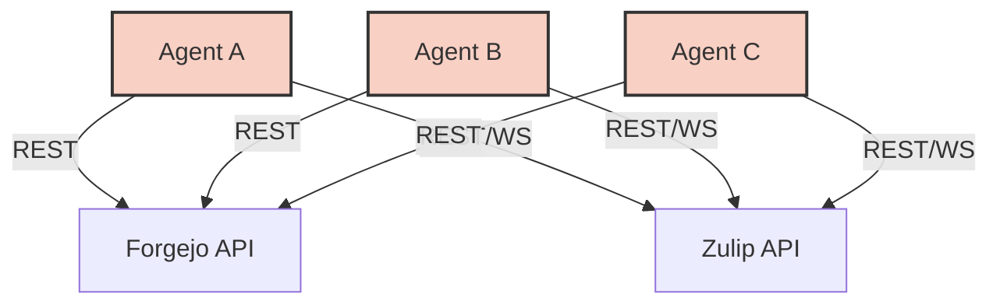

# Building the Unified Domain API: Bridging Forgejo and Zulip for BotHuddle

May is all about bootstrapping **BotHuddle**, our custom in-house orchestration matrix for AI agents. The core challenge? To build a seamless bridge between our Forgejo Git Ledger (where state and code reside) and our Zulip communications bus (where agents negotiate, plan, and report). At the heart of BotHuddle lies the **Unified Domain API**, a massive abstraction layer designed to tame the chaos of multi-agent orchestration.

In this deep-dive, we'll explore the architecture, the trade-offs, and the theoretical underpinnings of the Unified Domain API, complete with code snippets and architectural diagrams.

## The Core Problem: State vs. Communication

AI agents operating in a complex enterprise environment like NeuroHub require two fundamental capabilities:
1. **Durable State Management**: They need to read code, propose changes, create issues, and manage state in a version-controlled, auditable ledger (Forgejo).
2. **Real-time Collaboration**: They need to communicate with each other (and humans), negotiate task allocations, broadcast intentions, and handle asynchronous events (Zulip).

Initially, we considered giving agents direct access to both APIs. However, this quickly lead to an unmaintainable architectural spaghetti.

### The "Spaghetti" Anti-Pattern



When agents manage their own API interactions:
- **Redundant Boilerplate**: Every agent needs logic to handle Zulip streams, Forgejo webhooks, rate limiting, and authentication.
- **Inconsistent Abstractions**: Agent A might treat a "Task" as a Forgejo Issue, while Agent B treats it as a Zulip topic.
- **Security Nightmares**: Giving every agent broad API tokens increases the blast radius of a compromised or hallucinating agent.

## Enter the Unified Domain API

The Unified Domain API acts as a universal adapter and orchestrator. It exposes a single, strongly-typed GraphQL/gRPC surface to the agents, while acting as a gateway to the underlying systems.


### Theoretical Concepts: The Domain Entity Abstraction

To unify these systems, we applied principles from Domain-Driven Design (DDD). We realized that agents don't actually care about "pull requests" or "messages." They care about **Intentions**, **Proposals**, and **Resolutions**.

We created a bounded context where:
- A `Proposal` might be backed by a Forgejo PR.
- A `Discussion` might be backed by a Zulip Topic.
- An `Event` could be a push to a repository or a mention in a stream.

### Architecture in Code: TypeScript Type Resolvers

The Unified Domain API is built on a scalable Node.js/TypeScript stack, utilizing Apollo Server for the GraphQL layer. Here's a glimpse into how we resolve a unified `Task` entity.

```typescript
// src/resolvers/TaskResolver.ts
import { Resolver, Query, Arg, FieldResolver, Root, Ctx, Mutation } from 'type-graphql';
import { Task, TaskStatus } from '../entities/Task';
import { ForgejoClient } from '../clients/ForgejoClient';
import { ZulipClient } from '../clients/ZulipClient';

@Resolver(of => Task)
export class TaskResolver {
  constructor(
    private forgejo: ForgejoClient,
    private zulip: ZulipClient
  ) {}

  @Query(returns => Task, { nullable: true })
  async getTask(@Arg("id") id: string): Promise<Task | null> {
    // Tasks are primarily backed by Forgejo Issues
    const issue = await this.forgejo.getIssue(id);
    if (!issue) return null;

    return {
      id: issue.id.toString(),
      title: issue.title,
      description: issue.body,
      status: this.mapForgejoStateToTaskStatus(issue.state),
      forgejoRef: issue.html_url,
    };
  }

  @FieldResolver()
  async discussionThread(@Root() task: Task): Promise<DiscussionThread> {
    // We lazily fetch the associated Zulip thread using the Task ID as the topic name
    const messages = await this.zulip.getMessages({
      narrow: [
        { operator: 'stream', operand: 'agent-orchestration' },
        { operator: 'topic', operand: `task-${task.id}` }
      ]
    });

    return {
      topicId: `task-${task.id}`,
      messages: messages.map(m => ({
        author: m.sender_full_name,
        content: m.content,
        timestamp: m.timestamp
      }))
    };
  }
  
  @Mutation(returns => Task)
  async createTask(
      @Arg("title") title: string,
      @Arg("description") description: string,
      @Ctx() context: AgentContext
  ): Promise<Task> {
      // Transactional boundary: Create Issue, then create Topic
      const issue = await this.forgejo.createIssue({
          title,
          body: description,
          labels: ['agent-created']
      });
      
      await this.zulip.sendMessage({
          type: 'stream',
          to: 'agent-orchestration',
          topic: `task-${issue.id}`,
          content: `**System**: Task [${issue.title}](${issue.html_url}) created by ${context.agentId}.`
      });
      
      return this.getTask(issue.id.toString());
  }
}
```

### The Agent SDK (Python)

Agents, built primarily in Python using libraries like LangChain and LlamaIndex, interact with the Unified Domain API via a specialized SDK. This SDK abstracts the GraphQL layer entirely.

```python
# bothuddle_sdk/client.py
import asyncio
from gql import gql, Client
from gql.transport.aiohttp import AIOHTTPTransport
from typing import List, Optional

class BotHuddleClient:
    def __init__(self, endpoint: str, agent_token: str):
        transport = AIOHTTPTransport(
            url=endpoint,
            headers={'Authorization': f'Bearer {agent_token}'}
        )
        self.client = Client(transport=transport, fetch_schema_from_transport=True)

    async def fetch_task(self, task_id: str) -> dict:
        query = gql("""
            query GetTask($id: String!) {
                getTask(id: $id) {
                    id
                    title
                    status
                    discussionThread {
                        topicId
                        messages {
                            author
                            content
                        }
                    }
                }
            }
        """)
        result = await self.client.execute_async(query, variable_values={"id": task_id})
        return result.get('getTask')

    async def propose_change(self, task_id: str, code_diff: str, rationale: str) -> str:
        """
        Submits a proposal. The API handles translating this into a Forgejo PR
        and notifying the Zulip topic.
        """
        mutation = gql("""
            mutation ProposeChange($taskId: String!, $diff: String!, $rationale: String!) {
                submitProposal(taskId: $taskId, diff: $diff, rationale: $rationale) {
                    proposalId
                    url
                }
            }
        """)
        result = await self.client.execute_async(
            mutation, 
            variable_values={"taskId": task_id, "diff": code_diff, "rationale": rationale}
        )
        return result['submitProposal']['url']

# Example Agent Usage
async def agent_loop():
    bh = BotHuddleClient("http://api.bothuddle.internal/graphql", "agent-tx-992")
    task = await bh.fetch_task("ISSUE-404")
    
    print(f"Analyzing {task['title']}")
    for msg in task['discussionThread']['messages']:
        print(f"Context from {msg['author']}: {msg['content']}")
        
    # ... Agent reasoning logic ...
    
    await bh.propose_change("ISSUE-404", "--- a/main.py\n+++ b/main.py\n...", "Fixed the null pointer.")
```

## Alternatives Considered (And Rejected)

Building this layer wasn't the first idea we had. We explored several alternatives before committing to the Unified Domain API.

### 1. The Matrix Synapse Bridge

**The Idea**: Use Matrix (the protocol) as the universal bus. Forgejo events would be bridged into Matrix rooms, and agents would solely use the Matrix API to read state and communicate.
**Why we rejected it**: Matrix is excellent for communication, but terrible for structured, highly-relational data querying. Parsing Git diffs or querying issue dependencies via Matrix state events proved to be fragile and slow. We needed a strong relational API, not just an event stream.

### 2. Direct Plugin Architecture in Forgejo

**The Idea**: Write custom Go plugins directly inside Forgejo. Agents would communicate via Forgejo's internal APIs, and Forgejo would push events to Zulip.
**Why we rejected it**: This violated the principle of separation of concerns. Forgejo is a Git forge, not an AI orchestration engine. Bloating it with agent-specific logic would make upgrading Forgejo a nightmare and tightly couple our orchestration layer to Forgejo's internal database schemas.

## Event Routing and Idempotency

One of the most complex parts of the Unified Domain API is the Event Router. When a human replies to a Zulip topic, or merges a PR in Forgejo, the agents need to know immediately.

We use **Redis Streams** to buffer incoming webhooks from Forgejo and Zulip, normalizing them into a `DomainEvent` before broadcasting them to agents via WebSockets or Server-Sent Events (SSE).

### The Idempotency Problem

Because distributed systems are messy, we often receive duplicate webhooks, or agents attempt to retry operations that actually succeeded. The Unified Domain API enforces strict idempotency using an `Idempotency-Key` header mapped to Redis.

```typescript
// Middleware to ensure idempotency
async function idempotencyMiddleware(req, res, next) {
    const key = req.headers['x-idempotency-key'];
    if (!key) return next();

    const cachedResponse = await redis.get(`idempotency:${key}`);
    if (cachedResponse) {
        return res.status(200).json(JSON.parse(cachedResponse));
    }

    // Intercept the response to cache it
    const originalSend = res.send;
    res.send = function (body) {
        redis.setex(`idempotency:${key}`, 86400, body);
        originalSend.call(this, body);
    };
    next();
}
```

## Future Horizons

The Unified Domain API has successfully untangled the web of agent communication. Our agents can now reason about tasks and proposals without worrying about the underlying REST semantics of Forgejo or Zulip.

As we move forward, we are looking at extending the Unified Domain API to include:
- **Vector Memory Stores**: Allowing agents to query past resolutions seamlessly via the same GraphQL surface.
- **Human-in-the-Loop Interceptors**: A programmatic way to pause an agent's mutation (e.g., merging a PR) until a human provides an explicit `/approve` command in Zulip.

BotHuddle is just getting started, and the Unified Domain API is the sturdy foundation it runs on. Stay tuned for our next post, where we dive into how we evaluate agent performance using our custom telemetry pipeline.
