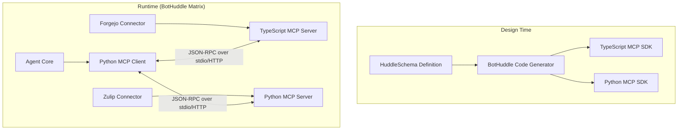
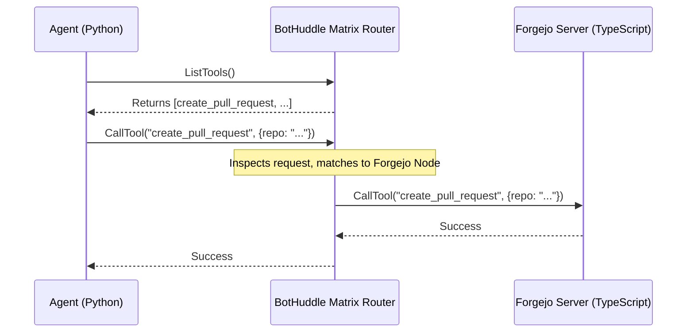

# The Auto-Generated MCP Layer: Bootstrapping BotHuddle

May has been a pivotal month here at NeuroHub Engineering as we focus on bootstrapping **BotHuddle**, our custom in-house orchestration matrix for AI agents. Designed to bridge our Forgejo Git Ledger with our Zulip communications bus, BotHuddle represents a significant leap in how we manage, deploy, and interact with autonomous agents. A cornerstone of this architecture is our auto-generated Model Context Protocol (MCP) layer.

In this massive deep dive, we will explore the theoretical underpinnings, architectural design, and deep technical implementation of how we auto-generate types, interfaces, and server stubs for our MCP layer directly from our central schema registry. We will also look at the alternative approaches we evaluated and ultimately rejected.

## 1. Introduction to BotHuddle and the MCP

BotHuddle isn't just a simple bot framework. It is an orchestration matrix designed for complex multi-agent interactions. Agents in BotHuddle need to:
1. Observe repository states and events from Forgejo.
2. Communicate with human operators and other agents via Zulip.
3. Access internal NeuroHub APIs securely.
4. Execute complex toolchains.

To achieve this, we adopted the **Model Context Protocol (MCP)** as the standard interface for our agents. MCP provides a robust, standardized way for AI models to discover and invoke tools, access resources, and read prompts. However, manually implementing MCP servers for every new capability is error-prone and scales poorly. 

Our solution? An auto-generated MCP layer that derives its entire surface area—types, schemas, validation logic, and transport bindings—from a single source of truth.

## 2. Architectural Overview

At a high level, the BotHuddle architecture revolves around a central **Schema Registry** written in a superset of JSON Schema and OpenAPI (which we internally call `HuddleSchema`). The code generator takes this schema and produces both Python (for our heavy AI logic) and TypeScript (for our edge workers and UI interfaces) MCP SDKs.



### 2.1 The HuddleSchema

`HuddleSchema` acts as the single source of truth. It defines the tools, resources, and prompts available within the BotHuddle matrix.

```yaml
# example-schema.yaml
version: "1.0"
namespace: "forgejo"
tools:
  - name: "create_pull_request"
    description: "Creates a pull request in the Forgejo Git Ledger."
    parameters:
      type: object
      properties:
        repository:
          type: string
          description: "The full repository name (e.g., neurohub/core)"
        head_branch:
          type: string
        base_branch:
          type: string
        title:
          type: string
      required: [repository, head_branch, base_branch, title]
resources:
  - uri_template: "forgejo://{repository}/pulls/{pr_id}"
    name: "Pull Request Details"
    mime_type: "application/json"
```

## 3. Deep Dive: Code Generation

The core of our auto-generated layer is the `huddle-gen` compiler. Written in Rust for performance, it parses `HuddleSchema` files and emits highly optimized, type-safe bindings for both Python and TypeScript.

### 3.1 Generating TypeScript Interfaces

When `huddle-gen` encounters the `create_pull_request` tool, it generates the following TypeScript artifacts using the `@modelcontextprotocol/sdk`.

#### The Types
First, it generates Zod schemas and corresponding TypeScript interfaces for runtime validation.

```typescript
// generated/forgejo/types.ts
import { z } from "zod";

export const CreatePullRequestArgsSchema = z.object({
  repository: z.string().describe("The full repository name (e.g., neurohub/core)"),
  head_branch: z.string(),
  base_branch: z.string(),
  title: z.string(),
});

export type CreatePullRequestArgs = z.infer<typeof CreatePullRequestArgsSchema>;
```

#### The Server Stub
Next, it generates an abstract server class. Developers only need to extend this class and implement the abstract methods, completely ignoring the underlying JSON-RPC transport and schema validation.

```typescript
// generated/forgejo/server.ts
import { Server } from "@modelcontextprotocol/sdk/server/index.js";
import { CallToolRequestSchema, ListToolsRequestSchema } from "@modelcontextprotocol/sdk/types.js";
import { CreatePullRequestArgsSchema, CreatePullRequestArgs } from "./types.js";

export abstract class ForgejoMcpServerBase {
  protected server: Server;

  constructor(serverName: string = "forgejo-mcp", serverVersion: string = "1.0.0") {
    this.server = new Server({ name: serverName, version: serverVersion }, { capabilities: { tools: {} } });
    this.setupHandlers();
  }

  protected abstract handleCreatePullRequest(args: CreatePullRequestArgs): Promise<any>;

  private setupHandlers() {
    this.server.setRequestHandler(ListToolsRequestSchema, async () => {
      return {
        tools: [
          {
            name: "create_pull_request",
            description: "Creates a pull request in the Forgejo Git Ledger.",
            inputSchema: {
              type: "object",
              properties: {
                repository: { type: "string", description: "The full repository name (e.g., neurohub/core)" },
                head_branch: { type: "string" },
                base_branch: { type: "string" },
                title: { type: "string" }
              },
              required: ["repository", "head_branch", "base_branch", "title"]
            }
          }
        ]
      };
    });

    this.server.setRequestHandler(CallToolRequestSchema, async (request) => {
      if (request.params.name === "create_pull_request") {
        const args = CreatePullRequestArgsSchema.parse(request.params.arguments);
        const result = await this.handleCreatePullRequest(args);
        return { content: [{ type: "text", text: JSON.stringify(result) }] };
      }
      throw new Error(`Unknown tool: ${request.params.name}`);
    });
  }
  
  public getServer(): Server {
    return this.server;
  }
}
```

This drastically reduces boilerplate. A developer implementing the Forgejo connector simply writes:

```typescript
import { ForgejoMcpServerBase } from "./generated/forgejo/server.js";
import { CreatePullRequestArgs } from "./generated/forgejo/types.js";
import { StdioServerTransport } from "@modelcontextprotocol/sdk/server/stdio.js";

class ForgejoMcpServer extends ForgejoMcpServerBase {
  protected async handleCreatePullRequest(args: CreatePullRequestArgs) {
    // Actual business logic hitting the Forgejo API
    console.error(`Creating PR for ${args.repository}`);
    return { status: "success", pr_url: `https://git.neurohub.com/${args.repository}/pulls/123` };
  }
}

async function main() {
  const server = new ForgejoMcpServer();
  const transport = new StdioServerTransport();
  await server.getServer().connect(transport);
}
main();
```

### 3.2 Generating Python Client Bindings

On the agent side (typically Python), we need a seamless way to invoke these tools. Our generator leverages Pydantic for validation and the `mcp` Python SDK.

```python
# generated/forgejo/client.py
from pydantic import BaseModel, Field
from typing import Dict, Any
from mcp import ClientSession

class CreatePullRequestArgs(BaseModel):
    repository: str = Field(..., description="The full repository name (e.g., neurohub/core)")
    head_branch: str
    base_branch: str
    title: str

class ForgejoMcpClient:
    def __init__(self, session: ClientSession):
        self.session = session

    async def create_pull_request(self, args: CreatePullRequestArgs) -> Dict[str, Any]:
        """Creates a pull request in the Forgejo Git Ledger."""
        result = await self.session.call_tool(
            "create_pull_request", 
            arguments=args.model_dump()
        )
        return result.content
```

## 4. Resource and Prompt Generation

Tools are just one part of MCP. Our generator also handles `resources` and `prompts`.

### Resource Templates
Resources in MCP often use URI templates (e.g., `forgejo://{repository}/pulls/{pr_id}`). `huddle-gen` parses these templates and generates strongly typed resource resolvers.

```typescript
// Generated Resource Resolver Stub
export abstract class ResourceResolverBase {
  // Enforces that developers extract the correct path parameters
  protected abstract resolvePullRequestDetails(repository: string, pr_id: string): Promise<string>;
  
  // ... generated routing logic ...
}
```

### Strongly Typed Prompts
Prompts define the structural context we feed to LLMs. By defining them in `HuddleSchema`, we guarantee that an agent has the exact right arguments to instantiate a prompt before it makes an LLM request.

## 5. Alternative Approaches Considered and Rejected

Building `huddle-gen` was a significant investment. Before committing, we evaluated several alternatives:

### 5.1 Rejected: Pure OpenAPI/Swagger Generation
*Why we considered it:* OpenAPI is the industry standard for REST.
*Why we rejected it:* OpenAPI is hyper-focused on HTTP semantics (status codes, headers, methods). MCP operates over abstract transports (stdio, SSE) and relies on JSON-RPC. Mapping OpenAPI paths to MCP Tools felt forced and resulted in brittle code. Furthermore, OpenAPI has no native concept of MCP `prompts` or `resources` (in the MCP URI sense).

### 5.2 Rejected: Dynamic Runtime Reflection (e.g., Python `inspect`)
*Why we considered it:* We could just write Python functions, inspect their signatures at runtime, and automatically expose them as MCP tools (similar to FastAPI).
*Why we rejected it:* While this works great for a single language, BotHuddle is polyglot. We have Forgejo connectors in Go/TypeScript, Zulip bots in Python, and internal microservices in Rust. Runtime reflection doesn't give us a language-agnostic contract. We needed a schema-first approach to ensure a Python agent could safely call a TypeScript tool with guaranteed type safety.

### 5.3 Rejected: GraphQL
*Why we considered it:* GraphQL provides excellent schema definitions and introspection.
*Why we rejected it:* GraphQL implies a query language and a specific resolution execution model. MCP is simpler: it's just RPC for tools and simple URI fetching for resources, optimized for LLM consumption. Wrapping MCP in GraphQL would add unnecessary parsing overhead for the LLMs.

## 6. Theoretical Concepts: The Orchestration Matrix

BotHuddle is described as an "orchestration matrix." What does that mean in the context of our generated MCP layer?

In traditional microservices, services communicate point-to-point or via an event bus. In BotHuddle, the "Matrix" is a dynamic graph of MCP connections. 

When an agent wakes up (perhaps triggered by a Zulip message mentioning a Forgejo PR), it doesn't know *a priori* where the `create_pull_request` tool lives. It queries the BotHuddle Matrix router, which uses the same generated `HuddleSchema` metadata to perform **Tool Routing**.



Because every node in this sequence is running code generated from the exact same schema, we guarantee complete RPC fidelity across the matrix, regardless of the underlying language or transport layer.

## 7. Conclusion

Bootstrapping BotHuddle with an auto-generated MCP layer has fundamentally changed our development velocity. We no longer write boilerplate JSON-RPC servers or manual validation logic. We define our capabilities in `HuddleSchema`, run `huddle-gen`, and immediately start writing business logic.

As we continue to expand BotHuddle throughout May, integrating more deeply with Forgejo and Zulip, this strong type foundation will ensure our agents operate safely, predictably, and efficiently within the NeuroHub ecosystem.

Stay tuned for our next post where we'll dive into how we handle secure context isolation within BotHuddle!
