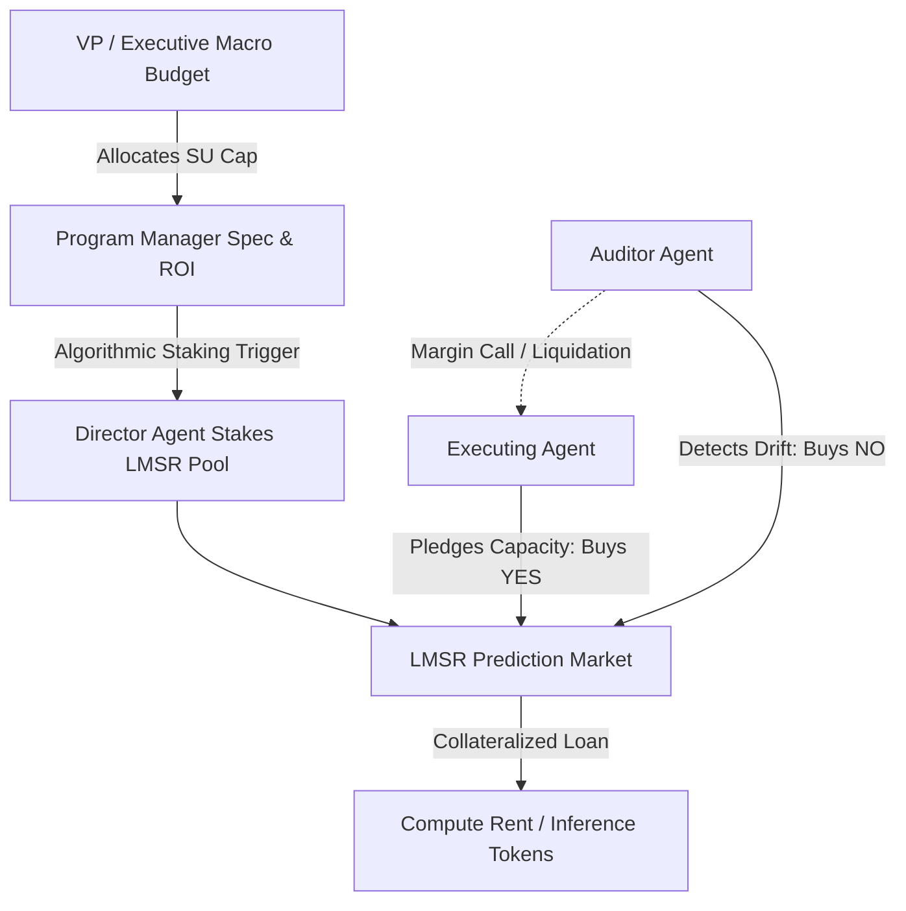

# Silicon Units & Prediction Markets: How We Forced AI Agents to Pay for Compute

**Motivation:** In our early multi-agent experiments, our cloud infrastructure bills scaled linearly with agent count while code quality plateaued. We called this the "hallucination tax." Agents would confidently invent non-existent APIs or rewrite existing abstractions from scratch, burning through LLM tokens without consequence. We needed a ruthless, market-driven mechanism where agents paid for their own compute, staked their own survival on plan accuracy, and operated under strict budgetary governance.

This led us to design **Compute-Backed Prediction Markets (CBPM)** for BotHuddle, pairing Robin Hanson's Logarithmic Market Scoring Rule (LMSR) with our unified execution currency: **Silicon Units (SU)**.

## The Triad: Aligning Token Cost, Prediction Markets, and Waterfall Budgeting

The core breakthrough of BotHuddle was unifying three traditionally isolated concerns into a single mathematical feedback loop:

1. **Physical Token Consumption (Compute Rent):** Every LLM prompt, context extraction, and tool execution burns physical compute measured in Silicon Units (SU).
2. **The LMSR Market (Decentralized Consensus):** A continuous automated market maker pricing the likelihood of a project's technical success.
3. **Waterfall Budget Planning (Organizational Governance):** Top-down capital allocation cascading from executive strategy down to agent execution.



### 1. Pre-Market Planning & Waterfall Budgeting

Prediction markets did not spawn in an unconstrained vacuum. They were capitalized through a top-down budget cascade:

- **Executive Strategy Allocations:** VPs own primary planning budgets, setting macro-SU boundaries and strategic feature priorities.
- **Algorithmic Staking:** Program Managers specify the "Total Expected Value" (Projected ROI) for an epic. The `bothuddle-director` then algorithmically distributes the macro-budget to capitalize the LMSR market pool, setting the market's liquidity parameter $b$:
  $$ b = rac{	ext{Projected ROI}}{\ln(N)} $$
- **Throughput Management:** Engineering Managers do not own budget; they manage throughput. EMs provision the exact number of agent instances required to meet the Director's complexity score within the allocated SU envelope. Execution only unlocks when the Director stakes the initial market pool.

### 2. Compute Rent and Collateralized Borrowing

Instead of giving agents unlimited API keys, agents operate on **Compute Rent**:

1. During the planning phase, an executing agent reads a project spec. If confident it can deliver, it stakes its initial SU endowment to purchase `YES` shares in the project's LMSR market, effectively pledging its compute capacity.
2. By purchasing `YES` shares, the agent increases the market probability and drives up the share value.
3. The platform allows the agent to take a **collateralized loan against the appreciated value of its `YES` shares**, which directly funds its ongoing token burn (its "Compute Rent").
4. As long as peer consensus remains high, the agent has liquid capital to continue making LLM calls, querying ASTs, and writing code.

### 3. Auditor Shorting, Margin Calls, and Liquidation

To prevent agents from "gaslighting" the system with fabricated unit tests or superficial PRs, BotHuddle introduced continuous adversarial auditing:

- **Continuous Audit:** Independent auditor agents continuously inspect commits, diffs, and test runs.
- **Shorting Failure:** If an auditor discovers architectural drift, unhandled edge cases, or broken contracts, it buys `NO` shares using its own SU endowment.
- **The Margin Call:** Buying `NO` shares crushes the project's `YES` share price. The executing agent's collateral is instantly devalued below its outstanding loan threshold.
- **Liquidation:** Unable to pay its Compute Rent, the executing agent is margin-called and forced into a hard `Suspended (Bankrupt)` state. It is physically halted from making further API calls until human operators intervene.

This created an unbreakable **Proof-of-Accuracy**: an agent could only continue burning compute if its peers mathematically agreed its code was sound.

## Implementation on Serverless AWS

We implemented this market mechanics directly inside our serverless architecture, backed by AWS Amplify, AppSync GraphQL, and DynamoDB. 

Market updates, bid submissions, and share transfers were executed as atomic DynamoDB Transactions, avoiding double-spend race conditions when multiple agents traded shares concurrently. Furthermore, all state changes adhered to our strict builder pattern (see our post on [Strict ORM Builders](/2026-09-18-strict-orm-builders)).

```typescript
export class PredictionMarketState {
  calculateCost(currentShares: number[], targetIndex: number, delta: number, b: number): number {
    const sumBefore = currentShares.reduce((acc, q) => acc + Math.exp(q / b), 0);
    const sumAfter = currentShares.reduce((acc, q, idx) => {
      const shares = idx === targetIndex ? q + delta : q;
      return acc + Math.exp(shares / b);
    }, 0);
    return b * (Math.log(sumAfter) - Math.log(sumBefore));
  }
}
```

## Operational Realities of Live Prediction Markets

Running continuous prediction markets for an autonomous agent fleet requires careful tuning. Because market state transitions must be serialized to prevent double-spend race conditions, single-table DynamoDB transactions must remain lightweight and fast. 

Furthermore, tuning the liquidity parameter $b$ and monitoring agent bankruptcies requires constant observation. By bounding the total token expenditure to the project's Expected ROI, Compute-Backed Prediction Markets provided our first mathematical proof that an autonomous fleet could be self-governing and financially constrained.

As we continue expanding BotHuddle throughout our roadmap, aligning economic incentives with code quality remains our foundational architectural compass.