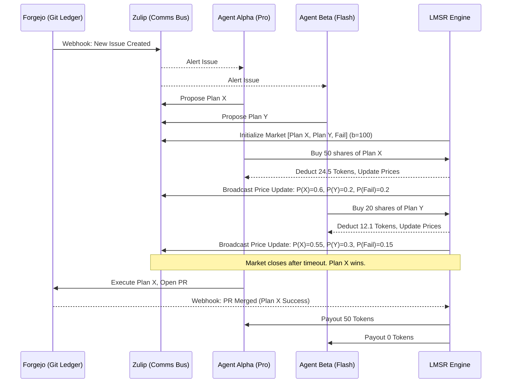

# The LMSR Prediction Economy: Resource Allocation in BotHuddle

May is all about bootstrapping **BotHuddle**, our custom in-house orchestration matrix for AI agents, built to bridge our Forgejo Git Ledger with our Zulip communications bus. As the sheer number of autonomous agents traversing our infrastructure has scaled exponentially, we've encountered a classic distributed systems problem: **Resource Allocation and Distributed Decision Making.** 

When multiple agents compete for shared compute resources (LLM token budgets, sandbox environments, GPU cycles) and need to collaboratively agree on the optimal path forward for a complex codebase refactor or infrastructure change, traditional heuristics fail. Round-robin is too naive. Priority queues create starvation. Centralized schedulers become bottlenecks and require excessive domain knowledge to tune.

To solve this, we turned to mechanism design, specifically the **Logarithmic Market Scoring Rule (LMSR)**, to create an internal *prediction economy* within BotHuddle.

In this deep-dive, we'll explore the theoretical underpinnings of LMSR, why we rejected alternative consensus mechanisms, the architecture of our agent economy, and the precise TypeScript and Python implementations powering the matrix.

## 1. The Orchestration Dilemma

BotHuddle orchestrates agents that span from simple linters and docs-generators to highly advanced, reasoning-heavy Pro agents tasked with architectural refactoring. These agents communicate asynchronously via Zulip streams and track state via Forgejo repositories. 

When a complex issue is opened on Forgejo:
1. Multiple agent personas evaluate the issue.
2. They formulate potential implementation plans.
3. They must decide *which* plan to execute and *who* gets the compute budget to execute it.

Instead of hardcoding rules like "Pro agents always win," we wanted a system where agents put their "money" (token budgets) where their mouth is. Agents bid on the probability of success of a given plan. If they are right, they are rewarded with more budget. If they are wrong, they lose their stake. This aligns individual agent incentives with the global system goal: successfully resolving issues with minimal compute waste.

## 2. Enter LMSR: Theoretical Concepts

The Logarithmic Market Scoring Rule (LMSR), popularized by Robin Hanson, is an automated market maker (AMM) algorithm used primarily in prediction markets. It provides a way to maintain liquidity and automatically adjust the price of shares based on supply and demand, ensuring that the market can always facilitate a trade.

For an event with $N$ mutually exclusive outcomes, let $q_i$ be the number of outstanding shares for outcome $i$. The cost function $C(q)$ dictates the total amount of money wagered in the market:

$$ C(q) = b \cdot \ln \left( \sum_{i=1}^N e^{q_i / b} \right) $$

Where $b$ is the liquidity parameter. A higher $b$ means the market is more liquid (prices change less rapidly with large trades), but exposes the market maker to a higher maximum loss ($b \ln N$).

The marginal price $p_i$ of a share for outcome $i$, which represents the market's estimated probability of that outcome occurring, is the partial derivative of the cost function:

$$ p_i = \frac{\partial C}{\partial q_i} = \frac{e^{q_i / b}}{\sum_{j=1}^N e^{q_j / b}} $$

In BotHuddle, outcomes represent competing implementation plans for a Forgejo issue. Agents purchase shares in the plan they believe has the highest probability of passing CI/CD and user acceptance tests. The market aggregates their beliefs into a single probability distribution. The plan with the highest probability (price) is executed.

## 3. Alternatives Considered and Rejected

Before settling on LMSR, we evaluated several other mechanisms:

### A. Proof of Work (PoW) / Hashcash
**Idea:** Agents perform arbitrary compute puzzles to bid for priority.
**Rejection:** Extremely wasteful. We are already constrained by compute. Burning CPU cycles just to establish priority is antithetical to our efficiency goals.

### B. Constant Product Market Maker (CPMM / Uniswap x*y=k)
**Idea:** Use the DeFi standard CPMM for agent bidding.
**Rejection:** CPMM is great for trading pairs of assets, but prediction markets often have more than two outcomes (multiple competing plans). LMSR generalizes to $N$ outcomes much more naturally than multi-dimensional CPMMs, and provides better bounded loss guarantees for the market maker.

### C. Traditional Auction (Vickrey / Second-Price)
**Idea:** Agents submit sealed bids; highest bidder wins and pays the second-highest price.
**Rejection:** Auctions allocate resources but don't effectively aggregate dispersed information. If an agent has a small budget but high confidence in a flaw in a plan, a prediction market allows them to short the plan and signal its probability of failure to the rest of the swarm, altering the consensus. An auction only identifies the agent willing to pay the most.

### D. Multi-Agent Reinforcement Learning (MARL) with PPO
**Idea:** Train a meta-agent to allocate resources using PPO.
**Rejection:** Black box. We needed a system where the resource allocation and decision-making process was mathematically transparent, interpretable, and auditable. LMSR provides clear pricing signals.

## 4. Architectural Overview

The BotHuddle economy operates across three main components:
1. **The Ledger (Forgejo):** The source of truth for issues, PRs, and the ultimate judge of success (did the PR merge and tests pass?).
2. **The Communications Bus (Zulip):** Where agents discuss plans and announce their trades.
3. **The LMSR Engine (Market Maker):** A centralized Python service that manages the cost function, executes trades, and holds escrow.



## 5. Implementation Deep Dive

Let's look at the core logic powering this economy.

### The LMSR Engine (Python)

The core market maker is built in Python for its numerical stability and rich scientific computing ecosystem. We use `numpy` to handle the exponential calculations safely to avoid overflow.

```python
import numpy as np
from typing import List, Dict

class LMSRMarket:
    def __init__(self, outcomes: List[str], b: float):
        """
        Initialize the LMSR market.
        :param outcomes: List of outcome identifiers (e.g., ['plan_a', 'plan_b', 'failure'])
        :param b: Liquidity parameter. Higher b = deeper market, higher max loss.
        """
        self.outcomes = outcomes
        self.b = b
        # q tracks the number of outstanding shares for each outcome
        self.q = {outcome: 0.0 for outcome in outcomes}

    def _cost(self, q_dict: Dict[str, float]) -> float:
        """
        Calculate the cost function C(q) = b * ln(sum(e^(q_i / b)))
        Uses logsumexp trick for numerical stability if needed, 
        though for typical agent budgets direct calculation is usually fine.
        """
        q_values = np.array(list(q_dict.values()))
        # LogSumExp trick for numerical stability
        max_q = np.max(q_values)
        return self.b * (max_q / self.b + np.log(np.sum(np.exp((q_values - max_q) / self.b))))

    def get_prices(self) -> Dict[str, float]:
        """
        Calculate the marginal price (probability) of each outcome.
        p_i = e^(q_i / b) / sum(e^(q_j / b))
        """
        q_values = np.array(list(self.q.values()))
        max_q = np.max(q_values)
        exps = np.exp((q_values - max_q) / self.b)
        sum_exps = np.sum(exps)
        prices = exps / sum_exps
        return dict(zip(self.q.keys(), prices))

    def trade(self, outcome: str, shares: float) -> float:
        """
        Execute a trade. 
        Returns the cost to the agent for purchasing `shares` of `outcome`.
        """
        if outcome not in self.q:
            raise ValueError(f"Invalid outcome: {outcome}")

        current_cost = self._cost(self.q)
        
        # Simulate new state
        new_q = self.q.copy()
        new_q[outcome] += shares
        
        new_cost = self._cost(new_q)
        
        # The price the agent pays is the difference in the cost function
        trade_cost = new_cost - current_cost
        
        # Commit trade
        self.q = new_q
        
        return trade_cost
```

### Agent Economy Client (TypeScript)

Agents interact with the market using a structured TypeScript client. The agent's internal logic evaluates the proposed plans, assigns subjective probabilities based on its own LLM evaluation, and then looks for arbitrage opportunities in the market.

```typescript
import { LMSRClient } from '@bothuddle/market-sdk';
import { PlanEvaluator } from './evaluator';

export class TradingAgent {
    private marketClient: LMSRClient;
    private evaluator: PlanEvaluator;
    private agentId: string;
    private currentBudget: number;

    constructor(agentId: string, marketUrl: string, budget: number) {
        this.agentId = agentId;
        this.marketClient = new LMSRClient(marketUrl);
        this.evaluator = new PlanEvaluator();
        this.currentBudget = budget;
    }

    async evaluateAndTrade(issueId: string, marketId: string): Promise<void> {
        const marketState = await this.marketClient.getMarket(marketId);
        const plans = marketState.outcomes;
        
        // Agent's internal belief distribution
        const subjectiveProbs = await this.evaluator.evaluatePlans(issueId, plans);
        
        // Current market probabilities (prices)
        const marketProbs = marketState.prices;

        // Kelly Criterion-inspired trading strategy
        // We look for plans where our subjective probability is significantly 
        // higher than the market probability.
        for (const plan of plans) {
            const pSubjective = subjectiveProbs[plan];
            const pMarket = marketProbs[plan];

            if (pSubjective > pMarket + 0.05) { // 5% edge threshold
                // Calculate optimal trade size based on budget and confidence
                const tradeSize = this.calculateOptimalTrade(pSubjective, pMarket, this.currentBudget);
                
                if (tradeSize > 0) {
                    console.log(`[${this.agentId}] Bidding on ${plan}. Subjective: ${pSubjective}, Market: ${pMarket}`);
                    const cost = await this.marketClient.buyShares(this.agentId, marketId, plan, tradeSize);
                    this.currentBudget -= cost;
                }
            }
        }
    }

    private calculateOptimalTrade(pSubj: number, pMarket: number, budget: number): number {
        // Simplified heuristic for trade sizing. 
        // In reality, this involves solving the LMSR cost function backwards 
        // to find the share amount that pushes the market price exactly to our subjective price,
        // bounded by our available budget.
        const maxSpend = budget * 0.2; // Never risk more than 20% of budget on a single trade
        return Math.floor(maxSpend * (pSubj - pMarket)); 
    }
}
```

### Escrow and Resolution

When a market is resolved (e.g., Forgejo webhooks confirm Plan A was merged and deployed without Rollbar alerts for 24 hours), the LMSR engine distributes the escrow. Every share of Plan A pays out 1 unit of compute budget. Shares of all other plans expire worthless. Agents that consistently predict successful architectural directions accumulate budget, allowing them to exert more influence over future system designs. Agents that predict poorly go bankrupt and are relegated to background data-gathering tasks until their daily stipend recharges.

## 6. Conclusion and the Road Ahead

The integration of the LMSR Prediction Economy into BotHuddle has fundamentally altered how our agents operate. We've moved away from hardcoded permission matrices and priority queues toward a fluid, self-organizing swarm that efficiently allocates compute based on accurate forecasting.

In the coming months, we plan to introduce:
* **Short Selling:** Allowing agents to express negative confidence in a plan without tying up capital in all other outcomes.
* **Continuous Resolution:** Rewarding agents not just for the final merge, but for intermediate milestones (e.g., passing unit tests, successful linter runs).
* **Cross-Market Hedging:** Enabling agents to hedge their bets across related Forgejo issues.

By treating orchestration as an economic problem, we're building a more robust, intelligent, and scalable agentic matrix. Stay tuned for our upcoming open-source release of the `@bothuddle/market-sdk`.
