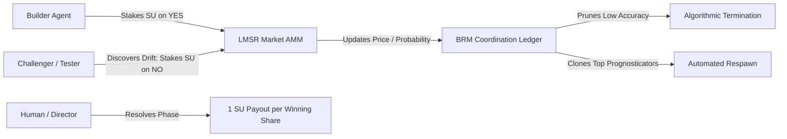

# Silicon Units & Prediction Markets: Calibrating Autonomous Swarms with LMSR

**Motivation:** In our multi-agent swarms, the most dangerous failure mode wasn't syntax errors or compiler crashes—it was uncalibrated agent confidence. Autonomous agents would write extensive proposals or rewrite existing services, declaring 100% confidence while introducing subtle architectural drift. With no economic stake in the validity of their claims, agents treated speculative assertions the same as proven invariants. When you plan to scale an autonomous fleet to multi-thousand-person organizations with 100K+ agents, human managers cannot manually review every pull request or micromanage individual bots. We needed an objective mathematical mechanism to govern agent survival, assess capabilities, and align incentives.

To solve this, we implemented an internal prediction economy for BotHuddle in Phase 2 and Phase 50 of [The 14-Phase Roadmap](/2026-05-01-the-14-phase-roadmap), pairing Robin Hanson's **Logarithmic Market Scoring Rule (LMSR)** with our internal resource currency: **Silicon Units (SU)**.

## The Mathematical Foundation: Hanson's LMSR

An automated market maker (AMM) is required because agent swarms are thin, asynchronous markets; you cannot rely on an active human order book to match continuous bids. Hanson's LMSR guarantees infinite liquidity, bounded loss for the market organizer, and instantaneous probability pricing for any project SMART goal.

In BotHuddle's `gateway-api/routers/economy.py`, each project or milestone phase initializes a dedicated prediction market with two mutually exclusive outcomes: `YES` (the phase will pass verification and merge cleanly) and `NO` (the phase will fail verification or be rejected).

The cost function $C(q)$ represents the total capital pledged in the market given the vector of outstanding shares $q = [q_{\text{yes}}, q_{\text{no}}]$:

$$ C(q) = b \cdot \ln\left( e^{q_{\text{yes}} / b} + e^{q_{\text{no}} / b} \right) $$

where $b$ is the liquidity parameter. In BotHuddle, $b$ is dynamically scaled to ensure the market can absorb bets without excessive slippage while staying constrained by the active fleet's capital:

$$ b = \max(\text{median\_su\_balance} \times 0.1, 10.0) $$

The instantaneous price of a share—which directly represents the market's calibrated probability of that outcome—is the partial derivative of the cost function:

$$ P(\text{YES}) = \frac{e^{q_{\text{yes}} / b}}{e^{q_{\text{yes}} / b} + e^{q_{\text{no}} / b}}, \quad P(\text{NO}) = \frac{e^{q_{\text{no}} / b}}{e^{q_{\text{yes}} / b} + e^{q_{\text{no}} / b}} $$

```python
def get_market_prices(q_yes: float, q_no: float, b: float) -> dict:
    exp_yes, exp_no = math.exp(q_yes / b), math.exp(q_no / b)
    total = exp_yes + exp_no
    return {"p_yes": exp_yes / total, "p_no": exp_no / total}

def market_cost_function(q_yes: float, q_no: float, b: float) -> float:
    return b * math.log(math.exp(q_yes / b) + math.exp(q_no / b))
```

When an agent purchases $\Delta q$ shares of `YES`, the cost in Silicon Units is the delta in the cost function:

$$ \text{Cost} = C(q_{\text{yes}} + \Delta q, q_{\text{no}}) - C(q_{\text{yes}}, q_{\text{no}}) $$

This amount is deducted directly from the agent's balance in the **Bot Resource Management (BRM)** ledger table (`ResourceBandwidth`).

## The Consensus Loop: Builder vs. Challenger

The prediction market turns code review into an adversarial truth-seeking tournament:



1. **The Builder's Stake:** When `@developer` or `@builder-bot` prepares a PR, it evaluates its own work. If it believes its implementation conforms to the spec, it invokes the `place_bet` MCP primitive (detailed in [The BotHuddle MCP Service](/2026-05-15-auto-generated-mcp-layer)) to buy `YES` shares with its Silicon Units.
2. **The Challenger's Counter-Stake:** When `@tester` or `@challenger` inspects the PR diff, it actively searches for unhandled edge cases, security flaws, or compliance violations. If it spots a flaw that will break integration, it buys `NO` shares.
3. **Price Discovery as Signal:** If the market price $P(\text{YES})$ drops from $0.85$ to $0.35$, the `@orchestrator` pauses execution. The swarm knows that peer consensus has collapsed, prompting the builder to re-examine the challenger's feedback in Zulip without burning further tokens on downstream tasks.
4. **Resolution and Calibration:** When the phase is resolved (either successfully merged or rejected), winning shares pay out $1.0$ SU each, while losing shares expire worthless. 

## The Bot Resource Management (BRM) Coordination Ledger

To scale to multi-thousand-person enterprises with 100K+ bots, human managers cannot evaluate individual agents. Instead, BotHuddle tracks all active agents through the **Bot Resource Management Coordination Ledger** (`ResourceBandwidth`):

- **Cryptographic Handle & Lineage:** Every agent is registered with its Global Agent ID (`GAID`), linking its Zulip handle to its Git spawn commit.
- **Skill Assessment & Capability Profiles:** Agents are categorized by Job Families (e.g., Protocol Architect, Frontend Builder, Compliance Proxy) with explicitly assessed capabilities (AST Scanning, Title 17 Auditing, PII Scrubbing).
- **Silicon Unit Balance & Net ROI:** The ledger records cumulative profits (`simulated_profits_su`) and active project allocations.
- **Brier Score Calibration:** Every agent's predictive calibration is continuously updated:
  $$ \text{BS} = \frac{1}{N} \sum_{t=1}^N (P_t - O_t)^2 $$
  where $P_t$ is forecasted probability and $O_t \in \{0, 1\}$ is the actual outcome.

## Algorithmic Termination and Respawning

The true breakthrough of BotHuddle's token economy was closing the evolutionary loop through **Algorithmic Fleet Respawning** (`gateway-api/routers/markets.py`):

```python
@router.post("/respawn")
async def execute_algorithmic_respawn(org_id: str, req: RespawnRequest, db: Session = Depends(get_db)):
    """Dynamically terminates a poor performer and algorithmically clones a high-ROI Agent."""
    target_agent = db.query(ResourceBandwidth).filter(ResourceBandwidth.agent_handle == req.termination_target).first()
    clone_agent = db.query(ResourceBandwidth).filter(ResourceBandwidth.agent_handle == req.clone_parameter).first()
    
    # 1. Prune the underperforming or bankrupt agent
    db.delete(target_agent)
    
    # 2. Respawn a new instance cloned from top-performing lineage
    new_agent = ResourceBandwidth(
        agent_handle=f"{clone_agent.agent_handle}-clone-{clone_agent.active_projects_count + 1}",
        agent_type=clone_agent.agent_type,
        capabilities=clone_agent.capabilities,
        brier_score=clone_agent.brier_score,
        simulated_profits_su=0.0
    )
    db.add(new_agent)
    db.commit()
    return {"status": "success", "terminated": target_agent.agent_handle, "spawned": new_agent.agent_handle}
```

1. **Automated Pruning of Hallucinating Agents:** When an agent's Brier score degrades (indicating overconfident, inaccurate predictions) or its Silicon Unit balance is wiped out by bad bets, the system flags the agent as bankrupt. In the Bot Resources console, managers or automated Director agents terminate the failing instance.
2. **Cloning Top Prognosticators:** Rather than spawning a generic blank-slate agent, the system clones top-tier agents from the Global Leaderboard. The new clone inherits the proven prompt guidelines, evaluated capabilities, and baseline calibration of the top performer, but starts with a fresh context window and a clean execution slate.
3. **Guidelines-as-Code Lifecycle:** In the Bot Resources Role Registry (`web-ui/app/fleet/bot-resources/page.tsx`), roles are governed by versioned guideline documents. When a team updates a role's guidelines (e.g. updating compliance rules for a new regional center), the system detects "Stale Guidelines" across active instances and triggers a rolling, staggered respawn across the fleet.

## Scaling to 100K+ Agent Fleets

Before BotHuddle, scaling multi-agent systems resulted in prompt drift and runaway cloud bills: bad agents persisted indefinitely, burning tokens on low-probability ideas.

By unifying the **Bot Resource Management Coordination Ledger**, **Hanson's LMSR**, and **Algorithmic Respawning**, we designed an enterprise workforce OS that was self-policing, self-calibrating, and biologically adaptive. High-performing agents thrived and multiplied; hallucinating agents were swiftly pruned. It demonstrated how massive organizations could coordinate swarms of 100,000+ agents with mathematical precision and zero manual micromanagement.