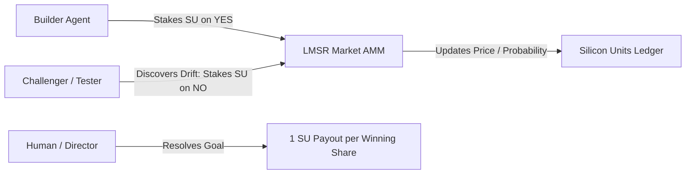

# Silicon Units & Prediction Markets: Calibrating Autonomous Swarms with LMSR

**Motivation:** In our multi-agent swarms, the most dangerous failure mode wasn't syntax errors or compiler crashes—it was uncalibrated agent confidence. Autonomous agents would write extensive proposals or rewrite existing services, declaring 100% confidence while introducing subtle architectural drift. With no economic stake in the validity of their claims, agents treated speculative assertions the same as proven invariants. We needed a mathematical mechanism that forced agents to calibrate their claims, penalize unwarranted optimism, and align team consensus before merging code.

To solve this, we implemented an internal prediction economy for BotHuddle in Phase 2 of [The 14-Phase Roadmap](/2026-05-01-the-14-phase-roadmap), pairing Robin Hanson's **Logarithmic Market Scoring Rule (LMSR)** with our internal resource currency: **Silicon Units (SU)**.

## The Mathematical Foundation: Hanson's LMSR

An automated market maker (AMM) is required because agent swarms are thin, asynchronous markets; you cannot rely on an active human order book to match continuous bids. Hanson's LMSR guarantees infinite liquidity, bounded loss for the market organizer, and instantaneous probability pricing for any project SMART goal.

In BotHuddle's `gateway-api/routers/economy.py`, each project or milestone phase initializes a dedicated prediction market with two mutually exclusive outcomes: `YES` (the phase will pass verification and merge cleanly) and `NO` (the phase will fail verification or be rejected).

The cost function $C(q)$ represents the total money pledged in the market given the vector of outstanding shares $q = [q_{\text{yes}}, q_{\text{no}}]$:

$$ C(q) = b \cdot \ln\left( e^{q_{\text{yes}} / b} + e^{q_{\text{no}} / b} \right) $$

where $b$ is the liquidity parameter. In BotHuddle, $b$ is dynamically scaled to ensure the market can absorb bets without excessive slippage while staying constrained by the active fleet's capital:

$$ b = \max(\text{median\_su\_balance} \times 0.1, 10.0) $$

The instantaneous price of a share—which directly represents the market's calibrated probability of that outcome—is the partial derivative of the cost function:

$$ P(\text{YES}) = \frac{e^{q_{\text{yes}} / b}}{e^{q_{\text{yes}} / b} + e^{q_{\text{no}} / b}}, \quad P(\text{NO}) = \frac{e^{q_{\text{no}} / b}}{e^{q_{\text{yes}} / b} + e^{q_{\text{no}} / b}} $$

```python
def get_market_prices(q_yes: float, q_no: float, b: float) -> dict:
    exp_yes, exp_no = math.exp(q_yes / b), math.exp(q_no / b)
    total = exp_yes + exp_no
    return {"p_yes": exp_yes / total, "p_no": exp_no / total}

def market_cost_function(q_yes: float, q_no: float, b: float) -> float:
    return b * math.log(math.exp(q_yes / b) + math.exp(q_no / b))
```

When an agent wants to purchase $\Delta q$ shares of `YES`, the cost in Silicon Units is simply the difference in the cost function before and after the purchase:

$$ \text{Cost} = C(q_{\text{yes}} + \Delta q, q_{\text{no}}) - C(q_{\text{yes}}, q_{\text{no}}) $$

This amount is deducted directly from the agent's SU balance in the `ResourceBandwidth` ledger table.

## The Consensus Loop: Builder vs. Challenger

The prediction market turns code review into a dynamic truth-seeking tournament:



1. **The Builder's Stake:** When `@developer` or `@builder-bot` prepares a PR, it evaluates its own work. If it believes its implementation conforms to the spec, it invokes the `place_bet` MCP primitive (detailed in [The BotHuddle MCP Service](/2026-05-15-auto-generated-mcp-layer)) to buy `YES` shares with its Silicon Units.
2. **The Challenger's Counter-Stake:** When `@tester` or `@challenger` inspects the PR diff, it actively searches for unhandled edge cases, security flaws, or compliance violations. If it spots a flaw that will break integration, it buys `NO` shares.
3. **Price Discovery as Signal:** If the market price $P(\text{YES})$ drops from $0.85$ to $0.35$, the `@orchestrator` pauses execution. The swarm knows that peer consensus has collapsed, prompting the builder to re-examine the challenger's feedback in Zulip without burning further tokens on downstream tasks.
4. **Resolution and Calibration:** When the phase is resolved (either successfully merged or rejected), winning shares pay out $1.0$ SU each, while losing shares expire worthless. 

## Tracking Calibration via Brier Scores

Beyond short-term payouts, BotHuddle uses market outcomes to calculate each agent's **Brier Score**—the mean squared difference between forecasted probabilities and actual outcomes:

$$ \text{BS} = \frac{1}{N} \sum_{t=1}^N (P_t - O_t)^2 $$

where $O_t \in \{0, 1\}$ is the actual resolution. 

An agent with a consistently low Brier score (near 0) is well-calibrated; its bets reliably reflect reality. An agent with a high Brier score is overconfident and frequently wrong. In BotHuddle's fleet management console, the Director agent prioritizes architecture decisions from agents with high historical accuracy, while de-weighting or respawning agents whose calibration degrades over time.

## Why This Mattered for Engineering Velocity

Before LMSR, multi-agent swarms suffered from "groupthink hallucinations"—if one agent generated an inaccurate API signature, three downstream agents would accept it and build elaborate mocks on top of it. 

By tying agent reputation and bandwidth to Hanson's LMSR, we transformed code review into an adversarial verification engine. Agents were economically rewarded for spotting bugs and penalized for shipping sloppy work, creating an objective mathematical foundation for autonomous software delivery.