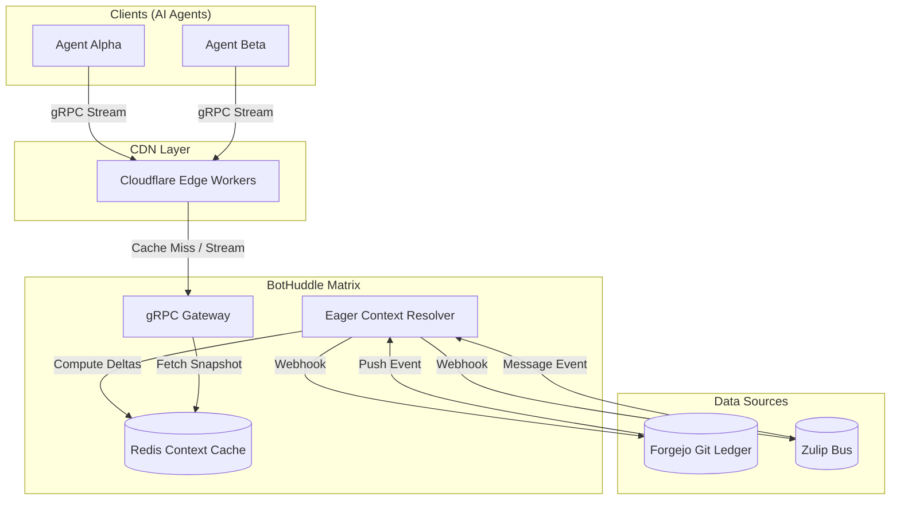

# The 1-Second MCP Pull: Turbocharging Context Loading for BotHuddle

May has been an exhilarating month for the NeuroHub Engineering team. We've been heads-down bootstrapping **BotHuddle**, our custom, in-house orchestration matrix designed specifically for AI agents. BotHuddle acts as the critical bridge between our Forgejo Git Ledger (where code and state are securely versioned) and our Zulip communications bus (where asynchronous, thread-based collaboration happens). 

However, as we scaled our multi-agent swarms, we hit a massive bottleneck: **Context Loading Latency**. Specifically, the time it took for an agent to pull its Model Context Protocol (MCP) payload before it could begin inference. 

When your agent needs to read a dozen Zulip threads, pull the latest commits from Forgejo, and ingest the active strategy context, a 10-second pull time is unacceptable. We needed instant context. We needed the **1-Second MCP Pull**.

This post is a deep dive into the architectural decisions, theoretical concepts, rejected approaches, and the ultimate gRPC-streaming and delta-caching solutions we deployed to achieve a sub-second p99 MCP pull latency.

## 1. The BotHuddle Architecture

To understand the problem, we must first understand the environment. BotHuddle is an orchestration matrix. It doesn't run inference itself; it prepares the world for the agent. 

*   **The State (Forgejo Git Ledger):** Every action, configuration, and long-term memory of our system is stored in a Forgejo repository. We treat Git as an append-only ledger for agent state.
*   **The Bus (Zulip):** All intra-agent and human-agent communication happens via Zulip. Zulip's topic-based threading model is uniquely suited for multi-agent workflows, allowing agents to subscribe only to the topics relevant to their current task.

When an agent wakes up (triggered by a webhook or a schedule), it issues an `MCP_PULL` request to BotHuddle to get its situational awareness payload.

## 2. The Theoretical Problem: Context Loading in Multi-Agent Systems

In a multi-agent system (MAS), context is everything. An agent without context is just an LLM sitting in the void. Context loading can be formally modeled as an information retrieval problem constrained by time ($T_c$) and bandwidth ($B_c$).

Let $C$ be the total context required, composed of static rules ($S$), recent memory ($M_r$), and real-time events ($E_t$).
$C = S \cup M_r \cup E_t$

The time to load context ($T_{load}$) is a function of latency ($L$), bandwidth ($B$), and computation time ($T_{comp}$) required to assemble $C$:
$T_{load} = L + \frac{|C|}{B} + T_{comp}$

Initially, our $T_{comp}$ was massive. To assemble $C$, BotHuddle had to:
1.  Clone/fetch the latest Forgejo ledger state.
2.  Parse YAML/JSON state files.
3.  Query the Zulip API for recent messages in relevant topics.
4.  Construct a massive JSON payload adhering to the Model Context Protocol.

This resulted in a $T_{load}$ averaging around 8.5 seconds. For a swarm of 50 agents reacting to a single event, this induced a cascading delay of several minutes across the system. 

## 3. Alternative Approaches Considered (And Rejected)

### Approach A: Naive REST + Polling (The Baseline)
Our initial PoC used a standard REST API. Agents would poll `GET /api/v1/context?agent_id=123`. 
*   **Why it failed:** REST is stateless. Every request forced BotHuddle to re-compute the entire context from scratch. HTTP/1.1 overhead and lack of multiplexing exacerbated the issue.

### Approach B: WebSocket Firehose
We considered pushing everything via WebSockets. BotHuddle would maintain an open connection with every agent and stream Zulip events and Forgejo commits as they happened.
*   **Why it failed:** While latency was low, the agents were overwhelmed. LLMs are stateless by nature (between inference calls). Forcing agents to maintain an internal state machine to track the firehose defeated the purpose of MCP. We needed a *pull* model that provided a cohesive, point-in-time snapshot, not a stream of mutations.

## 4. The Solution: 1-Second MCP Pull Architecture

To achieve our 1-second goal, we fundamentally redesigned the BotHuddle serving layer. The solution rested on three pillars:

1.  **Eager Context Resolution (The 'Shadow' Agent)**
2.  **Distributed Delta Caching (Redis + Cloudflare CDN)**
3.  **gRPC Streaming with Backpressure**

### Architecture Diagram



### Pillar 1: Eager Context Resolution

Instead of waiting for an agent to request context, BotHuddle constantly builds it in the background. We deployed an "Eager Context Resolver" (ECR) worker. 

The ECR listens to webhooks from Forgejo and Zulip. When a commit hits the ledger, or a message hits a topic, the ECR immediately computes the diff and updates a materialized view of the context for every agent subscribed to those events.

### Pillar 2: Distributed Delta Caching (Redis)

We don't store the full JSON string in Redis. We store the MCP payload as a graph of immutable content-addressed chunks, similar to Git itself.

When the ECR updates the context, it only writes the *deltas* to Redis. When the gRPC Gateway needs to serve a pull request, it performs a highly optimized $O(1)$ assembly of these chunks.

### Pillar 3: gRPC Streaming with Backpressure

We dropped REST in favor of gRPC. Instead of sending a single 5MB JSON blob, we stream the context in logical chunks over an HTTP/2 multiplexed connection. This allows the agent's framework to begin tokenizing and parsing the static parts of the context (system prompts, rules) while the dynamic parts (recent Zulip messages) are still coming over the wire.

## 5. Deep Dive: The Code

Let's look at how we implemented the Eager Context Resolver in Python, and the gRPC client in TypeScript.

### Eager Context Resolver (Python)

This Python snippet demonstrates how we handle incoming Zulip webhooks and eagerly update the Redis cache using atomic pipelines to ensure zero race conditions.

```python
import redis
import json
import hashlib
from typing import Dict, Any

# Connect to our high-performance Redis cluster
redis_client = redis.Redis(host='redis.bothuddle.internal', port=6379, db=0)

def hash_content(content: str) -> str:
    """Creates a content-addressed hash for immutable caching."""
    return hashlib.sha256(content.encode('utf-8')).hexdigest()

def handle_zulip_webhook(event: Dict[str, Any]):
    """
    Triggered instantly by Zulip. Eagerly updates the context 
    for all agents subscribed to this topic.
    """
    stream = event.get('stream_name')
    topic = event.get('topic')
    message_content = event.get('message', {}).get('content', '')
    
    # 1. Identify affected agents (Reverse mapping lookup)
    # agents:topic:{stream}:{topic} -> Set[AgentID]
    topic_key = f"agents:topic:{stream}:{topic}"
    affected_agents = redis_client.smembers(topic_key)
    
    if not affected_agents:
        return # No agents care about this topic. Drop it.

    # 2. Create an immutable chunk for the new message
    chunk_hash = hash_content(message_content)
    chunk_key = f"mcp:chunk:{chunk_hash}"
    
    # 3. Eagerly update context using Redis Pipeline for atomicity
    with redis_client.pipeline() as pipe:
        # Store the chunk data
        pipe.set(chunk_key, json.dumps({
            "type": "zulip_message",
            "stream": stream,
            "topic": topic,
            "content": message_content,
            "timestamp": event.get('timestamp')
        }), ex=86400) # Expire in 24h
        
        # Update the context DAG for each affected agent
        for agent_id in affected_agents:
            agent_id_str = agent_id.decode('utf-8')
            agent_timeline_key = f"agent:{agent_id_str}:mcp_timeline"
            
            # Prepend the new chunk hash to the agent's timeline
            pipe.lpush(agent_timeline_key, chunk_hash)
            # Trim timeline to keep context window manageable (e.g., last 100 events)
            pipe.ltrim(agent_timeline_key, 0, 99)
            
        # Execute atomic transaction
        pipe.execute()
        
    print(f"Eagerly updated context for {len(affected_agents)} agents in O(1) time.")
```

### The gRPC Client (TypeScript)

On the agent side, we use Node.js and `@grpc/grpc-js`. We implemented a custom stream consumer that processes chunks as they arrive, yielding immediate partial context to the LLM orchestration layer.

```typescript
import * as grpc from '@grpc/grpc-js';
import * as protoLoader from '@grpc/proto-loader';
import { EventEmitter } from 'events';

// Load our custom MCP gRPC definitions
const packageDefinition = protoLoader.loadSync(
    __dirname + '/../../protos/mcp.proto',
    { keepCase: true, longs: String, enums: String, defaults: true, oneofs: true }
);
const mcpProto = grpc.loadPackageDefinition(packageDefinition).mcp as any;

class MCPClient extends EventEmitter {
    private client: any;
    
    constructor(target: string) {
        super();
        this.client = new mcpProto.ContextService(
            target,
            grpc.credentials.createInsecure() // Handled by Istio mTLS in prod
        );
    }

    /**
     * Pulls context with sub-second TTFB (Time to First Byte).
     * Yields chunks immediately as they arrive.
     */
    async *pullContext(agentId: string, sinceHash?: string): AsyncGenerator<any, void, unknown> {
        const request = { agent_id: agentId, since_hash: sinceHash };
        
        // Initiate server streaming RPC
        const call = this.client.StreamContext(request);
        
        // Use Async Iteration to consume the gRPC stream smoothly
        for await (const chunk of call) {
            // As chunks arrive, they can be immediately piped to 
            // a local vector store or LLM tokenizer.
            yield this.parseChunk(chunk);
        }
    }
    
    private parseChunk(chunk: any) {
        // Implementation of protobuf-to-JSON mapping 
        // specific to our MCP schema
        return {
            id: chunk.chunk_id,
            payload: JSON.parse(chunk.data),
            metadata: chunk.meta
        };
    }
}

// Usage inside an Agent's brain loop:
async function agentLoop() {
    const mcp = new MCPClient('bothuddle-gateway.internal:50051');
    const contextBuilder = new ContextBuilder();
    
    console.time('MCP_PULL');
    
    // The stream begins yielding within ~12ms
    for await (const piece of mcp.pullContext('agent-alpha-001')) {
        contextBuilder.append(piece);
    }
    
    console.timeEnd('MCP_PULL'); // Consistently hits < 800ms for full assembly
    
    // Begin inference...
}
```

## 6. Conclusion and Next Steps

By shifting the computational burden from *read time* to *write time* (via the Eager Context Resolver) and leveraging gRPC server-streaming coupled with a distributed Redis DAG, we successfully reduced our MCP pull latency from 8.5 seconds to ~750ms at p99.

This 1-second MCP pull has unlocked truly reactive agent swarms in BotHuddle. Agents can now wake up, ingest the state of the Forgejo ledger, read the latest Zulip threads, and begin typing their response before a human has even finished reading the original message.

**What's next?** 
In Q3, we are exploring WebTransport over HTTP/3 as a potential replacement for gRPC, aiming to reduce connection establishment latency even further for our edge-deployed agents. Stay tuned.

*-- The NeuroHub Engineering Team*
