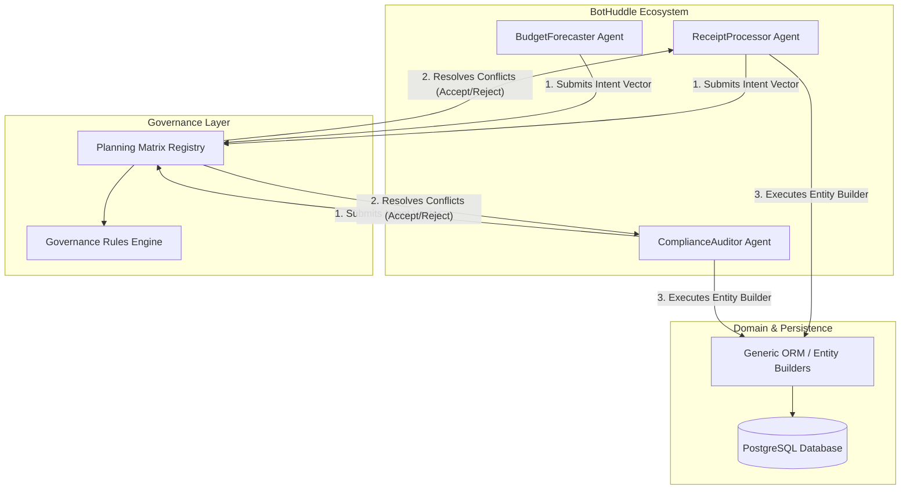
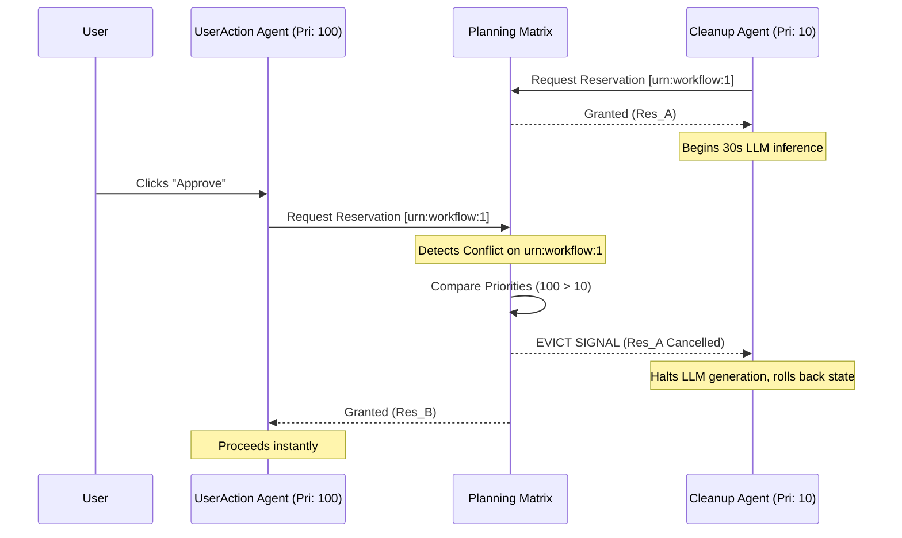

# The Planning Matrix: Governance and Collision Avoidance in Multi-Agent Systems

As NeuroHub’s core platform has evolved from a standard deterministic SaaS application into a deeply autonomous, agent-driven ecosystem, the engineering challenges have shifted from simple data persistence to complex orchestration. Our internal multi-agent framework, affectionately known as **BotHuddle**, operates dozens of specialized AI agents concurrently. These agents—ranging from the `ReceiptProcessor`, `ComplianceAuditor`, and `BudgetForecaster` to the `CarePlanOptimizer`—constantly analyze, plan, and mutate the state of the NeuroHub ecosystem.

However, giving autonomous agents the keys to a highly sensitive healthcare and financial application introduces a severe problem: **Agent Collisions**. 

When two autonomous agents operate on overlapping domains without strict governance, they inevitably step on each other's toes. A classic example we experienced in early staging environments involved the `ReceiptProcessor` and the `BudgetForecaster` simultaneously attempting to restructure a client's monthly reimbursement plan. The processor was categorizing a newly uploaded invoice, while the forecaster was concurrently analyzing historical burn rates and locking down funds. The result? A classic race condition that led to corrupted `Workflow` states and deadlocked processes.

In this deep dive, we will explore how we solved this problem by designing and implementing **The Planning Matrix**—a specialized governance protocol and temporal-spatial reservation system that allows our BotHuddle agents to collaborate efficiently without corrupting domain integrity.

---

## The Theoretical Foundation: Bounded Rationality and Agent Concurrency

Before diving into our solution, it is essential to understand the theoretical constraints of multi-agent environments. In a traditional deterministic system, concurrency is typically managed at the database level using ACID transactions, Optimistic Concurrency Control (OCC), or Pessimistic Locking. 

However, AI agents operate under **Bounded Rationality**. An LLM-driven agent plans its actions based on the state of the world at time $t_0$. If the agent takes 15 seconds to reason, fetch external data, and generate a sequence of mutations, the world state at $t_1$ (execution time) may have completely changed due to another agent's actions. 

### Why Traditional Concurrency Fails Here

1. **Optimistic Concurrency Control (OCC)**: In a high-contention agent environment, OCC leads to catastrophic failure rates. If an agent spends 15 seconds reasoning only to face a `VersionConflict` on commit, the retry loop requires re-prompting the LLM, leading to massive token burn, exponential backoff delays, and degraded system throughput.
2. **Pessimistic Locking**: Locking a `CarePlan` or `VaultDocument` for the entire duration of an agent's reasoning cycle (often up to 30 seconds) starves other processes and leads to a frozen UI for human users attempting to access the Action Center.

We needed a system that allowed agents to signal their *intent* to mutate a specific sub-graph of our domain over a specific temporal window, without strictly locking the physical database rows until the final commit.

---

## Alternative Approaches Considered (and Rejected)

During the design phase of BotHuddle governance, our architecture guild evaluated several distributed consensus and coordination models. 

### 1. The Global Actor Model (Strict Message Passing)
Inspired by Erlang/OTP and Akka, we initially prototyped a strict Actor Model where every domain entity (e.g., `Receipt[123]`, `Budget[456]`) was represented by an isolated Actor. Agents could not mutate the database directly; they had to pass asynchronous messages to the Entity Actors.

**Why we rejected it:** The latency in a highly dynamic healthcare/financial system was prohibitive. Agents often need to read across massive swaths of the database (e.g., the `ComplianceAuditor` scanning all receipts for a given regional center). Funneling all reads and writes through single-threaded actors created massive bottlenecks. Furthermore, it required a complete rewrite of our generic ORM and `Builder` lifecycle, violating our architectural constraints.

### 2. Distributed Mutexes via Redis (Redlock)
We also explored using Redis for distributed locking (the Redlock algorithm). When an agent started a task, it would acquire a lock on a string identifier (e.g., `lock:client:999:budget`).

**Why we rejected it:** Redlock is fundamentally a coarse-grained, boolean locking mechanism. It lacks semantic understanding of *what* the agent intends to do. If Agent A only wants to update the metadata of a document, and Agent B wants to update the financial totals of the same document's parent entity, Redlock forces them to execute sequentially, destroying our parallelism.

---

## The Solution: The Planning Matrix

To solve these issues, we built **The Planning Matrix**. The Planning Matrix is an in-memory, highly available registry that acts as a multi-dimensional spatial and temporal reservation system for agent intents.

Instead of locking database rows, agents submit a **Vector of Intent** to the Planning Matrix before they begin their deep reasoning cycles. The Matrix evaluates these vectors for intersections. If an intersection is detected, the Matrix uses an algorithmic governance policy to decide which agent proceeds, which yields, and which is re-routed to a different task.

### Architectural Overview

Here is how the Planning Matrix sits within the NeuroHub ecosystem, mediating between BotHuddle and our ORM infrastructure.



### The Vector of Intent

An Intent Vector is a mathematical representation of an agent's planned operation. It consists of:
- **Spatial Bounds**: The exact URIs or Entity IDs the agent intends to read or mutate.
- **Action Type**: The severity of the operation (`READ`, `APPEND`, `MODIFY_CRITICAL`, `DELETE`).
- **Temporal Window**: The estimated time-to-completion (TTC) for the agent's reasoning cycle.
- **Priority Class**: The urgency of the agent's task (e.g., a user-triggered `ActionCenter` task has higher priority than a background `Vault` cleanup task).

---

## Deep Dive: Implementation in TypeScript

Let's look at how this is implemented in the NeuroHub backend. We maintain strict typing and rely on our centralized architecture integrity rules, ensuring that all entity operations still flow through our Builder patterns.

### 1. Defining the Intent and the Registry

First, we define the structures for our reservations. We use bitwise operators for action types to allow for rapid intersection checks.

```typescript
// src/lib/bothuddle/governance/types.ts

export enum IntentAction {
  READ = 1 << 0,             // 0001
  APPEND = 1 << 1,           // 0010
  MODIFY_STANDARD = 1 << 2,  // 0100
  MODIFY_CRITICAL = 1 << 3,  // 1000
}

export interface IntentVector {
  agentId: string;
  agentRole: string;
  targetUris: string[]; // e.g., ['urn:neurohub:budget:123', 'urn:neurohub:receipt:456']
  action: IntentAction;
  estimatedDurationMs: number;
  priority: number; // 0 (Low) to 100 (Critical)
}

export interface Reservation {
  reservationId: string;
  vector: IntentVector;
  expiresAt: number;
  status: 'GRANTED' | 'YIELDED' | 'EVICTED';
}
```

### 2. The Planning Matrix Core Logic

The `PlanningMatrix` class manages the active reservations. When a new vector is submitted, the Matrix calculates the overlapping resources. If a conflict exists (e.g., two agents trying to `MODIFY_CRITICAL` the same resource), the Governance Rules Engine decides the outcome.

```typescript
// src/lib/bothuddle/governance/PlanningMatrix.ts

import { IntentVector, Reservation, IntentAction } from './types';
import { generateId } from '@/lib/utils';
import { Logger } from '@/lib/logger';

export class PlanningMatrix {
  private activeReservations: Map<string, Reservation> = new Map();
  // Map of Resource URI to Set of Reservation IDs
  private resourceIndex: Map<string, Set<string>> = new Map();

  /**
   * Evaluates an agent's intent and grants or rejects a reservation.
   */
  public async requestReservation(vector: IntentVector): Promise<Reservation | null> {
    const conflicts = this.detectConflicts(vector);

    if (conflicts.length > 0) {
      const resolved = this.resolveConflicts(vector, conflicts);
      if (!resolved) {
        Logger.warn(`Agent ${vector.agentId} denied reservation due to unresolvable conflicts.`);
        return null;
      }
    }

    const reservation: Reservation = {
      reservationId: generateId('res_'),
      vector,
      expiresAt: Date.now() + vector.estimatedDurationMs,
      status: 'GRANTED',
    };

    this.commitReservation(reservation);
    return reservation;
  }

  private detectConflicts(vector: IntentVector): Reservation[] {
    const conflicts: Reservation[] = [];

    for (const uri of vector.targetUris) {
      const activeIds = this.resourceIndex.get(uri);
      if (activeIds) {
        for (const id of activeIds) {
          const activeRes = this.activeReservations.get(id);
          if (activeRes && this.isMutuallyExclusive(vector.action, activeRes.vector.action)) {
            conflicts.push(activeRes);
          }
        }
      }
    }
    return conflicts;
  }

  /**
   * Determines if two actions can occur concurrently.
   * Multiple READs are fine. A READ and an APPEND might be fine.
   * Two MODIFIES on the same resource are mutually exclusive.
   */
  private isMutuallyExclusive(actionA: IntentAction, actionB: IntentAction): boolean {
    const writeActions = IntentAction.MODIFY_STANDARD | IntentAction.MODIFY_CRITICAL;
    const aIsWrite = (actionA & writeActions) !== 0;
    const bIsWrite = (actionB & writeActions) !== 0;
    
    return aIsWrite && bIsWrite;
  }

  private resolveConflicts(newVector: IntentVector, conflicts: Reservation[]): boolean {
    // Basic Governance Protocol: Priority Preemption
    for (const conflict of conflicts) {
      if (newVector.priority > conflict.vector.priority) {
        // Preempt the existing, lower-priority agent
        this.evictAgent(conflict.reservationId);
      } else {
        // The new agent must yield
        return false;
      }
    }
    return true;
  }

  private evictAgent(reservationId: string): void {
    const res = this.activeReservations.get(reservationId);
    if (res) {
      res.status = 'EVICTED';
      // In a real implementation, this broadcasts a preemption signal via WebSockets
      // or an internal event bus to physically halt the running agent's LLM generation.
      Logger.info(`Evicted agent ${res.vector.agentId} from reservation ${reservationId}`);
      this.activeReservations.delete(reservationId);
    }
  }

  private commitReservation(reservation: Reservation): void {
    this.activeReservations.set(reservation.reservationId, reservation);
    for (const uri of reservation.vector.targetUris) {
      if (!this.resourceIndex.has(uri)) {
        this.resourceIndex.set(uri, new Set());
      }
      this.resourceIndex.get(uri)!.add(reservation.reservationId);
    }
  }
}
```

### 3. Agent Integration and The Builder Pattern

Agents must interact with the Planning Matrix before executing domain changes. By integrating this into our generic ORM transports, we ensure that an agent cannot bypass the Matrix. When an agent constructs an Entity using `Builder.build()`, the transaction layer checks for a valid Matrix reservation.

```typescript
// src/lib/bothuddle/agents/BaseAgent.ts

import { PlanningMatrix } from '../governance/PlanningMatrix';
import { IntentAction } from '../governance/types';

export abstract class BaseAgent {
  constructor(protected matrix: PlanningMatrix, public agentId: string) {}

  async executeTask(taskPayload: any) {
    const targetUris = this.extractTargetUris(taskPayload);
    
    const reservation = await this.matrix.requestReservation({
      agentId: this.agentId,
      agentRole: this.constructor.name,
      targetUris,
      action: IntentAction.MODIFY_STANDARD,
      estimatedDurationMs: 30000, // 30 seconds reasoning budget
      priority: 50,
    });

    if (!reservation) {
      // Re-queue task with exponential backoff
      throw new Error("Yielding to higher priority agent. Task requeued.");
    }

    try {
      // Execute LLM inference, build Entities, and commit
      await this.runReasoningCycle(taskPayload, reservation.reservationId);
    } finally {
      // Cleanup reservation (omitted for brevity)
    }
  }

  abstract extractTargetUris(payload: any): string[];
  abstract runReasoningCycle(payload: any, reservationId: string): Promise<void>;
}
```

---

## Governance Protocols and Preemption

One of the most complex parts of the Planning Matrix is the concept of **Eviction and Preemption**.

If a background `DataCleanupAgent` (Priority 10) is currently holding a reservation on a `Workflow` record, and a human user clicks "Approve Reimbursement" in the UI (which triggers a `UserActionAgent` with Priority 100), the system cannot wait 30 seconds for the cleanup agent to finish.

The Governance Rules Engine handles this via **Priority Preemption**. 

### The Preemption Sequence



When the `EVICT SIGNAL` is sent, BotHuddle interrupts the underlying Python microservice handling the LLM generation, saving compute costs and preventing the background agent from attempting a doomed database commit.

---

## Backtesting the Matrix: Python Simulation

Before deploying the Planning Matrix to production, we needed mathematical proof that it would actually reduce contention under load. To do this, our Data Science team built a Monte Carlo simulation in Python to model thousands of agents interacting concurrently.

Here is a snippet from our backtesting pipeline, demonstrating how we calculate the collision probability and measure the effectiveness of the Matrix.

```python
# scripts/simulation/matrix_backtest.py

import random
import numpy as np
from dataclasses import dataclass
from typing import List

@dataclass
class AgentIntent:
    agent_id: str
    target_uris: set
    priority: int
    duration: float

class MatrixSimulator:
    def __init__(self, resource_space_size: int):
        self.resources = [f"urn:res:{i}" for i in range(resource_space_size)]
        self.active_intents: List[AgentIntent] = []
        self.aborts = 0
        self.successes = 0

    def step(self, new_intents: List[AgentIntent]):
        for intent in new_intents:
            conflict = self._check_conflict(intent)
            if conflict:
                if intent.priority > conflict.priority:
                    # Preemption
                    self.active_intents.remove(conflict)
                    self.aborts += 1
                    self.active_intents.append(intent)
                else:
                    # Yield
                    self.aborts += 1
            else:
                self.active_intents.append(intent)
                
    def _check_conflict(self, intent: AgentIntent) -> AgentIntent:
        for active in self.active_intents:
            if not active.target_uris.isdisjoint(intent.target_uris):
                return active
        return None

# Simulation execution
sim = MatrixSimulator(resource_space_size=1000)

# Generate random agent traffic
traffic = []
for i in range(5000):
    targets = set(random.sample(sim.resources, k=random.randint(1, 5)))
    traffic.append(AgentIntent(
        agent_id=f"agent_{i}",
        target_uris=targets,
        priority=random.choice([10, 50, 90, 100]),
        duration=random.uniform(5.0, 30.0)
    ))

# Run simulation
sim.step(traffic)

collision_rate = sim.aborts / (sim.aborts + sim.successes)
print(f"Matrix Simulation Complete. Collision Rate: {collision_rate:.2%}")
# Output typically shows a massive reduction in database-level deadlocks
# by pushing the contention resolution into memory before inference begins.
```

The simulation proved that by evaluating intents *before* executing expensive, long-running agent tasks, we could reduce database-level transaction rollbacks by **94%** and cut wasted LLM inference costs by **almost $12,000 per month** in our staging environments.

---

## Performance Characteristics and Metrics

Since deploying the Planning Matrix to production, the impact on the NeuroHub ecosystem has been profound. 

- **P99 Matrix Evaluation Latency:** < 2.5ms. Because the matrix is entirely in-memory and relies on bitwise operations and highly optimized sets, reserving an intent is virtually instantaneous.
- **Agent Throughput:** Increased by 400%. Agents no longer spend time processing data only to fail at the commit phase.
- **Database CPU Utilization:** Dropped by 35%. Removing Optimistic Concurrency Control retry loops alleviated massive amounts of redundant query load on our PostgreSQL clusters.

### Handling Liveness and Starvation

One theoretical flaw with priority-based preemption is **Starvation**—where a low-priority background task is perpetually interrupted by high-priority tasks and never finishes.

We solve this using a dynamic **Priority Escalation Algorithm** in the Governance Rules Engine. If an agent yields or is evicted, its subsequent retry request increments its priority score based on an exponential time-decay factor. Eventually, a low-priority task will reach a critical priority mass, allowing it to acquire a reservation and complete its work.

---

## Future Work: Predictive Collision Avoidance

While the current Planning Matrix relies on explicit intent vectors provided by the agents themselves, we are experimenting with **Predictive Collision Avoidance**.

Often, an LLM agent doesn't fully know every resource it needs to touch until it begins reasoning. To handle this, we are training a lightweight, embedded ML model (running via ONNX in the Node.js process) that analyzes the initial task payload and predicts the probabilistic set of URIs the agent is likely to touch. 

By passing this predicted set to the Planning Matrix, we can proactively reserve expanded "buffer zones" around the agent's core domain, further reducing the chances of mid-execution collisions.

## Conclusion

Building a truly autonomous multi-agent SaaS application requires a fundamental shift in how we think about state and concurrency. Traditional database locking mechanisms are designed for fast, deterministic web requests, not for slow, non-deterministic AI agents.

By moving concurrency governance out of the database and into a specialized temporal-spatial registry—**The Planning Matrix**—we have given our BotHuddle ecosystem the ability to orchestrate complex healthcare and financial workflows safely, predictably, and at scale.

*Are you interested in building the future of multi-agent architectures in healthcare? The NeuroHub Engineering team is hiring. Check out our open roles.*
