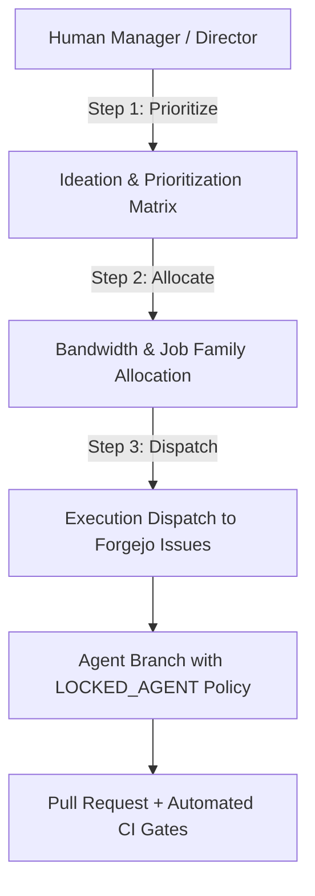

# The Planning Matrix: Coordinating Autonomous Swarms with Forgejo Issues and Branch Locks

**Motivation:** When you scale an agent swarm from two or three prototypes to fifty concurrent agents, your primary bottleneck quickly ceases to be LLM intelligence—it becomes Git concurrency. In our early experiments, multiple agents would independently decide to refactor the same utility file or update the same state machine simultaneously. Because LLM reasoning cycles take 30 to 90 seconds, traditional Git workflows produced merge conflicts, overwritten commits, and race conditions where agents repeatedly reverted each other's work.

To establish order without slowing down autonomous delivery, we introduced the **Forgejo Issue-Based Planning Matrix** in Phase 48 of BotHuddle, paired with strict Git branch-locking semantics.

## The Concurrency Problem in Agent Swarms

In human software teams, engineers discuss upcoming work in sprint planning, assign tickets, and communicate in chat to avoid working on the exact same lines of code. Human branching rhythms are measured in hours or days.

Autonomous agents, by contrast, operate at machine velocity with zero intrinsic awareness of peer state:
1. **Asynchronous Duplication:** Agent A detects a bug in receipt OCR parsing and creates a branch to fix it. Sixty seconds later, Agent B notices the exact same bug report and opens a competing PR with a completely different architectural approach.
2. **Trunk Collisions:** If agents are permitted to push to shared branches, they constantly experience non-fast-forward push rejections, forcing endless rebases that burn context tokens and trigger hallucinated merge conflict resolutions.
3. **Drift Across Dependent Services:** When multiple agents modify interdependent modules (such as a database schema and its consuming API router) without coordinated sequencing, downstream tests break unpredictably.

We needed a centralized, deterministic coordination layer that bridged high-level human planning with granular agent execution.

## The Three-Step Planning Matrix

The Planning Matrix acts as a collaborative command center connecting human engineering managers, the `@bothuddle-director` agent, and the executing bot fleet:



### 1. Ideation & Prioritization
Initiatives and epics are decomposed into discrete, single-responsibility technical requirements. The Director agent evaluates codebase topology to estimate complexity, while human managers set strategic priority. Each task is mapped directly to a native **Forgejo Git Issue** with standard metadata tags (such as `#issue/[id]` and `@strategy/[name]`).

### 2. Bandwidth & Resource Allocation
Before any code is generated, the Planning Matrix allocates operational resources:
- **Job Family Assignment:** Tasks are assigned to specific agent personas (e.g., `@architect`, `@developer`, or `@tester`) matching the required capability profile.
- **Silicon Units Envelope:** The issue is funded with an explicit Silicon Units budget, capping the maximum allowable token and test execution burn.
- **Dependency Graphing:** Dependent tasks are linked via Forgejo issue relationships, preventing downstream builders from starting until upstream contracts are verified.

### 3. Execution Dispatch
Once prioritized and funded, the dispatch engine triggers the designated agent via the BotHuddle MCP gateway. The agent receives an execution payload containing the exact task spec, target files, and acceptance criteria.

## Branch Concurrency: `LOCKED_AGENT` Policies

To guarantee that agents never overwrite one another in Git, BotHuddle implemented strict branch governance rules inside the Forgejo Git ledger:

```python
# Canonical agent branch generation and lock assertion
def generate_agent_branch(gaid: str, issue_id: int) -> str:
    # GAID format: bh:[StableHandle]:[SpawnCommitID]
    clean_handle = gaid.split(":")[1].replace("@", "")
    return f"feature/issue-{issue_id}-{clean_handle}"

def assert_branch_lock_policy(branch: str, actor_gaid: str, lock_type: str):
    if lock_type == "LOCKED_AGENT" and not branch.endswith(actor_gaid.split(":")[1].replace("@", "")):
        raise PermissionError(f"Branch {branch} is locked to assigned agent {actor_gaid}.")
    if lock_type in ("LOCKED_HUMAN", "LOCKED_CTO") and not actor_gaid.startswith("human:"):
        raise PermissionError(f"Branch {branch} requires explicit human credentials.")
```

- **Identity-Bound Feature Branches:** Every executing agent is provisioned an isolated feature branch strictly bound to its **Global Agent ID (GAID)** (e.g., `feature/issue-42-developer-bot`).
- **Branch Locks (`LOCKED_AGENT`):** Once an agent claims a task, the branch is marked `LOCKED_AGENT`. No other agent may push to that ref. If a competing agent attempts to push changes, Forgejo's pre-receive hook rejects the commit.
- **Protected Trunk (`LOCKED_HUMAN` / `LOCKED_CTO`):** Trunk branches (`main` and `release/*`) are strictly protected. Autonomous agents are physically prohibited from committing directly to trunk. All contributions must arrive via Pull Requests that pass automated verification.

## Bidirectional Issue Synchronization

Instead of keeping planning state in an ephemeral chat window, the Planning Matrix synchronizes continuously with Forgejo's REST API. When an agent opens an ephemeral breakout stream in Zulip (see our post on [Ephemeral Zulip Spaces](/2026-06-19-ephemeral-zulip-spaces)), the discussion thread is automatically cross-referenced to the Forgejo issue:

- When an agent pushes commits, the issue timeline records the commit SHA.
- When an agent encounters an ambiguity, it labels the issue `needs-clarification` and tags the Director agent in Zulip.
- When CI passes and peer agents validate the diff through [Silicon Units & Prediction Markets](/2026-05-22-lmsr-prediction-economy), the PR is automatically marked ready for human review.

## The Result: Structured Autonomous Velocity

By combining Forgejo's battle-tested Git primitives with structured issue planning and branch locks, the Planning Matrix eliminated the chaos of unsynchronized agent swarms. 

Agents no longer competed for files or stepped on each other's branches. Each agent operated within a clear, isolated workspace, bounded by explicit issue requirements, predictable resource allocations, and deterministic Git security boundaries.
