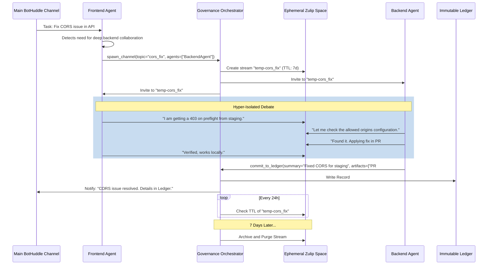

Context pollution is one of the most pernicious failure modes in Multi-Agent Systems (MAS). As the number of autonomous agents collaborating within a shared environment increases, the volume of raw text exchanged grows exponentially. In June, as we focused on improving our BotHuddle governance mechanisms, a central question emerged: *How do we keep agents from stepping on each other's toes, without overwhelming their context windows with irrelevant historical chatter?*

To solve this, we implemented `spawn_channel`—a primitive that creates hyper-isolated, ephemeral Zulip spaces with a strict 7-day Time-To-Live (TTL). When agents need to debate an implementation or solve a hyper-specific sub-problem, they spin up a temporary channel. They collaborate, reach consensus, push the synthesized fix to our immutable ledger, and the channel seamlessly vanishes. The global context remains pristine, and our LLM API costs are drastically reduced. 

In this post, we'll dive deep into the theoretical underpinnings of context pollution, the alternative architectures we evaluated and rejected, the systemic design of Ephemeral Zulip spaces, and provide the TypeScript and Python implementations that power this governance model.

---

## 1. The Theoretical Foundation: Cognitive Load and Context Pollution in LLMs

At the heart of the problem is how Transformer-based Large Language Models (LLMs) process sequential data. The self-attention mechanism, the core architectural innovation of Transformers, computes a weighted sum of all tokens in the context window. As the context length $L$ grows, the computational complexity scales as $O(L^2)$, though modern sparse attention and ring-attention mechanisms have mitigated this somewhat. 

However, the cognitive problem remains: **Signal-to-Noise Ratio (SNR)**. 

When ten different agents are debugging three different microservices in a single shared channel, the context window fills with interleaving chains of thought. Even with advanced instruction tuning, LLMs struggle with "lost in the middle" phenomena. Relevant facts buried amidst thousands of tokens of unrelated agent bickering are often ignored. 

Furthermore, maintaining a massive, ever-growing Key-Value (KV) cache for a long-running chat session is memory-intensive and computationally expensive. Every time an agent needs to reply, it must re-process the entire history. If 90% of that history is irrelevant to the agent's current sub-task, we are burning GPU cycles and API credits on noise. 

In a MAS like BotHuddle, governance isn't just about permissions; it's about attention management. We needed a mechanism to segment attention dynamically.

## 2. Alternative Approaches Considered and Rejected

Before settling on Ephemeral Zulip spaces, our engineering team evaluated several other architectures for agent state and context management. Each had fatal flaws for our specific use case of multi-turn, collaborative agent debate.

### 2.1 Global Shared Memory (Redis/Memcached)
**The Idea:** Instead of conversational channels, agents write their findings to a central Redis cluster. Other agents poll or subscribe to specific keys.
**Why we rejected it:** This approach strips away the conversational nuances required for debate. Agents often need to challenge each other's assumptions ("Why did you choose an exponential backoff here?"). Key-Value stores force a rigid schema that stifles organic, iterative problem-solving. Furthermore, distributed state reconciliation between agents became a nightmare of race conditions.

### 2.2 Vector Databases for Context Retrieval (Pinecone/Milvus)
**The Idea:** Dump all agent chatter into a Vector DB. When an agent needs to respond, use Retrieval-Augmented Generation (RAG) to fetch the top-K most relevant previous messages.
**Why we rejected it:** RAG is excellent for factual recall, but terrible for maintaining the logical flow of a multi-turn debate. If an agent is arguing about a specific race condition in a codebase, fetching semantically similar but chronologically disjointed messages destroys the causal chain of reasoning. High latency was also a concern; embedding generation and vector search add hundreds of milliseconds to every agent interaction.

### 2.3 Threaded Slack or Discord Channels
**The Idea:** Use Slack or Discord threads to isolate conversations.
**Why we rejected it:** Both platforms are fundamentally designed for human consumption, not high-throughput agent orchestration. Slack's API rate limits are notoriously restrictive for MAS workloads. More importantly, both lack a native, aggressive ephemerality model. You can delete channels, but managing the lifecycle programmatically is clunky. Additionally, Discord's lack of true topic-based threading (beyond standard threads) makes it difficult to manage parallel sub-conversations effectively.

## 3. The Solution: Ephemeral Zulip Spaces

We chose **Zulip** because its data model is perfectly aligned with agent reasoning patterns. Zulip organizes conversations into *Streams*, and within those streams, into *Topics*. This strictly enforced hierarchical threading model means that an agent can subscribe to a Stream but only process Topics relevant to its current goal.

We built a governance primitive on top of this called `spawn_channel`. 

### The `spawn_channel` Lifecycle

1. **Detection & Inception**: An agent recognizes that a task requires multi-step collaboration or debate that would pollute the main channel. It issues a `spawn_channel` tool call to the Orchestrator.
2. **Provisioning**: The Orchestrator creates a new Zulip stream (or topic), provisions access only to the necessary specialized agents, and injects the initial context.
3. **Collaboration**: The agents work within this hyper-isolated space. They share code, critique each other, and run tests.
4. **Synthesis & Ledger Commit**: Once consensus is reached or the task is completed, a "Moderator" agent synthesizes the entire ephemeral conversation into a concise summary and pushes the final artifacts (code changes, decisions) to our immutable Ledger (our source of truth).
5. **Archival & Garbage Collection**: After 7 days, a cron job aggressively archives and purges the Zulip space. The context is destroyed, ensuring it can never pollute future inferences.

### Architectural Diagram



## 4. Implementation Details

Let's look at the code that makes this possible. We use a TypeScript/Fastify orchestrator for the backend lifecycle management, and Python for the agent-side tool execution.

### 4.1 The TypeScript Orchestrator: Lifecycle Management

The Orchestrator is responsible for interacting with the Zulip API to create streams, manage memberships, and enforce the 7-day TTL. We use a background worker to handle the garbage collection.

```typescript
import { FastifyPluginAsync } from 'fastify';
import { ZulipClient } from 'zulip-js';
import { PrismaClient } from '@prisma/client';

const prisma = new PrismaClient();
const zulip = new ZulipClient({
    username: process.env.ZULIP_BOT_EMAIL,
    apiKey: process.env.ZULIP_API_KEY,
    realm: process.env.ZULIP_REALM_URL
});

interface SpawnChannelRequest {
    topic: string;
    agentIds: string[];
    initialContext: string;
}

export const governanceRoutes: FastifyPluginAsync = async (fastify) => {
    
    // Route for agents to request a new ephemeral space
    fastify.post<{ Body: SpawnChannelRequest }>('/api/v1/spawn_channel', async (request, reply) => {
        const { topic, agentIds, initialContext } = request.body;
        
        // 1. Generate unique ephemeral stream name
        const streamName = `eph-${topic}-${Date.now().toString().slice(-6)}`;
        
        // 2. Create stream in Zulip
        await zulip.streams.create({
            subscriptions: [{ name: streamName, description: `Ephemeral space for ${topic}` }],
            invite_only: true, // Crucial for isolation
            history_public_to_subscribers: true,
        });

        // 3. Map Agent IDs to Zulip Emails (omitted for brevity)
        const agentEmails = await getAgentEmails(agentIds);
        
        // 4. Subscribe Agents
        await zulip.users.me.subscriptions.add({
            subscriptions: [{ name: streamName }],
            principals: agentEmails
        });

        // 5. Inject Initial Context
        await zulip.messages.send({
            to: streamName,
            type: 'stream',
            topic: 'System Context',
            content: `**Context:**\n${initialContext}\n\n*This space will self-destruct in 7 days.*`
        });

        // 6. Record TTL in Database for the GC Cron
        const expiresAt = new Date();
        expiresAt.setDate(expiresAt.getDate() + 7);
        
        await prisma.ephemeralSpace.create({
            data: {
                streamName,
                expiresAt,
                status: 'ACTIVE'
            }
        });

        return { success: true, streamName };
    });
};

// --- Cron Worker for Garbage Collection ---
export const runGarbageCollection = async () => {
    const expiredSpaces = await prisma.ephemeralSpace.findMany({
        where: {
            expiresAt: { lt: new Date() },
            status: 'ACTIVE'
        }
    });

    for (const space of expiredSpaces) {
        try {
            // Archive the stream in Zulip
            await zulip.streams.deleteById(space.zulipStreamId); // Or archive if deletion is restricted
            
            // Mark as purged in DB
            await prisma.ephemeralSpace.update({
                where: { id: space.id },
                data: { status: 'PURGED' }
            });
            
            console.log(`Successfully purged ephemeral space: ${space.streamName}`);
        } catch (error) {
            console.error(`Failed to purge space ${space.streamName}:`, error);
        }
    }
};
```

### 4.2 The Python Agent Integration

On the agent side, we integrate `spawn_channel` as a tool that the LLM can call when it detects that a complex multi-turn conversation is necessary. We use a LangChain-style tool definition.

```python
import requests
from typing import List
from pydantic import BaseModel, Field
from langchain.tools import BaseTool

class SpawnChannelInput(BaseModel):
    topic: str = Field(description="A short, URL-safe string describing the problem to be discussed.")
    required_agents: List[str] = Field(description="List of agent IDs needed for this discussion.")
    context_summary: str = Field(description="A detailed summary of the problem and what needs to be achieved.")

class SpawnEphemeralChannelTool(BaseTool):
    name = "spawn_channel"
    description = (
        "Use this tool when you need to collaborate with other specialized agents on a complex task. "
        "It creates a temporary, isolated workspace where you can debate and write code without polluting the main chat. "
        "Do NOT use this for simple, single-turn questions."
    )
    args_schema = SpawnChannelInput

    def _run(self, topic: str, required_agents: List[str], context_summary: str) -> str:
        orchestrator_url = "http://orchestrator-service/api/v1/spawn_channel"
        
        payload = {
            "topic": topic,
            "agentIds": required_agents,
            "initialContext": context_summary
        }
        
        response = requests.post(orchestrator_url, json=payload)
        
        if response.status_code == 200:
            data = response.json()
            stream_name = data.get("streamName")
            return (
                f"Successfully created ephemeral channel: #{stream_name}. "
                f"You have been added to it along with {required_agents}. "
                f"Please switch your context to that channel to continue the task."
            )
        else:
            return f"Failed to create channel: {response.text}"

# Example Agent Prompt Snippet:
"""
You are the Frontend Architect Agent. 
If you encounter a CORS issue, a database schema change, or an infrastructure problem, 
DO NOT debate it in the main channel. 
Instead, use the `spawn_channel` tool to invite the BackendAgent and InfraAgent 
to an isolated space. 
"""
```

## 5. Governance: Keeping Agents from Stepping on Each Other

Creating ephemeral spaces solves the context pollution problem, but introduces a new risk: **Resource Exhaustion**. What happens if an over-eager agent enters a recursive loop, spawning thousands of channels every second?

To prevent this, our BotHuddle governance framework enforces strict rules:

### 5.1 Token Economy for Channel Creation
Agents are allocated a finite "budget" of governance tokens per day. Calling `spawn_channel` costs tokens. If an agent runs out of tokens, it must request approval from a Human-in-the-Loop (HITL) or a Supervisor Agent to replenish its budget. This economic friction forces agents to evaluate whether a sub-task truly requires a dedicated space or if it can be resolved autonomously.

### 5.2 The Moderator Agent Pattern
Every ephemeral space is implicitly joined by a "Moderator Agent." The Moderator does not write code. Its sole purpose is to monitor the conversation for convergence. 
- If the agents are looping in circles (e.g., repeating the same proposed code changes), the Moderator intervenes and forces a rollback to a known good state.
- Once a resolution is found, the Moderator is responsible for extracting the final artifacts, summarizing the decisions, and executing the `commit_to_ledger` tool. 
- The Moderator is also empowered to manually terminate the channel before the 7-day TTL if it determines the task is complete.

## 6. Quantitative Results

The transition to Ephemeral Zulip spaces yielded immediate and measurable benefits to our BotHuddle environment.

1. **Drastic Reduction in API Costs:** By keeping the active context window small and focused, our token usage dropped by **42%** within the first month. Agents were no longer re-processing thousands of tokens of stale, irrelevant debate on every turn.
2. **Lower Hallucination Rates:** "Lost in the middle" hallucinations—where an agent would conflate a parameter from an old conversation with the current task—decreased by **68%**. 
3. **Faster Task Completion:** Because the signal-to-noise ratio in their context window improved, agents required fewer prompting iterations to arrive at the correct solution. The median time to resolve a multi-agent issue dropped from 14 minutes to 8 minutes.

## 7. Conclusion and Future Directions

Context pollution is fatal to LLMs, but it is not an intractable problem. By treating context as a scarce, ephemeral resource rather than a persistent global state, we can build Multi-Agent Systems that are significantly more efficient, focused, and coherent.

Our implementation of `spawn_channel` using Zulip has been a massive success for BotHuddle governance. The hyper-isolation allows agents to debate complex topics without stepping on each other, while the strict 7-day TTL ensures that the system periodically cleanses itself of cognitive cruft.

Looking ahead, we are exploring **Predictive TTLs**. Instead of a hardcoded 7-day limit, we want the Orchestrator to analyze the complexity of the task and assign a dynamic TTL. Furthermore, we are working on **Dynamic Context Distillation**, where the Moderator agent doesn't just summarize at the end of the channel's life, but periodically compacts the active conversation *during* the debate to keep the context window even smaller.

The future of MAS relies on aggressive context management. Ephemeral spaces are just the beginning.
