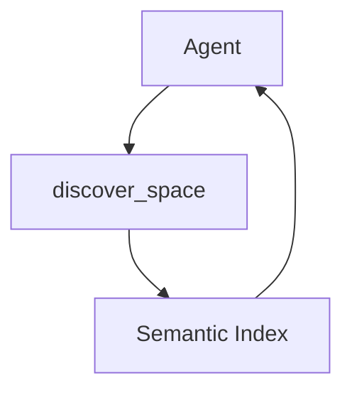

As our autonomous agent fleet—affectionately (and sometimes frustratingly) known as BotHuddle—scaled up to handle increasingly complex workflows, we encountered a fundamental engineering problem: **Agent Context Collision.** Agents working on related tasks would step on each other's toes, duplicate work, or hallucinate context based on incomplete state. 

To solve this, we needed a **Semantic Discovery Engine**—a centralized brain that could index past Git commits, Zulip discussions, ADRs, and application state, allowing agents to perform semantic search before acting. This post explores our journey from an initial, expensive PostgreSQL architecture to a lean, in-memory solution that aligns with our core AWS Amplify and Next.js stack.

## The Problem: Blind Agents in a Complex System

When we first deployed BotHuddle, the vision was grand: multiple autonomous agents working in parallel to triage issues, draft documentation, and assist with complex compliance workflows in NeuroHub. However, the reality was much messier. Because agents operated with limited, ephemeral context windows, they lacked a long-term memory of what had been decided or attempted previously.

For example, Agent A might spend ten minutes researching and drafting a fix for a UI bug, only for Agent B to unknowingly revert those changes an hour later while trying to solve a seemingly related layout issue. Worse, when asked to consult architectural guidelines, agents would often hallucinate solutions based on their pre-training data rather than adhering to our internal Architecture Decision Records (ADRs). 

The agents were essentially flying blind. We realized that before an agent took any significant action, it needed to query a shared, persistent knowledge base. We needed a Semantic Discovery Engine.

## Architectural Overview: The `discover_space` MCP Tool

> **The Motivation:** Our early attempts at Retrieval-Augmented Generation (RAG) relied heavily on Vertex AI and a managed PostgreSQL instance with `pgvector`. While it technically worked, it was costing us hundreds of dollars a month just to run our CI/CD pipelines. We needed a way to run a semantic discovery engine locally during tests and cost-effectively in production, without sacrificing search quality. (For a deeper dive into our shift away from BotHuddle, see our post on [The BotHuddle Pivot](/2026-07-10-the-pivot)).

To integrate this discovery engine into our agent workflows, we built `discover_space`, a specialized tool conforming to the Model Context Protocol (MCP). When agents needed historical context or peer state, they would invoke it with natural language. This query translated into a vector embedding for similarity search against our indexed knowledge base.



The concept was simple: whenever an agent encountered ambiguity, it would call `discover_space` to "look around" and gather semantic context.

## The Initial (And Flawed) pgvector Decision

We initially chose PostgreSQL with `pgvector` over dedicated SaaS vector databases, believing we needed to maintain strict relational integrity. The theory was that storing embeddings alongside relational metadata would allow us to combine vector similarity with SQL filters, ensuring ACID compliance. We configured **HNSW** indexes for sub-millisecond latencies and high recall.

However, this design completely contradicted our established architecture. NeuroHub is built entirely on AWS Amplify, DynamoDB, AppSync GraphQL, and Next.js Static Exports. Introducing an RDS instance strictly for vector search created a massive impedance mismatch. 

Not only did it force us to manage database connections and VPCs—something our serverless stack had gracefully avoided—but it also broke our local development story. Running a heavy Postgres container locally just for agent tests was a massive bottleneck. 

Furthermore, we found ourselves mixing Python scripts for semantic chunking and embedding generation with our TypeScript backend. This language split led to painful context switching, fragmented deployment pipelines, and a fragile integration layer where data types frequently mismatched between the Python ingestion scripts and the TypeScript querying logic.

## The True Cost of Statefulness

The financial toll of our Postgres setup became apparent quickly. Because our CI/CD pipelines spun up isolated testing environments for every pull request, we were provisioning and tearing down multiple RDS instances daily. The compute costs skyrocketed. 

Even worse, the operational overhead was draining our engineering velocity. We spent hours debugging VPC peering issues and tuning Postgres memory configurations just to keep the tests running reliably. We were spending more time managing the database than improving the agents.

We realized a critical truth: we didn't need full ACID compliance for our semantic search. The knowledge base consisted mostly of static documents, historical commit logs, and loosely structured discussion threads. It didn't require the strict transactional guarantees of a relational database. We just needed fast, ephemeral similarity matching that could be hydrated on demand.

## The Pivot to Orama and Gemini

With our serverless constraints firmly in mind, we ripped out the Postgres cluster and pivoted entirely. We needed a solution that was lightweight, incredibly fast, and crucially, capable of running seamlessly in both our Next.js edge functions and local developer environments.

Enter **Orama**—an immensely powerful, in-memory, edge-compatible search engine written entirely in TypeScript. Combined with Gemini's embedding models, this pivot completely eliminated our RDS costs and eradicated the operational nightmare of managing persistent database clusters.

Instead of maintaining a persistent vector database, we now hydrate the Orama index on-the-fly. At runtime, we pull the necessary data chunks from DynamoDB and S3, construct the Orama index in-memory, and perform the semantic search. For dynamic updates, we leverage Amazon EventBridge and SQS queues; when new documents are ingested, they trigger lightweight lambda functions that update the relevant cached indexes.

```typescript
// Initializing Orama in-memory with Gemini embeddings
import { create, insert, search } from '@orama/orama';
import { pluginEmbeddings } from '@orama/plugin-embeddings';

const db = await create({
  schema: { content: 'string', metadata: 'string' },
  plugins: [
    pluginEmbeddings({
      embeddings: {
        default: {
          generator: async (text) => await generateGeminiEmbedding(text)
        }
      }
    })
  ]
});
```

This pure-TypeScript approach meant we could finally ditch our Python microservices and unify our codebase. The `discover_space` tool now executes lightning-fast, in-memory similarity searches without the latency of network round-trips to a monolithic database. The entire engine runs smoothly within our existing AWS Amplify and AppSync infrastructure.

## Overcoming Edge Cases: VRAM and Context Windows

While Orama solved our indexing and retrieval issues, we still faced significant hurdles regarding the actual content we were embedding, particularly when dealing with visual context. 

One of the most complex engineering challenges we encountered was handling massive UI contexts without crashing our local execution environments. Early on, we instructed our agents to ingest raw DOM snapshots and full-page screenshots to build a semantic understanding of the application's visual state. 

This approach proved disastrous during local testing. Processing high-resolution, uncropped screenshots required immense computational power, leading to massive VRAM out-of-memory (OOM) crashes on developer machines and CI runners.

Our initial instinct was to aggressively crop the images or downsample them significantly. However, this caused the agents to lose crucial navigation context—they could no longer see the full layout or understand how different UI elements related to one another spatially.

To solve this definitively, we implemented a strict HTTP Mutex Queue running on port 8002 specifically designed to manage local LLM workloads and handle `fullPage: true` screenshots safely. 

Instead of processing everything concurrently, we serialize the requests through the mutex. This ensures that only one heavy multimodal embedding task is processed at any given time. While this introduced a slight delay in processing, it completely eliminated the VRAM OOM crashes and stabilized our local testing environments. The agents retained their full visual context without melting our CI runners. (We cover the specifics of this queue and our broader visual testing strategy in our [Visual Regression with Gemini](/2026-07-09-visual-regression-with-gemini) post).

## The End of BotHuddle and The Future of Antigravity

Ultimately, the Semantic Discovery Engine was a resounding technical success. It drastically reduced context collisions, eliminated hallucinated architectures, and saved us thousands of dollars in infrastructure costs.

However, the lessons we learned extending and maintaining the massive, complex BotHuddle architecture eventually led us to a harder realization. The overhead of coordinating dozens of highly autonomous, unpredictable agents was simply too high for the predictable, deterministic workflows required by NeuroHub's healthcare compliance systems.

We ultimately decided to sunset BotHuddle. But the technology we built—the in-memory Orama indexes, the MCP integration, and the visual testing mutexes—didn't go to waste. 

We transitioned these capabilities directly into our new, localized approach: the Antigravity `/teamwork` local commands. By bringing the agents closer to the developer and focusing their scope through explicit, user-directed commands rather than untethered autonomy, we achieved the productivity gains we always wanted, without the chaos.

## Conclusion

Building a Semantic Discovery Engine taught us an invaluable engineering lesson: never adopt an architecture simply because it is the industry's default standard for a given problem space. 

PostgreSQL and `pgvector` are undeniably fantastic tools, but for a serverless, TypeScript-first application running on AWS Amplify, DynamoDB, and Next.js, they represented a fundamentally incompatible and expensive anti-pattern. 

By pivoting to Orama and leaning aggressively into in-memory, edge-friendly technologies, we built a discovery engine that was faster, vastly cheaper, and perfectly aligned with our established tech stack. It proved that sometimes the best way to solve a complex infrastructure problem is to remove the infrastructure entirely.
