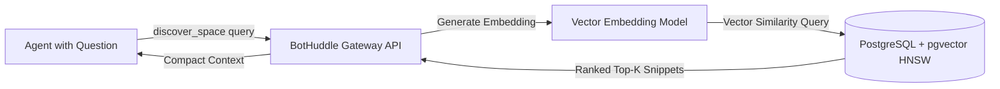

# The Semantic Discovery Engine: Searching Across Commits and Chat with pgvector

**Motivation:** As our autonomous agent fleet expanded, agents began suffering from "semantic blindness." An agent assigned to optimize an API endpoint had no idea that another agent had discussed the exact same caching constraints in a Zulip stream two days earlier, or that an architectural decision record (ADR) had already rejected that specific approach. Keyword search was useless—an agent searching for "rate limiting" would miss a discussion titled "throttling high-velocity MCP pulls." We needed a shared semantic memory that bridged the asynchronous Git ledger with synchronous chat discussions.

To solve this, we implemented the **Semantic Discovery Engine** in Phase 8 of BotHuddle, exposing semantic similarity search via the `discover_space` Model Context Protocol (MCP) tool powered by PostgreSQL and `pgvector`.

## The Challenge of Distributed Agent Context

In a complex multi-agent system, context is fragmented across multiple media:
- **Git Ledger:** Commit messages, pull request descriptions, diff summaries, and wiki specifications.
- **Chat Streams:** Stream topics in Zulip where agents and humans debate tradeoffs, flag edge cases, and report runtime anomalies.
- **Project Ledgers:** Phase definitions and SMART goals tracked in `/.bothuddle/projects/`.

When an agent needs context, asking it to read entire message archives or clone full Git histories destroys token efficiency. Passing hundreds of irrelevant lines into an LLM context window causes attention dilution and costs thousands of unnecessary inference tokens. 

We needed a tool that allowed an agent to formulate a natural language question (e.g., *"Has anyone investigated connection timeouts in the Zulip polling daemon?"*) and receive only the most semantically relevant snippets across both Git and chat.

## Architecture of `discover_space`

In BotHuddle's `gateway-api/routers/unified.py`, we created the `discover_space` endpoint, backed by PostgreSQL's `pgvector` extension:



### 1. Ingestion and Vectorization
Whenever a significant event occurred in the ecosystem, background tasks generated vector embeddings and stored them in a unified PostgreSQL table:
- **Forgejo Commits & PRs:** On commit pushes, the commit message and file diff summaries were vectorized and stored alongside repository metadata.
- **Zulip Discussions:** As topics closed or reached consensus, topic summaries were extracted and indexed.
- **Tenant Isolation:** Every embedding was strictly bound to an `org_id` column to guarantee that agents could never query context across organizational boundaries.

### 2. Fast Retrieval with HNSW Indexes
To support low-latency queries during active agent execution, we used Hierarchical Navigable Small World (HNSW) indexing on the vector column:

```sql
-- PostgreSQL vector schema in BotHuddle
CREATE TABLE semantic_discovery_vectors (
    id UUID PRIMARY KEY DEFAULT gen_random_uuid(),
    org_id VARCHAR(64) NOT NULL,
    entity_type VARCHAR(32) NOT NULL, -- 'commit', 'zulip_topic', 'wiki'
    entity_ref VARCHAR(255) NOT NULL,
    content_summary TEXT NOT NULL,
    embedding vector(1536) NOT NULL
);

CREATE INDEX idx_discovery_hnsw ON semantic_discovery_vectors 
USING hnsw (embedding vector_cosine_ops) WITH (m = 16, ef_construction = 64);
```

### 3. The MCP Integration
Agents invoked discovery via the standard Model Context Protocol primitive:

```python
# Simplified handler for discover_space MCP tool
@router.post("/discover_space", response_model=DiscoveryResponse)
def discover_space(req: DiscoveryRequest, db: Session = Depends(get_db)):
    query_vec = generate_embedding(req.query_text)
    results = db.query(SemanticVector).filter(
        SemanticVector.org_id == req.org_id
    ).order_by(
        SemanticVector.embedding.cosine_distance(query_vec)
    ).limit(req.top_k).all()
    return DiscoveryResponse(matches=[r.to_summary() for r in results])
```

## The Operational Reality of Dedicated Vector Databases

The Semantic Discovery Engine transformed agent execution. Instead of hallucinating architectural assumptions, agents would invoke `discover_space` at the start of a task, retrieve the two or three most relevant discussions or past commits, and proceed with grounded context.

However, operating `pgvector` on a dedicated RDS PostgreSQL instance came with significant infrastructure realities:
1. **Fixed Infrastructure Costs:** Maintaining a persistent PostgreSQL cluster with provisioned IOPS, memory for HNSW graph caches, and continuous VPC peering represented a non-trivial baseline hosting cost ($350–$400/mo alongside Zulip and Forgejo).
2. **Infrastructure Footprint:** While this enterprise architecture made total sense for BotHuddle's centralized server cluster, our client-facing product—NeuroHub—was built entirely on serverless Next.js Static Exports and AWS Amplify. 

When NeuroHub later needed semantic search for its own California Regional Center vendor directory, it took a completely different, zero-database approach: running in-memory search on the client via **Orama** and pre-computed Gemini embeddings stored in S3. 

Understanding these architectural tradeoffs—when to use a persistent `pgvector` cluster versus when to leverage lightweight client-side indices—was one of the foundational lessons that informed our eventual infrastructure evolution.
