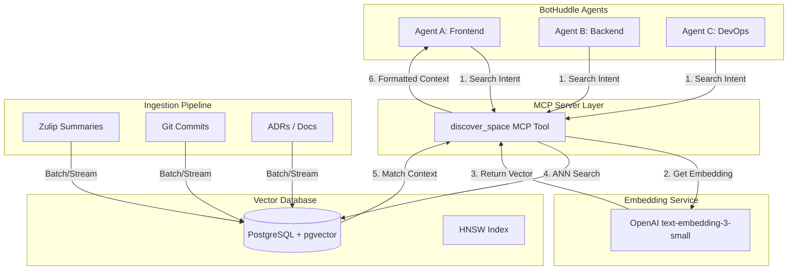

As NeuroHub's autonomous agent fleet (affectionately named "BotHuddle") scaled from a handful of experimental co-pilots to an interconnected swarm of dozens of specialized workers, we encountered a fundamental distributed systems problem: **Agent Context Collision and Governance.**

In a multi-agent system where different agents handle everything from code refactoring to database migrations and customer support inquiries, keeping them from stepping on each other’s toes—or duplicating work—becomes a massive challenge. When Agent A is refactoring a React hook in `src/components`, and Agent B is simultaneously updating the global state management strategy that affects that same hook, the result is often chaotic merge conflicts, redundant API calls, and context loss. 

To solve this, we needed a way for agents to implicitly discover the ongoing and historical context of their peers. We needed a **Semantic Discovery Engine**—a centralized brain that indexes past Git commits, ongoing Zulip discussion summaries, and architecture decision records (ADRs), allowing any agent to perform a semantic search before it acts.

In this deep dive, we will explore how we built our `discover_space` MCP (Model Context Protocol) tool, why we chose PostgreSQL with `pgvector` over dedicated vector databases, the mathematical foundations of our indexing strategy, and the concrete TypeScript and Python implementations powering BotHuddle governance.

## The Context Collision Problem

Before implementing semantic discovery, our BotHuddle governance relied on strict, rule-based boundaries (e.g., "Agent A only touches `/src/lib/orm`"). However, modern software engineering is highly cross-functional. A change in the ORM might necessitate a UI update. 

When agents lacked semantic context of the broader system and the actions of their peers, they suffered from:
1. **Redundant Work:** Multiple agents investigating the same bug ticket because they were triggered by different alert systems.
2. **Destructive Interference:** Agent A reverting a styling change made by Agent B because Agent A was unaware of the new design system guidelines discussed in a Zulip thread.
3. **Hallucination via Isolation:** Agents hallucinating APIs or context because they couldn't find the correct historical Git commit that introduced a new service pattern.

We realized that agents, much like human engineers, need a "watercooler"—a way to overhear what others are working on and search through the company's collective memory.

## Architectural Overview: The `discover_space` MCP Tool

To expose this capability to our agents, we built `discover_space`, a tool conforming to the Model Context Protocol (MCP). When an agent begins a task, it invokes `discover_space` with a natural language description of its intent. The tool translates this intent into a vector embedding, performs a similarity search across our corpus, and returns highly relevant context chunks.



## Why pgvector? (Alternative Approaches Considered)

When building a semantic search engine, the immediate instinct is to reach for a specialized vector database. We evaluated several alternatives before settling on PostgreSQL with `pgvector`.

### 1. Dedicated SaaS Vector DBs (Pinecone, Weaviate)
**Pros:** Fully managed, highly optimized for vector search, built-in chunking strategies in some cases.
**Cons:** We already use PostgreSQL for our primary application data. Introducing a separate SaaS vector database would mean maintaining complex synchronization pipelines. When a Git commit is reverted, or a Zulip message is deleted, we would have to implement two-phase commits to ensure the vector database stays in sync with the relational database. Data privacy was also a concern; sending highly sensitive architectural discussions to a third-party vector store required additional compliance reviews.

### 2. Elasticsearch / OpenSearch (k-NN)
**Pros:** Excellent hybrid search (combining exact keyword match with dense vector search).
**Cons:** JVM memory overhead and complex cluster management. While Elasticsearch's dense vector capabilities have improved, managing a separate ES cluster solely for agent context was operational overkill compared to adding an extension to our existing Postgres instances.

### 3. Qdrant / Milvus
**Pros:** High performance, purpose-built for massive scale.
**Cons:** Similar to the Pinecone argument—adding another stateful component to our infrastructure for a corpus of ~10 million embeddings (Zulip + Git + Docs) is unnecessary when Postgres can handle it easily.

### The pgvector Decision
`pgvector` allows us to store embeddings directly alongside our relational metadata. We can execute queries that combine vector similarity with strict SQL filters (e.g., "Find context related to 'React hooks' but ONLY from the 'frontend' team channel in Zulip within the last 30 days"). ACID compliance is guaranteed. If an agent creates a new architectural document and generates an embedding for it, both are committed in a single transaction.

## Theoretical Foundations: HNSW vs. IVFFlat

In vector search, finding the absolute closest vector (K-Nearest Neighbors, or KNN) requires calculating the distance between the query vector and every single vector in the database. This is an $O(N)$ operation, which becomes unacceptably slow as the dataset grows.

To achieve sub-millisecond latencies, we use **Approximate Nearest Neighbor (ANN)** search. `pgvector` supports two primary indexing algorithms: `IVFFlat` (Inverted File Flat) and `HNSW` (Hierarchical Navigable Small World).

We chose **HNSW**.

### Why HNSW?
1. **IVFFlat** works by clustering vectors into $N$ lists (Voronoi cells) using k-means. To search, it finds the closest centroids and only searches within those clusters. The downside? You must build the index *after* loading a substantial amount of data so the centroids are representative. If your data distribution changes (e.g., you start ingesting a new type of log), the index degrades.
2. **HNSW** builds a multi-layered graph. The bottom layer contains all vectors connected to their nearest neighbors. Higher layers contain exponentially fewer vectors, acting as "expressways" to quickly navigate the graph. 
   - **Search:** Starts at the top layer, finds the closest node, drops down a layer, and repeats until it hits the bottom layer.
   - **Pros:** Extremely fast, high recall, and allows for incremental updates without degrading performance. No training phase required.

Our index creation looks like this:

```sql
CREATE TABLE agent_context (
    id UUID PRIMARY KEY DEFAULT gen_random_uuid(),
    source_type VARCHAR(50) NOT NULL, -- 'zulip', 'git', 'adr'
    content TEXT NOT NULL,
    metadata JSONB,
    embedding vector(1536), -- text-embedding-3-small dimensionality
    created_at TIMESTAMPTZ DEFAULT NOW()
);

-- HNSW index using cosine distance (<=>)
CREATE INDEX ON agent_context USING hnsw (embedding vector_cosine_ops)
WITH (m = 16, ef_construction = 64);
```
*(Note: `m` defines the maximum number of connections per element in the graph, and `ef_construction` defines the size of the dynamic list used during index construction. Tuning these parameters balances index build time, memory usage, and search recall.)*

## Ingesting Context: Python Pipeline

The ingestion layer is written in Python, utilizing standard NLP libraries for chunking before calling the OpenAI API. Since Git commits can be massive (e.g., a package-lock.json update), and Zulip threads can span hundreds of messages, intelligent chunking is crucial. We use semantic chunking to ensure embeddings capture discrete concepts rather than arbitrary text fragments.

```python
import os
import psycopg2
from openai import OpenAI
from sentence_transformers import SentenceTransformer
from langchain.text_splitter import RecursiveCharacterTextSplitter

client = OpenAI(api_key=os.getenv("OPENAI_API_KEY"))

# Use Langchain's robust text splitter for Markdown and Code
text_splitter = RecursiveCharacterTextSplitter(
    chunk_size=1000,
    chunk overlap=200,
    separators=["\n\n", "\n", " ", ""]
)

def generate_embedding(text: str) -> list[float]:
    response = client.embeddings.create(
        input=text,
        model="text-embedding-3-small"
    )
    return response.data[0].embedding

def ingest_git_commit(commit_hash: str, commit_message: str, diff_text: str):
    conn = psycopg2.connect(dsn=os.getenv("DATABASE_URL"))
    cursor = conn.cursor()
    
    # Combine context
    full_text = f"Commit: {commit_hash}\nMessage: {commit_message}\n\nDiff:\n{diff_text}"
    chunks = text_splitter.split_text(full_text)
    
    for chunk in chunks:
        vector = generate_embedding(chunk)
        cursor.execute("""
            INSERT INTO agent_context (source_type, content, metadata, embedding)
            VALUES (%s, %s, %s, %s)
        """, (
            'git', 
            chunk, 
            psycopg2.extras.Json({'commit_hash': commit_hash}), 
            vector
        ))
        
    conn.commit()
    cursor.close()
    conn.close()
```

## The MCP Tool: TypeScript Implementation

Agents interact with this data via the `discover_space` MCP tool. By encapsulating this inside an MCP server, any agent in BotHuddle—regardless of its underlying LLM framework or prompt configuration—can access the semantic search engine seamlessly.

Our implementation uses Prisma (with raw queries for vector math) and zod for robust input validation.

```typescript
import { z } from 'zod';
import { PrismaClient } from '@prisma/client';
import OpenAI from 'openai';

const prisma = new PrismaClient();
const openai = new OpenAI({ apiKey: process.env.OPENAI_API_KEY });

// The schema defining the tool's expected arguments
export const DiscoverSpaceInput = z.object({
  query: z.string().describe("Natural language description of the context you are looking for."),
  source_types: z.array(z.enum(['zulip', 'git', 'adr'])).optional().describe("Filter by specific context sources."),
  limit: z.number().min(1).max(20).default(5),
  similarity_threshold: z.number().min(0).max(1).default(0.5)
});

type DiscoverSpaceArgs = z.infer<typeof DiscoverSpaceInput>;

export async function executeDiscoverSpace(args: DiscoverSpaceArgs) {
  // 1. Generate embedding for the agent's query
  const embeddingResponse = await openai.embeddings.create({
    model: "text-embedding-3-small",
    input: args.query,
  });
  
  const queryVector = embeddingResponse.data[0].embedding;
  const vectorStr = `[${queryVector.join(',')}]`;

  // 2. Perform hybrid search (Vector Similarity + Metadata Filtering)
  // We use <=> for Cosine Distance. 
  // Similarity = 1 - Distance. Therefore, 1 - (embedding <=> query) is the cosine similarity.
  
  let sourceFilter = Prisma.sql`1=1`;
  if (args.source_types && args.source_types.length > 0) {
      sourceFilter = Prisma.sql`source_type = ANY(${args.source_types})`;
  }

  const matches = await prisma.$queryRaw`
    SELECT 
      id,
      source_type,
      content,
      metadata,
      1 - (embedding <=> ${vectorStr}::vector) as similarity
    FROM agent_context
    WHERE 
      1 - (embedding <=> ${vectorStr}::vector) > ${args.similarity_threshold}
      AND ${sourceFilter}
    ORDER BY embedding <=> ${vectorStr}::vector
    LIMIT ${args.limit};
  `;

  // 3. Format and return to the agent
  return formatMatchesForAgent(matches);
}

function formatMatchesForAgent(matches: any[]): string {
    if (matches.length === 0) {
        return "No relevant semantic context found for your query.";
    }

    let output = "Found the following historical context:\n\n";
    for (const match of matches) {
        output += `--- [Source: ${match.source_type} | Similarity: ${(match.similarity * 100).toFixed(1)}%] ---\n`;
        if (match.metadata && match.metadata.commit_hash) {
            output += `Commit Hash: ${match.metadata.commit_hash}\n`;
        }
        output += `${match.content}\n\n`;
    }
    return output;
}
```

### Addressing the Hybrid Search Problem

One challenge with `pgvector` and HNSW indexes is the interaction between vector search limits and SQL `WHERE` clauses (the "pre-filtering" vs "post-filtering" problem).

If we run `ORDER BY embedding <=> query LIMIT 5` and then apply a strict `WHERE source_type = 'zulip'`, the database might fetch the 5 closest vectors, realize only 1 of them is from Zulip, and return just 1 result, even though there are other relevant Zulip vectors further down the graph.

To solve this, we rely on PostgreSQL's query planner. Because we only have a few source types, Postgres can efficiently scan the index and apply the filter iteratively. However, for highly restrictive metadata filters (e.g., filtering by a specific author and a specific day), we've implemented an iterative fetching mechanism in the application layer: fetching a larger initial pool (e.g., `LIMIT 100`), applying strict application-level filtering, and taking the top $K$ results.

## BotHuddle Governance: Preventing Collisions

With `discover_space` deployed, we augmented the system prompts of all BotHuddle agents. Before making any mutating action to the filesystem or database schemas, agents are required to execute a semantic search.

**Example Scenario:**
Agent C is tasked with migrating a legacy `User` model.
1. Agent C queries: `"Recent discussions or commits regarding User model migration and schema changes."`
2. `discover_space` hits the Postgres database.
3. It returns a Zulip summary from yesterday where the lead architect mandated that all new User migrations must include a specific `tenant_id` column for the upcoming multi-tenant rollout, alongside a Git commit from Agent A implementing a helper script for this.
4. Agent C ingests this context, utilizes Agent A's helper script, and adds the `tenant_id` column—completely avoiding a costly mistake and subsequent rewrite.

## Conclusion and Future Work

Using `pgvector` as the backbone of our multi-agent Semantic Discovery Engine has dramatically reduced redundant work and hallucinated context within BotHuddle. By keeping the vector data co-located with our relational data, we sidestepped the immense operational overhead of managing specialized vector databases while still achieving sub-millisecond query latencies using HNSW indexes.

In the future, we plan to extend `discover_space` with Reciprocal Rank Fusion (RRF) to combine dense vector search with sparse BM25 keyword search, improving recall for exact entity names (like specific UUIDs or class names) where vector similarity occasionally falls short. Until then, our Postgres-backed brain continues to keep our autonomous fleet synchronized, informed, and governed.
