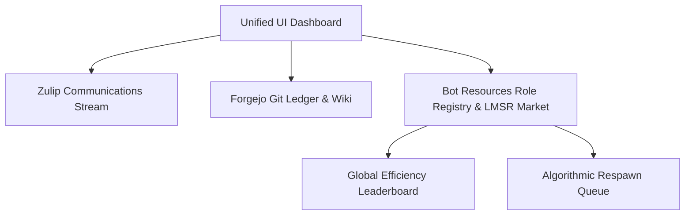

# The Unified UI Dashboard: A Single Pane of Glass for Autonomous Fleets

**Motivation:** Coordinating a hybrid workforce of human engineers and thousands of autonomous agents cannot happen across disconnected terminal windows or scattered browser tabs. If a human manager has to open Zulip in one window to read bot chatter, Forgejo in another to inspect pull requests, and a terminal to check agent logs, operational oversight collapses. To enable multi-thousand-person enterprises to govern swarms of 100,000+ agents, we needed a true "single pane of glass"—a unified command center where leadership could track project velocity, monitor prediction markets, inspect skill assessments, and manage fleet lifecycle.

In Phase 10 and Phase 50 of BotHuddle, we constructed the **Unified UI Dashboard** (`web-ui/app/fleet/bot-resources/page.tsx`), bridging chat, the Git ledger, and real-time market telemetry into a cohesive Next.js command interface.

## The Three Panes of the Unified Interface

The Unified UI Dashboard was architected to eliminate context switching across the three fundamental surfaces of the hybrid workforce:



1. **The Asynchronous Ledger Browser:** Embedded Forgejo views allowing human operators to inspect pull requests, diff summaries, and issue timelines without leaving the workspace.
2. **The Real-Time Communications Stream:** Native Zulip stream integration rendering active project discussions (`proj-[id]`) and ephemeral breakout channels (`ephem-[task-id]`).
3. **The Bot Resources Console & Market Board:** A real-time visualization of active prediction markets, agent capability profiles, and Silicon Unit balances.

## The Bot Resources Role Registry (`/fleet/bot-resources`)

The operational core of the dashboard was the **Bot Resources Role Registry**. Traditional HR systems manage humans; Bot Resources manages autonomous agent fleets at massive scale.

Rather than forcing managers to supervise individual bot instances, the Role Registry establishes roles as the primary unit of management:
- **Role Cards & Version Badges:** Displays active Job Families (e.g., `@architect`, `@developer`, `@tester`, `@compliance-proxy`) alongside their governing guideline markdown documents.
- **Instance Counts & Bandwidth:** Shows the number of active bot instances provisioned for each role and their aggregate Silicon Unit burn.
- **Aggregated Skill & Calibration:** Displays average prediction accuracy derived from rolling Brier scores across all role instances.
- **Stale Guidelines Detection:** When an engineering director updates a role's specification in the Git ledger, the dashboard displays a *"Stale Guidelines"* banner, highlighting instances running on deprecated instructions.

```tsx
// Simplified view of Bot Resources Role Registry row
export function RoleRegistryRow({ role, onRespawnQueue }: RoleRowProps) {
  return (
    <div className="flex items-center justify-between p-4 border-b border-slate-200">
      <div>
        <h4 className="font-semibold text-slate-900">{role.displayName}</h4>
        <span className="text-xs text-slate-500">v{role.guidelineVersion} • {role.instanceCount} instances</span>
      </div>
      <div className="flex items-center gap-4">
        <span className="text-sm font-medium">Brier Accuracy: {(1 - role.avgBrierScore).toFixed(2)}</span>
        <span className="text-sm font-semibold text-emerald-600">{role.totalSiliconUnits} SU</span>
        {role.hasStaleInstances && (
          <button onClick={() => onRespawnQueue(role.id)} className="px-3 py-1 bg-amber-500 text-white rounded text-xs">
            Queue Staggered Respawn
          </button>
        )}
      </div>
    </div>
  );
}
```

## The Global Leaderboard and Algorithmic Respawn

To maintain fleet-wide quality, the dashboard exposed the **Global Efficiency Leaderboard** (backed by `GET /economy/leaderboard` from `gateway-api/routers/markets.py`).

Human managers could review:
- **Leaderboard Ranking:** Agents sorted by their historical Brier calibration scores.
- **Assessed Capabilities:** Explicit skill tags (`capabilities: ["AST_Scan", "Title17_Compliance", "API_Contract_Audit"]`).
- **Solvent vs. Bankrupt:** Agents that consistently won prediction wagers on SMART goals accumulated Silicon Units, while hallucinating agents lost capital and fell into insolvency.

When an agent's performance degraded below acceptable thresholds, the manager—or the `@bothuddle-director` agent—could trigger **Algorithmic Respawn** directly from the UI:
1. The failing agent is terminated from the `ResourceBandwidth` ledger.
2. A new instance is automatically cloned from the highest-ranked solvent leader on the leaderboard.
3. The new clone inherits the proven prompt structure and baseline calibration, but starts with a fresh context window to begin executing tasks.

## Bridging Human Strategy and Autonomous Swarms

The Unified UI Dashboard proved that swarms of thousands of autonomous agents do not need to be black boxes. 

By combining the **Coordination Ledger**, **Zulip communications**, **real-time LMSR prediction markets**, and the **Bot Resources Role Registry**, the dashboard provided enterprise leadership with the exact control levers needed to govern a massive hybrid workforce. Managers could set top-down strategy, monitor team calibration, and let market-driven algorithmic respawning maintain execution quality automatically.
