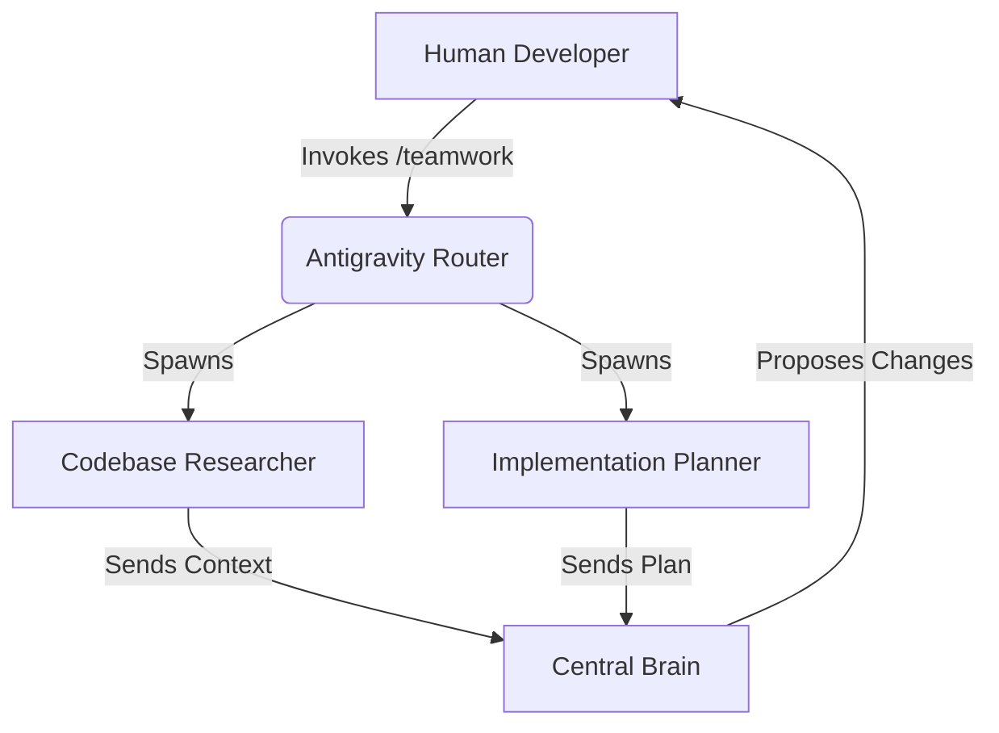

Just a week after finalizing the beautiful Unified UI Dashboard for BotHuddle, we received our AWS billing alert. The cluster running our 50-agent fleet, the Kafka event bus, and the complex LMSR prediction markets was burning through $350/month—mostly while idling, waiting for tasks. 

In a bootstrapped startup environment, a $350/mo infrastructure bill for an internal development tool is an existential threat. We had to make a choice: continue funding our perfect, over-engineered agent governance framework, or kill our darlings and find a cheaper path. We chose the latter.

## The Anatomy of a $350/mo Bill

To understand why BotHuddle was so expensive, we have to look at the deployment topology. BotHuddle wasn't just a set of scripts; it was a microservices behemoth designed for maximum isolation and resilience.

1.  **EKS Cluster (Elastic Kubernetes Service):** $73/mo base cost just for the control plane.
2.  **EC2 Worker Nodes (m5.xlarge):** We needed heavy compute to handle local vector DB queries and rapid context swapping for the agents. ~$150/mo.
3.  **Managed Kafka (MSK):** For the event-driven architecture and market bids. ~$100/mo.
4.  **Miscellaneous (NAT Gateways, EBS, Data Transfer):** ~$27/mo.

### The Idling Problem

The fatal flaw in our design was the "always-on" nature of the agents. To participate in the LMSR markets effectively, agents had to constantly evaluate the state of the codebase, listen to Zulip channels, and update their beliefs. This meant continuous CPU cycles, continuous memory consumption, and continuous API polling.

```python
# The problematic always-on loop in BotHuddle
async def agent_evaluation_loop(agent: Agent, market: LMSRMarket):
    while True:
        # Constantly pulling context even when no user intent is present
        context = await agent.pull_latest_forgejo_commits()
        Zulip_messages = await agent.read_channel("engineering")
        
        # Re-evaluating beliefs consumes significant compute
        new_probability = agent.re_evaluate_market(market, context, Zulip_messages)
        
        if abs(new_probability - agent.current_bid) > 0.05:
            await market.submit_bid(agent, new_probability)
            
        await asyncio.sleep(1) # Too fast!
```

## The Pivot to Antigravity `/teamwork`

We needed a solution that was serverless, ephemeral, and ideally, free. Enter Google Antigravity and its built-in `/teamwork` slash command.

Antigravity operates directly inside our local development environment. When we invoke `/teamwork`, it dynamically spawns subagents *on demand* to tackle a specific goal, utilizing our local machine's resources and only hitting API endpoints when actively processing a task.

### Why `/teamwork` Won

1.  **Zero Infrastructure Cost:** The agents run locally. There are no EKS clusters, no Kafka buses. Our AWS bill for agent infrastructure dropped to $0.
2.  **Contextual Awareness:** Antigravity agents inherently understand the local filesystem and active workspace. We didn't need complex sync mechanisms to pull from Forgejo; the code is right there.
3.  **On-Demand Execution:** Agents only run when a human initiates a `/teamwork` session. They don't idle.



### What We Lost

The pivot was not without immense pain. We lost:
*   **The LMSR Markets:** We could no longer rely on market dynamics to resolve technical disputes between agents.
*   **Strict Governance:** BotHuddle forced agents into a rigid communication protocol. Antigravity agents are much more autonomous and conversational.
*   **The Unified UI:** Our beautiful WebGL dashboard was suddenly useless.

We traded architectural purity for survival. But as we would soon discover, removing the strict governance of BotHuddle and unleashing local `/teamwork` agents would lead to a completely different set of terrifying consequences.
