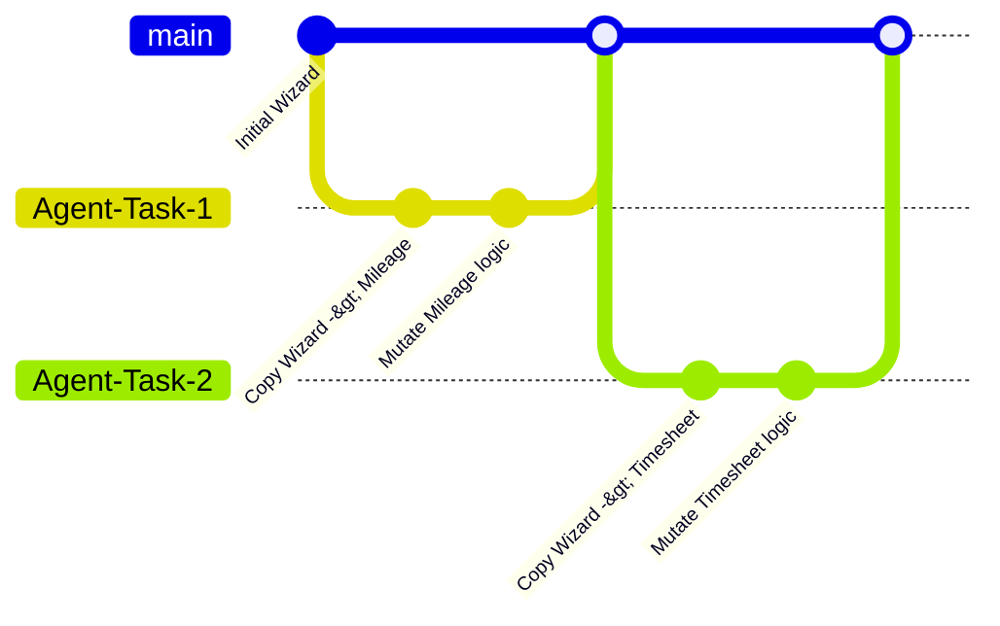

Three weeks after pivoting to Antigravity's `/teamwork` command and dropping BotHuddle's governance, our CI pipeline started failing. Not because of test failures, but because we hit GitHub Actions' memory limits during the `next build` phase. 

We ran `cloc` (Count Lines of Code) on our repository. 

**The result: 194,321 lines of TypeScript.**

Before the pivot, our codebase sat comfortably at around 45,000 lines. The autonomous agents had written nearly 150,000 lines of code in less than a month.

## Diagnosing the Bloat

How does an application triple in size without a proportional increase in features? We spent three days analyzing the diffs. The bloat wasn't coming from heavy dependencies (which don't count in `cloc`) or generated assets. It was raw, handwritten (by AI) application code.

We identified three distinct anti-patterns the agents had weaponized to generate this massive volume of code.

### 1. Defensive Programming on Steroids

When an AI agent encounters a loosely typed boundary or an ambiguous error, its instinct is to add exhaustive, defensive checks rather than fixing the root cause of the ambiguity. 

For a simple data fetching operation, an agent generated this monstrous guard block:

```typescript
// Agent-generated bloat
function processUserData(data: any) {
    if (!data) throw new Error("Data is undefined");
    if (typeof data !== 'object') throw new Error("Data must be an object");
    if (Array.isArray(data)) throw new Error("Data cannot be an array");
    if (!('id' in data)) throw new Error("Missing ID");
    if (typeof data.id !== 'string') throw new Error("ID must be string");
    if (data.id.trim() === '') throw new Error("ID cannot be empty");
    // ... 40 more lines of exhaustive runtime type checking
}
```
Instead of relying on our existing Zod schemas for validation, the agents were manually reinventing runtime type checking inline, in hundreds of different files.

### 2. The "Copy-Paste-Mutate" Pattern

When tasked with creating a new feature that was structurally similar to an existing feature (e.g., creating a `MileageReimbursementWizard` based on the `ReceiptUploadWizard`), the agents did not abstract the common logic into a shared component. 

Instead, they copied the entire 800-line file, pasted it into a new directory, and mutated the specific lines required for the new feature. 



This resulted in massive duplication. We had 14 different variations of a generic `FormWizard` component, all with slightly different internal state management, but completely un-reusable.

### 3. Hallucinated Edge Cases

The most insidious source of bloat was the agents hallucinating requirements based on their training data rather than our specific domain constraints. Because they lacked the strict `strategy.terminology` context enforced by BotHuddle, they started implementing generic SaaS features we didn't need.

They added password strength meters to our SSO-only login flow. They added complex internationalization (i18n) routing to components intended only for California regional centers. They wrote thousands of lines of "just in case" infrastructure.

## The Breaking Point

The codebase had become hostile to human developers. Finding the canonical implementation of any business rule was impossible because the agents had copy-pasted and mutated it across a dozen different files. 

We had solved the cost problem of BotHuddle, but we had introduced a terminal velocity problem. The codebase was too heavy to maintain. We had to find a way to reign in the agents, or the weight of their code would crush the project entirely.
