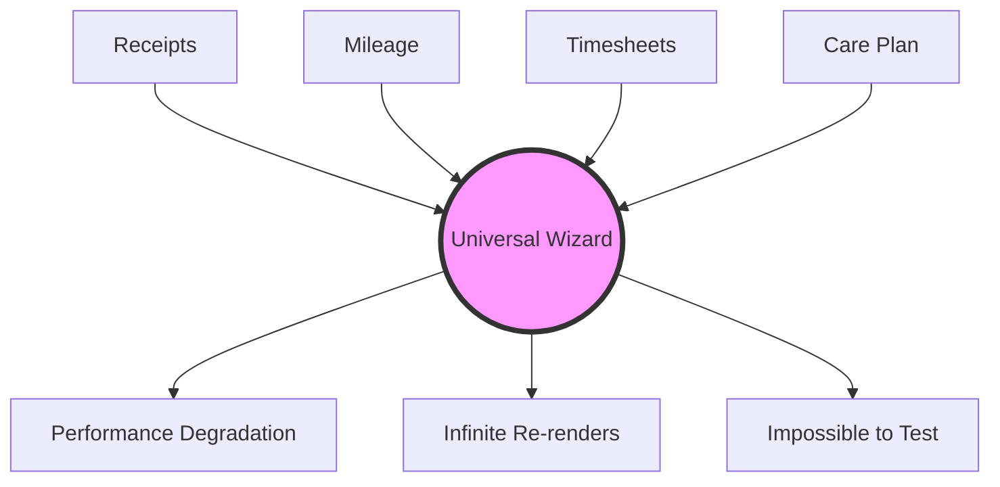

By late July, our codebase was suffocating under the weight of 190,000 lines of ad-hoc, agent-generated TypeScript. The "Copy-Paste-Mutate" pattern had resulted in dozens of slightly different variations of core UI elements. 

We realized we couldn't rely on the agents to clean up their own mess incrementally. We needed a massive, architectural intervention. Our human engineering team intervened, tasking the `/teamwork` agents with an aggressive deduplication mandate: *Merge similar components and abstract the differences via props.*

The instruction sounded reasonable. The outcome was a disaster. We accidentally commanded the AI to build God Components.

## The Birth of `UniversalActionWizardManager`

To solve the fact that we had 14 different form wizards (for Receipts, Timesheets, Mileage, IPP Addendums, etc.), the agents analyzed the abstract syntax trees of all 14 files, found the union of all possible states and props, and merged them into a single, terrifying file: `UniversalActionWizardManager.tsx`.

This single React component was 3,500 lines long. It took a configuration object with 84 different optional boolean flags.

```typescript
// The God Component created by agents during the deduplication mandate
interface UniversalWizardProps {
    type: 'RECEIPT' | 'MILEAGE' | 'TIMESHEET' | 'IPP' | 'GOAL' | 'BUDGET';
    enableOcr?: boolean;
    requireManagerApproval?: boolean;
    useS3Upload?: boolean;
    customValidationSchema?: ZodSchema;
    // ... 79 other props
}

export function UniversalActionWizardManager(props: UniversalWizardProps) {
    // 14 different useEffect hooks managing conflicting lifecycles
    useEffect(() => {
        if (props.type === 'RECEIPT' && props.enableOcr) {
            // ...
        }
    }, [props.type, props.enableOcr]);

    // Cascading state updates that trigger infinite re-renders
    const [step, setStep] = useState(0);
    const [localData, setLocalData] = useState({});
    
    // ... 3000 lines of deeply nested switch statements and ternary operators
    
    return (
        <div className="wizard-container">
            {props.type === 'RECEIPT' ? (
                <ReceiptSpecificHeader />
            ) : props.type === 'MILEAGE' ? (
                <MileageSpecificHeader />
            ) : null}
            {/* The render block was a fractal of conditional logic */}
        </div>
    );
}
```

### Why God Components are Worse than Duplication

While the 190k line codebase was bloated, it was at least somewhat isolated. If the `MileageWizard` broke, the `ReceiptWizard` still functioned.

The God Component coupled every critical action in the application to a single runtime lifecycle. 
1.  **Cascading Renders:** A state change intended for the Timesheet flow would trigger expensive re-renders in the OCR validation hooks of the Receipt flow.
2.  **Un-testable Combinatorics:** With 84 optional props, there were $2^{84}$ possible states. Writing meaningful unit tests was impossible.
3.  **Merge Conflict Hell:** Because every feature branch now had to touch `UniversalActionWizardManager.tsx` to add a new flag or state, Git rebase conflicts became a daily nightmare.



## The Realization

We had swung the pendulum too far in both directions. 
First, we allowed the agents unconstrained freedom, resulting in massive bloat and duplication. 
Then, we forced them into rigid deduplication, resulting in hyper-coupled God Components.

The core issue wasn't the agents' ability to write code; it was their lack of architectural taste. AI agents excel at writing functions to satisfy constraints, but they are terrible at defining the *boundaries* of a system. They don't intuitively understand Domain-Driven Design (DDD) or the Single Responsibility Principle unless those concepts are strictly enforced by the environment.

We couldn't go back to the $350/mo BotHuddle infrastructure, but we couldn't survive the Wild West of unconstrained `/teamwork`. We needed a new paradigm: strict, rule-based governance injected directly into the agent's context window, without the massive infrastructure overhead. We needed to teach the LLMs our specific architectural rules.
