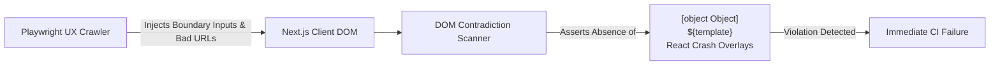

# Adversarial Fuzzing: Detecting DOM Contradictions in Client-Side State

**Motivation:** In high-stakes healthcare and financial software—where California families rely on NeuroHub to submit state-audited expense reimbursements and manage individualized spending plans—a subtle UI rendering failure can corrupt an entire claim. When autonomous coding agents rapidly generate frontend components, their code often compiles cleanly and passes unit tests, yet fails in subtle, visual ways at runtime. An agent might assume a GraphQL field is a string when it is actually an object, resulting in `[object Object]` rendering to the screen, or accidentally leak raw template strings into production.

To catch these subtle regressions before they ever reach families, we engineered an **Adversarial UX Crawler & DOM Fuzzer** into our Playwright testing suite.

## The Threat: Subtle DOM Contradictions

In a traditional web application, catastrophic bugs throw runtime exceptions that trigger HTTP 500 errors or crash server processes. But in a Next.js Static Export application communicating directly with AWS AppSync GraphQL, many AI-introduced failures are silent and non-fatal to the browser:

1. **Unstringified Objects (`[object Object]`):** An agent writes a component expecting a simple name string, but the AppSync schema returns a nested object (e.g., `{ id: "123", name: "Speech Therapy" }`). React attempts to render the object directly or casts it to a string, displaying the literal text `[object Object]` on a receipt review table.
2. **Template String Leakage:** When an agent bypasses our strict builder hydration pattern, uninterpolated template placeholders (such as `${user.coordinatorName}` or `{{amount}}`) appear verbatim on user cards.
3. **React Error Boundary Overlays:** When an unexpected `null` or `undefined` property crashes a component tree, a client-side Error Boundary catches the crash, but displays an unformatted stack trace that traps the user in an unrecoverable state.

Traditional unit tests often pass because the component successfully mounts in memory; standard snapshot tests pass because they don't semantically understand that `[object Object]` is an error.



## Anatomy of the Adversarial Fuzzer

Our automated fuzzer ([`tests/e2e/fuzzer.spec.ts`](file:///Users/abagher/Documents/GitHub/red-tape-ninja/tests/e2e/fuzzer.spec.ts)) crawls active dynamic routes, injecting unexpected payloads, boundary conditions, and malformed query strings into the browser:

```typescript
// DOM contradiction detection in Playwright test suite
export async function assertZeroDomContradictions(page: Page) {
  const bodyText = await page.locator("body").innerText();
  
  // Hunt for unstringified objects, leaked templates, or React crash overlays
  const hasObjectLeak = bodyText.includes("[object Object]");
  const hasTemplateLeak = /\$\{[a-zA-Z0-9_.]+\}/.test(bodyText);
  const hasCrashOverlay = await page.locator(".react-error-boundary").isVisible().catch(() => false);
  
  expect(hasObjectLeak, "Detected [object Object] in rendered DOM").toBe(false);
  expect(hasTemplateLeak, "Detected leaked template expression in DOM").toBe(false);
  expect(hasCrashOverlay, "Detected unhandled client-side crash overlay").toBe(false);
}
```

During test execution, the crawler navigates through critical flows—such as our multi-step reimbursement wizard and spending plan budget tables—and asserts this invariant across every rendered state.

## Dynamic Telemetry and Backend Correlation

To ensure the fuzzer accurately mirrors production conditions, the test runner dynamically parses backend configuration directly from `amplify_outputs.json`:

- The runner extracts the active `aws_appsync_graphqlEndpoint` and authentication settings.
- When the fuzzer injects edge-case parameters (e.g. invalid UUIDs or special characters in receipt filter parameters), it monitors the browser console and network traffic.
- If an AppSync mutation succeeds on the backend but the UI fails to render the resulting payload cleanly, the runner flags an immediate contradiction between network state and DOM presentation.

## Forcing Architectural Rigor

Adversarial fuzzing has become one of our most effective quality gates. It acts as an automated backstop against the tendency of AI coding assistants to take shortcuts. 

Whenever an agent attempts to cast an untyped JSON payload without passing it through our mandatory [Strict ORM Builders](/2026-09-18-strict-orm-builders) or skips error handling in a route component, the fuzzer catches the resulting DOM contradiction in CI and halts the build. 

By enforcing an absolute rule of **Zero DOM Contradictions**, we guarantee that our desktop-class SaaS interface remains clean, predictable, and trustworthy for the families who rely on it daily.
