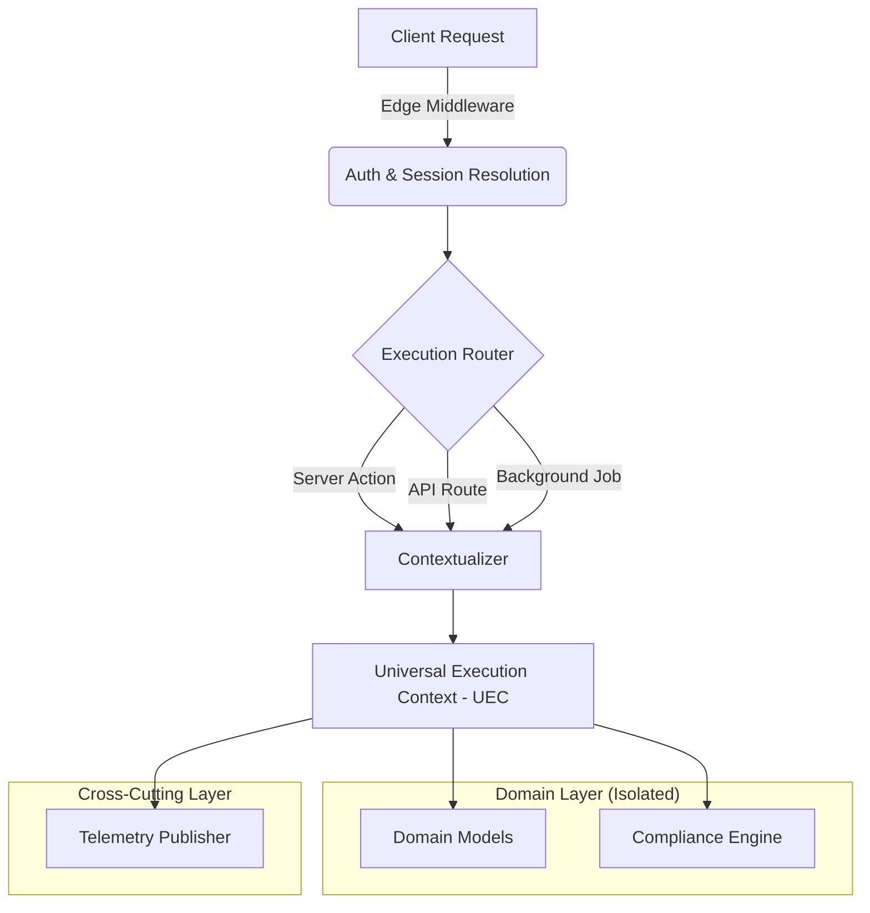

# The 190K Bloat: When Cross-Cutting Concerns Break Down

In the lifecycle of any hyper-growth SaaS product, there comes a moment when the sheer gravity of the codebase begins to warp the surrounding development ecosystem. For NeuroHub, that moment arrived this August when our repository crossed the 190,000 Lines of Code (LoC) threshold. While 190K LoC isn't objectively massive compared to monolithic enterprise systems, the *density* and *interconnectivity* of our business logic—spanning complex federal compliance rules, regional center regulations, and intricate care plans—created a unique form of software entropy. 

This post is a deeply technical post-mortem on how this bloat fundamentally broke our cross-cutting concerns—specifically authentication and telemetry—and the architectural patterns we implemented to rescue the system.

## The Symptoms of Entropy

At 50K LoC, cross-cutting concerns are easy. You wrap your Express or Next.js routes in a middleware, inject a logger, verify a JWT, and move on. But at 190K LoC, the application had fractured into dozens of micro-domains within our monorepo. We had Next.js Server Components, Server Actions, legacy tRPC endpoints, background Cron jobs, and highly asynchronous step-functions for document processing.

### The Authentication Fracture

Our original authentication architecture relied on a standard Higher-Order Function (HOF) wrapper for API routes and a React Context provider for the frontend. 

```typescript
// Legacy Approach - Worked well at 50K LoC
export const withAuth = (handler: NextApiHandler) => async (req, res) => {
  const token = req.cookies.auth_token;
  if (!token) return res.status(401).end();
  const user = await verifyToken(token);
  req.user = user;
  return handler(req, res);
};
```

As we transitioned to Next.js App Router and React Server Components (RSC), the concept of "the request" became fragmented. Server Actions could be invoked from anywhere. We began seeing silent failures where deeply nested ORM models were attempting to hydrate relationships without a valid execution context, because the authorization boundary was enforced at the network edge rather than the domain boundary.

### The Telemetry Avalanche

Telemetry suffered a different fate. We were using OpenTelemetry to trace requests across our microservices. But as the compliance engine grew, a single UI action (like "Approve Care Plan") triggered hundreds of sub-routines:
1. Validating against 4 different regional strategies.
2. Checking historical budget burn rates.
3. Generating audit-trail documents in S3.
4. Sending notifications via Courier.

Because our tracing was tightly coupled to our dependency injection container, the sheer volume of spans generated by a single user action began to cause memory leaks in our Node.js processes. 

## Architectural Overhaul: The Universal Execution Context

To solve this, we had to decouple cross-cutting concerns from the network layer and embed them directly into the domain layer's execution environment. We introduced the concept of the `Universal Execution Context` (UEC).

### Mermaid Diagram: UEC Architecture



### Implementing the UEC in TypeScript

Instead of passing user objects and loggers as parameters through 15 layers of functions (Prop Drilling but for backend), we leveraged Node.js `AsyncLocalStorage` to create a safe, isolated container for every execution thread.

```typescript
import { AsyncLocalStorage } from 'async_hooks';

interface ExecutionContext {
  userId: string;
  role: UserRole;
  tenantId: string;
  traceId: string;
  metadata: Record<string, any>;
}

const executionContext = new AsyncLocalStorage<ExecutionContext>();

export const runWithContext = <T>(
  context: ExecutionContext,
  fn: () => Promise<T>
): Promise<T> => {
  return executionContext.run(context, fn);
};

export const getContext = (): ExecutionContext => {
  const store = executionContext.getStore();
  if (!store) {
    throw new Error("Execution context is missing! Cross-cutting concerns cannot be satisfied.");
  }
  return store;
};
```

### Refactoring the ORM Boundary

With `AsyncLocalStorage`, our ORM and domain entities no longer needed to know *how* a user was authenticated, only that a valid context existed. We refactored our Entity Builders to enforce this:

```typescript
export class CarePlanBuilder {
  private _plan: Partial<CarePlan> = {};

  public withStatus(status: PlanStatus): this {
    // Audit logging is now implicit and safe!
    const ctx = getContext(); 
    Telemetry.track('care_plan_status_change', {
      actor: ctx.userId,
      newStatus: status
    });
    
    this._plan.status = status;
    return this;
  }
  
  // ...
}
```

## Alternative Approaches Considered

### 1. Aspect-Oriented Programming (AOP) via Decorators
We heavily considered using TypeScript decorators to weave auth and telemetry into our classes. 
*Pros:* Clean syntax, keeps business logic pure.
*Cons:* TypeScript decorators (prior to the 5.0 standard) were highly unstable, and they do not work well with functional programming paradigms, which we use extensively for our compliance engine rules.

### 2. Dependency Injection (DI) Containers
We evaluated massive DI frameworks like InversifyJS. 
*Pros:* Explicit contracts for every dependency.
*Cons:* The boilerplate was staggering. At 190K LoC, adding DI tokens for every service would have added another 20K LoC of pure configuration.

## Conclusion

Reaching 190K LoC forced us to stop treating cross-cutting concerns as "add-ons" to our network layer and start treating them as fundamental properties of our domain's runtime environment. By leveraging `AsyncLocalStorage` and the Universal Execution Context, we restored stability, eliminated silent authorization bypasses, and successfully tamed the telemetry avalanche.

In the next post, we will look at how we applied strict entity boundaries to solve the Invoice Batching challenge.
