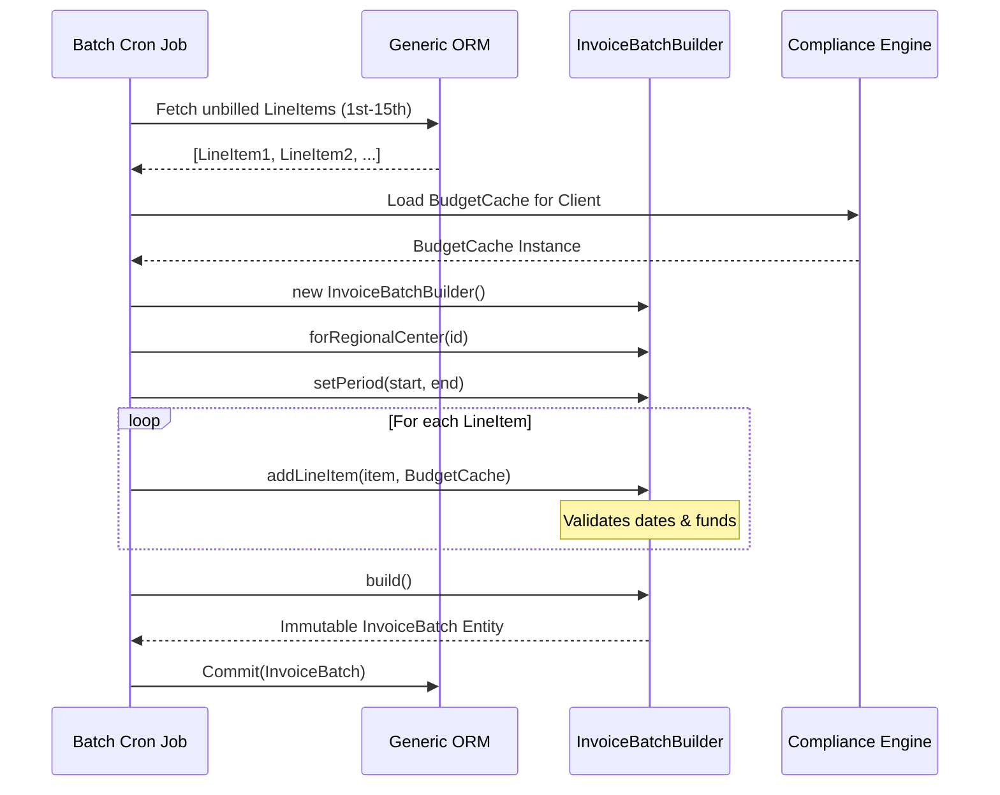

# Taming the Beast: Invoice Batching with Immutable Builders

In the realm of FinTech and healthcare SaaS, few domains are as notoriously difficult to model as invoicing. For NeuroHub, an "invoice" is not simply a bill sent to a customer. It is a highly regulated artifact representing a batch of authorized services, tied to specific state and federal funding lines, constrained by monthly budgetary caps, and segmented by regional center rules. 

As our user base grew, our initial `InvoiceService.generateBatch()` function ballooned into a 2,000-line monstrosity. It was slow, prone to race conditions, and incredibly difficult to test. This post details how we decomposed the invoice batching challenge using Immutable Builders and a strictly typed domain model.

## The Complexity of the Batch

To understand the solution, one must understand the problem. A single Invoice Batch in NeuroHub must satisfy the following constraints:
1. **Temporal Boundaries:** Services rendered strictly between the 1st and the 15th of the month.
2. **Budget Verification:** The sum of the batch cannot exceed the unallocated remainder of the `CarePlan` budget.
3. **Authorization Matching:** Every line item must map exactly to an authorized service code (e.g., `RESPITE_CARE_862`).
4. **Immutability:** Once a batch is generated and submitted to a regional center, it cannot be altered. Any modifications must be handled via a discrete `AdjustmentInvoice`.

Our old procedural approach attempted to handle all of this in a single pass: fetching the data, validating the rules, mutating the objects, and saving to the database. It was a classic "God Function."

## The Builder Pattern to the Rescue

We realized that constructing an Invoice Batch is a phased process. It requires accumulating state, validating intermediate steps, and ultimately finalizing an immutable artifact. The Builder Pattern is uniquely suited for this.

We instituted a strict rule: **The only way to construct an immutable Entity is `Builder.build()`.** 

### Defining the Immutable Entity

First, we defined the Invoice Batch as an immutable structure. Once instantiated, its properties cannot be modified.

```typescript
export class InvoiceBatch {
  public readonly id: string;
  public readonly regionalCenterId: string;
  public readonly periodStart: Date;
  public readonly periodEnd: Date;
  public readonly lineItems: ReadonlyArray<LineItem>;
  public readonly totalAmountCents: number;

  constructor(init: {
    id: string;
    regionalCenterId: string;
    periodStart: Date;
    periodEnd: Date;
    lineItems: LineItem[];
    totalAmountCents: number;
  }) {
    this.id = init.id;
    this.regionalCenterId = init.regionalCenterId;
    this.periodStart = init.periodStart;
    this.periodEnd = init.periodEnd;
    this.lineItems = Object.freeze([...init.lineItems]);
    this.totalAmountCents = init.totalAmountCents;
    Object.freeze(this);
  }
}
```

### Constructing the Builder

The `InvoiceBatchBuilder` acts as the mutable staging area. It is responsible for accumulating line items, applying compliance rules incrementally, and calculating the final totals.

```typescript
export class InvoiceBatchBuilder {
  private lineItems: LineItem[] = [];
  private periodStart?: Date;
  private periodEnd?: Date;
  private regionalCenterId?: string;

  public forRegionalCenter(id: string): this {
    this.regionalCenterId = id;
    return this;
  }

  public setPeriod(start: Date, end: Date): this {
    if (start > end) throw new DomainError("Start date must precede end date");
    this.periodStart = start;
    this.periodEnd = end;
    return this;
  }

  public addLineItem(item: LineItem, budgetCache: BudgetCache): this {
    // Incremental validation
    if (!this.periodStart || !this.periodEnd) {
      throw new DomainError("Cannot add line items before setting the period.");
    }
    
    if (item.serviceDate < this.periodStart || item.serviceDate > this.periodEnd) {
      throw new ComplianceError(`Line item outside batch period: ${item.id}`);
    }

    if (!budgetCache.hasSufficientFunds(item.serviceCode, item.amountCents)) {
       throw new BudgetExceededError(`Insufficient funds for code ${item.serviceCode}`);
    }

    this.lineItems.push(item);
    budgetCache.deduct(item.serviceCode, item.amountCents);
    return this;
  }

  public build(): InvoiceBatch {
    if (!this.regionalCenterId || !this.periodStart || !this.periodEnd) {
      throw new DomainError("Incomplete builder state");
    }

    const totalCents = this.lineItems.reduce((sum, item) => sum + item.amountCents, 0);

    return new InvoiceBatch({
      id: generateId(),
      regionalCenterId: this.regionalCenterId,
      periodStart: this.periodStart,
      periodEnd: this.periodEnd,
      lineItems: this.lineItems,
      totalAmountCents: totalCents,
    });
  }
}
```

### Architectural Flow: The Orchestrator

The Builder doesn't exist in a vacuum. It is driven by an Orchestrator (or Job) that manages the execution flow.



## Rejected Approaches

### Why not Event Sourcing?
We strongly considered Event Sourcing (ES) for the invoicing domain. Under ES, an invoice isn't a row in a table; it's a projection of events (`InvoiceCreated`, `LineItemAdded`). 
*Why we rejected it:* While conceptually pure, the operational overhead of ES for our specific team size was too high. Replaying events for millions of historical invoices to satisfy ad-hoc reporting queries required complex CQRS infrastructure that diverted focus from our core product.

### Why not Database-level Constraints?
We could have written massive PostgreSQL functions and triggers to enforce budget caps.
*Why we rejected it:* Business logic belongs in the application layer. Regional center rules change constantly, and writing compliance logic in PL/pgSQL makes versioning and testing incredibly painful.

## The Result

By migrating to the Builder pattern, we reduced our P99 batch generation time by 60%. More importantly, we achieved a level of domain integrity where it is mathematically impossible to construct an invalid `InvoiceBatch` in memory. The code is predictable, highly testable, and deeply aligned with our compliance mandates.
