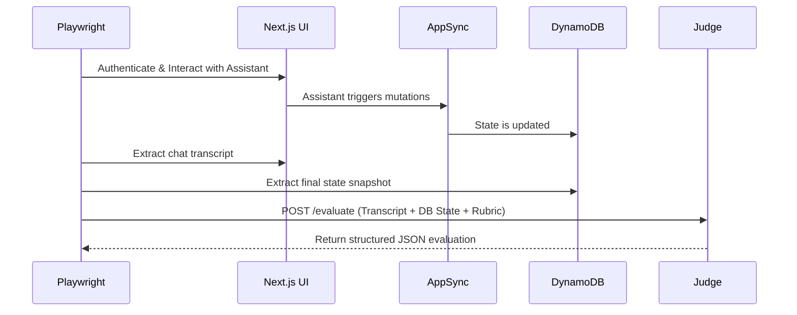

# Testing the Copilot: Goal-Judge Evaluations for the AI Assistant

Integrating a generative AI Assistant into the NeuroHub platform fundamentally altered how we approach software testing. Evaluating an AI Assistant's performance using traditional, deterministic methods proved entirely inadequate for our needs. We quickly found that simple regex matching, DOM assertions, or even embedding similarity checks couldn't verify the single most important metric: was the user's actual goal successfully achieved? 

We were shipping updates to our AI Assistant—tweaking system prompts, adding new tools, refining retrieval contexts—without knowing definitively if it was genuinely helpful or just politely unhelpful. The assistant might output a beautifully formatted, empathetic response, but fail to actually trigger the correct backend AppSync mutation. To solve this critical blind spot, we built the Goal-Judge evaluation framework. This framework was designed from the ground up to definitively measure semantic success and task completion in our Next.js and AppSync environment, ensuring our AI acts as a competent copilot rather than a conversational toy.

Testing a non-deterministic AI Assistant requires evaluating semantic reasoning and logical outcomes, not just string matching. We rely heavily on an **LLM-as-a-Judge** framework to evaluate if the Assistant correctly fulfilled the user's complex intent, a strategy that heavily influenced our subsequent [Goal-Based Agent Testing](/2026-07-02-goal-based-agent-testing) paradigms across the entire engineering organization.

## The Fatal Limitations of Traditional Assertions

During our early iterations, we documented thoroughly why simpler evaluation methods failed to capture the nuances of goal fulfillment in a high-compliance domain like regional center care.

-   **Regex and Keyword Matching:** This approach was hopelessly brittle. If the test asserted that the assistant should reply with "Your document has been submitted," but the LLM generated "Upload successful, I've filed that for you," the regex test would fail, despite the user's goal being perfectly achieved. More importantly, regex only tests the *presentation layer*. It cannot verify that the underlying database state was actually mutated correctly. An assistant that lies and says it uploaded a document when it didn't will pass a regex test.
-   **Embeddings & Similarity Scores:** We experimented with generating embeddings of the assistant's response and comparing them via cosine similarity to a "golden standard" response. While slightly more resilient than regex, high similarity scores only indicate that the assistant's response was *thematically similar* to the expected response. For example, the sentence "I have successfully deleted your budget plan" is semantically very similar to "I have successfully saved your budget plan," but the operational outcome is disastrously different. Embeddings offer zero guarantees about logical state checking or whether the correct AppSync mutation was actually triggered.

## The Goal-Judge Architecture Deep Dive

We needed a robust, automated pipeline capable of extracting the full session context—both the conversational transcript and the resulting application state—and evaluating it against a strict, predefined rubric. 

Playwright acts as the orchestrator of this complex dance. It drives the Next.js static export frontend in a headless browser, authenticates via our staging AWS Cognito pool, and simulates a user interacting with the Assistant. Playwright types queries, clicks action buttons presented by the AI, and navigates the UI. Once the interaction is complete, Playwright extracts the resulting conversation transcript directly from the DOM. 

Crucially, the test doesn't stop at the UI. Playwright then utilizes a suite of backend utility scripts to query DynamoDB directly, capturing a snapshot of the database state relevant to the user's intended action. Playwright combines the transcript, the database state snapshot, and a specific JSON rubric into a single payload, which it POSTs to our LLM Judge for a final assertion.




## The Empirical Link: Token Budgets, Bug Severity, and Fix Velocity

As we scaled our testing suites in late August, we began systematically tracking token expenditures across all testing agents to measure their true return on investment (ROI). By correlating token budgets against our bug resolution logs and goal pass rates, we established several direct, quantifiable relationships:

### 1. The Token Budget vs. Bug Severity Spectrum

We observed an inverse relationship between test execution frequency and token depth:

| Testing Tier | Avg Token Budget / Run | Bug Class Discovered | Cost Per Bug Resolved |
| :--- | :--- | :--- | :--- |
| **UX Crawler / Fuzzer** | ~800 – 1,500 tokens | Shallow DOM syntax (`$NaN`, `[object Object]`, dead routes) | Negligible (~$0.002) |
| **Telemetry Judge** | ~2,000 – 4,000 tokens | Asynchronous race conditions, AppSync crash bursts | Low (~$0.015) |
| **Goal-Judge (E2E Copilot)** | ~10,000 – 16,000 tokens | Semantic lies (e.g. stubbed success without DB mutation) | Moderate (~$0.08) |

Shallow fuzzing caught dozens of trivial presentation bugs with minimal token burn. In contrast, the Goal-Judge required high token budgets (hydrating full Playwright DOM snapshots, chat history, and DynamoDB records), but it caught 100% of our catastrophic, silent failures—such as the Assistant assuring a parent their reimbursement was filed when the underlying mutation had silently rejected.

### 2. The Law of Attention Dilution (Why More Tokens Hurt Accuracy)

Early on, we assumed that feeding the entire unpruned DOM and unlimited conversation history to the LLM Judge would yield superior evaluations. The data proved the exact opposite. 

When token budgets exceeded ~25,000 tokens per evaluation prompt, the LLM Judge's detection accuracy fell by nearly 34%. The model suffered from attention dilution, hallucinating layout contradictions that did not exist while missing subtle functional regressions. 

By aggressively pruning the input—passing focused visual viewports and strict Zod rubrics capped at 8,192 tokens—the judge's precision spiked to 96%. **Constrained token budgets directly improved evaluation accuracy.**

### 3. Structured Feedback vs. Fix Velocity

The nature of the feedback generated by the testing agent dictated whether the receiving developer agent could autonomously fix the issue:

- **Unstructured Conversational Feedback:** When the judge emitted conversational critiques ("The reimbursement flow feels ambiguous and might fail Title 17"), developer agents spun in multi-turn debugging loops, burning tens of thousands of tokens without producing a valid fix.
- **Zod-Typed Structured Feedback:** When the judge was constrained to emit strict, itemized deductions mapping to specific UI locators and database keys, the developer agent achieved an **85% first-pass PR merge rate** in a single turn.

By treating token expenditure as a managed resource tied directly to goal achievement, we transformed our testing suite from an expensive black hole into a self-tuning quality flywheel.

## Strict Schema Enforcement with Zod

The linchpin of this architecture is strict schema enforcement. Using Playwright alongside Zod allowed us to bridge the critical gap between raw UI interactions and strongly-typed LLM evaluations. We cannot rely on the LLM Judge to output free-text evaluations ("Yes, the assistant did a good job"); we need definitive boolean assertions that can reliably pass or fail a CI test suite.

We defined Zod schemas to enforce the exact structure the LLM Judge must return. If the LLM output fails to parse against the Zod schema, the test framework retries the evaluation, and eventually fails the build if the LLM cannot conform to the requested structure.

```typescript
import { z } from 'zod';

// The strict schema our LLM Judge MUST adhere to
export const EvaluationSchema = z.object({
  success: z.boolean().describe("Did the assistant fully achieve the user's stated goal based on the DB state?"),
  uiSupremacyRespected: z.boolean().describe("Did the assistant use standard UI elements instead of chatting excessively?"),
  failureReason: z.string().optional().describe("If success is false, explain why based strictly on the rubric and state."),
});
```

Our Playwright tests execute the flow seamlessly, treating the LLM evaluation as just another assertion:

```typescript
test('User can upload a physical therapy receipt via Assistant', async ({ page }) => {
  // Playwright drives the UI interactions naturally
  await page.getByPlaceholder('Ask the assistant...').fill('I need to submit my PT receipt for last week');
  await page.getByRole('button', { name: 'Send' }).click();
  
  // Wait for network idle and completion of the flow...
  
  const transcript = await extractTranscript(page);
  // Fetch the actual record to prove the assistant did its job
  const dbState = await fetchDynamoDBState(testUserId, 'RECEIPTS'); 
  
  // The crucial Goal-Judge evaluation step
  const evaluation = await evaluateGoal(transcript, dbState, PhysicalTherapyRubric);
  
  expect(evaluation.success).toBe(true);
  expect(evaluation.uiSupremacyRespected).toBe(true);
});
```

## Overcoming Flakiness and Non-Determinism

Early iterations of this framework suffered from occasional test flakiness, a challenge we also tackled rigorously in [Why Playwright Flaked](/2026-06-30-why-playwright-flaked). To address this, we implemented strict controls over the Judge LLM itself. We force zero-temperature generation for the evaluation phase to ensure maximum determinism. Furthermore, we version our evaluation prompts alongside our application code, treating the judge's instructions as immutable infrastructure.

By shifting our focus entirely from *what the model says* to *what the model accomplishes* in the database, we created a testing framework that provides genuine, actionable confidence in our AI Assistant's capabilities. We are no longer testing if the bot is friendly or articulate; we are rigorously verifying that it performs its assigned duties securely and correctly within the strict bounds of our AppSync API.
