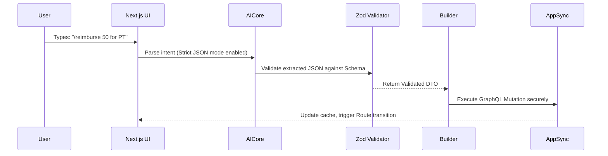

# Benchmarking Ninja Mode: Speed over Conversation

Shortly after the launch of our initial AI Assistant, our telemetry revealed a concerning and somewhat counter-intuitive trend: our most active power users were abandoning the new AI features entirely. When a professional user—such as an independent facilitator managing dozens of cases, or a parent navigating complex daily care routines—needs to quickly file a reimbursement or lookup a regional center policy, they do not want a conversation. They do not want to read a friendly, generated paragraph explaining what the AI is about to do, or thanking them for their input. They just want the action executed immediately. 

The conversational latency inherent in standard LLM interactions—where the model streams a preamble, outlines its reasoning, and finally executes a tool call—was actively destroying our tool's utility for high-volume, professional workflows. The cognitive load of reading "friendly" AI output was slowing our users down.

Our power users demand instant execution without conversational pleasantries. To address this fundamental UX mismatch, we engineered **Ninja Mode**, a profound architectural shift that bypasses the standard LLM chat paradigm in favor of a vastly faster, command-oriented execution surface.

## The Zero-Turn Execution Architecture

To achieve the instant response times required by Ninja Mode, we had to ruthlessly eliminate the LLM's natural tendency to chat before acting. In a standard React/Next.js architecture interacting with an LLM, when a user asks a question, the LLM streams a conversational response back to the client, and then, perhaps, executes a tool call to mutate state. This text generation phase blocks application state updates, hogs connection bandwidth, and significantly increases perceived latency.

Ninja Mode bypasses this generative step entirely by utilizing a Lexical Intent Router backed by strongly-typed Data Transfer Objects (DTOs) constructed via Zod. When Ninja Mode is active, we force the LLM into a strict structured-output mode (often referred to as JSON mode). We explicitly forbid the model from generating conversational text in its system prompt. Its sole, highly optimized purpose in Ninja Mode is to map the user's natural language input into a precise, validated JSON payload that exactly matches our AppSync GraphQL schema.



We enforce these structural schemas strictly through Zod to guarantee data integrity before any backend AppSync mutation is even attempted:

```typescript
// Strict schema required for Ninja Mode execution
// If the LLM cannot satisfy this schema, execution fails safely.
const ReimbursementIntentSchema = z.object({ 
  amount: z.number().positive(), 
  category: z.enum(["PHYSICAL_THERAPY", "RESPITE", "TRANSPORTATION", "EQUIPMENT"]),
  urgency: z.enum(["STANDARD", "HIGH"]).default("STANDARD"),
  dateOfService: z.string().datetime().optional()
});
```

If the user's request lacks the necessary information to satisfy the Zod schema (e.g., they type "/reimburse for PT" but forget the amount), the intent router instantly detects the validation failure. Instead of falling back to a conversational clarification ("I'm sorry, I didn't catch the amount..."), Ninja Mode immediately renders a highly targeted UI prompt—a native Next.js modal with an input field for the missing amount. This strictly adheres to our UI Supremacy guidelines, prioritizing fast, native components over slow, generated chat.

## Designing the Latency Benchmark in CI

Building Ninja Mode was only half the battle; preventing performance regressions as the codebase evolved was equally critical. We needed strict latency assertions built directly into our Playwright CI pipeline. This required a paradigm shift in how we test AI interactions, moving beyond mere functional correctness into hard, unforgiving performance constraints, building on methodologies we pioneered and discussed in [Adversarial Fuzzing Level 9](/2026-08-05-adversarial-fuzzing-level-9).

We measure end-to-end latency and ensure deterministic execution using native AWS Cognito authentication in our E2E tests. We absolutely avoid using mocks or simulated latency for these specific benchmarks; we want to measure the real-world network overhead of hitting our staging AppSync endpoints and the actual inference time of the LLM.

```typescript
import { test, expect } from '@playwright/test';

test('Executes /reimburse instantly without conversational UI', async ({ page }) => {
  const startTime = Date.now();
  
  // Simulate a power user firing a Ninja Mode command
  await page.getByPlaceholder('Command...').fill('/reimburse 50 for PT');
  await page.keyboard.press('Enter');
  
  // Wait for dynamic server-rendered route transition to the receipt page
  // This indicates the AppSync mutation succeeded and the UI updated
  await page.waitForURL('**/requests/receipts/**');
  
  const duration = Date.now() - startTime;
  
  // Strict latency assertion: Must complete intent parsing, schema validation, 
  // AppSync mutation, and UI routing in under 1500ms total.
  expect(duration).toBeLessThan(1500); 
  
  // Verify no chat bubbles were rendered during the transaction
  await expect(page.locator('.chat-bubble')).toHaveCount(0);
});
```

## Rejected Approaches and Lessons Learned

During the R&D phase of Ninja Mode, we evaluated and ultimately rejected several architectural workarounds before committing to fundamentally re-architecting the execution pipeline—lessons we codified early on in [The 14 Phase Roadmap](/2026-05-01-the-14-phase-roadmap).

-   **Client-Side LLM Execution:** We experimented with running smaller, quantized models directly in the browser via WebGL/WebGPU to eliminate network latency entirely. However, this proved disastrous. It was far too heavy for our average user's device, caused severe battery drain on mobile, and most importantly, it dangerously leaked core business logic and compliance rules to the client bundle. Security and compliance in our domain dictate that intent parsing and validation remain on the server.
-   **Optimistic UI Chat:** We tried rendering fake "typing..." indicators or optimistic success messages immediately in the chat interface while the LLM processed the actual mutation in the background via AppSync. This created a massive cognitive burden for power users, who had to second-guess whether the action *actually* happened. It degraded the tool from a precise, professional instrument to an unreliable conversational "toy" that couldn't be trusted.

By completely eliminating conversational fluff and relying entirely on strict Zod schemas, server-side intent routing, and lightning-fast AWS AppSync integrations, Ninja Mode optimizes for pure speed, data integrity, and professional-grade workflow efficiency. We successfully transformed our AI from a chatty companion into a high-speed execution engine tailored for power users.
