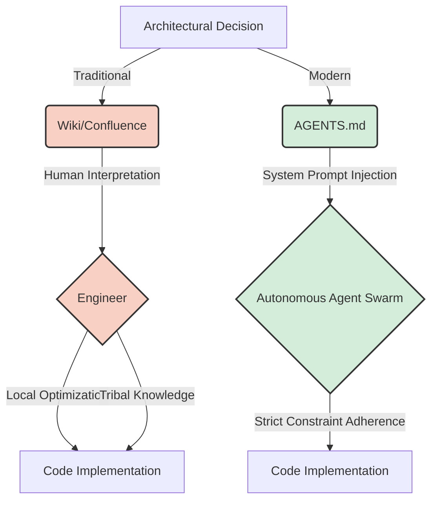
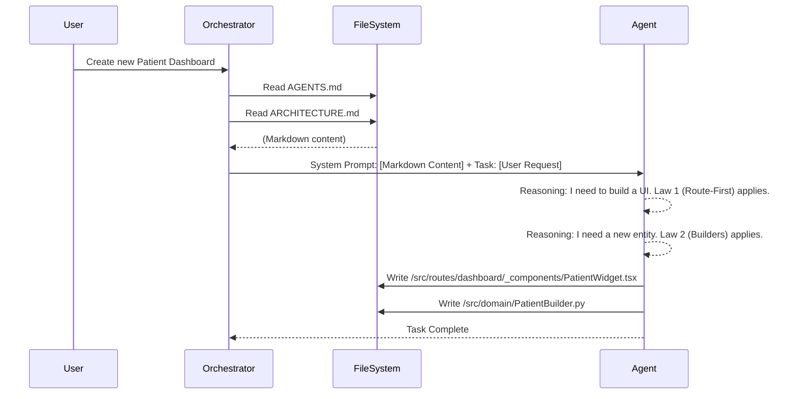

# Code Documentation as the Ultimate System Prompt

In an era where autonomous developers and agentic swarms form the backbone of modern engineering teams, the way we communicate architectural intent has fundamentally shifted. Gone are the days when documentation was an afterthought—a dusty wiki page updated quarterly by a beleaguered tech lead. Today, documentation is executable. It is the system prompt that dictates the behavior of a fleet of autonomous agents.

At NeuroHub, we’ve reached a critical inflection point. As of September 2026, we have formally recognized that our root-level markdown files—specifically files like `AGENTS.md` and `ARCHITECTURE.md`—are no longer just reference materials. They are the strict, executable laws of our codebase. They are the ultimate system prompts.

This deep dive explores how we transition from passive documentation to active, constraint-based system prompts that govern agentic behavior, the theoretical underpinnings of this shift, and the technical implementation of "Route-first Component Placement" and "Entity Construction via Builders."

## The Theoretical Shift: From Passive Wiki to Active Prompt

Historically, documentation was designed for human consumption. It was a lossy compression of architectural intent, relying on human intuition to fill in the gaps. When an engineer read a guideline like "use builder patterns for complex entities," they applied contextual judgment based on their experience.

Agents, however, lack this implicit, historical context. They operate in a hyper-literal paradigm. If a constraint is not explicitly stated and enforced, it does not exist. This necessitates a shift from *descriptive* documentation to *prescriptive, programmatic* system prompts.

### The Semantic Gap

Consider the traditional software development lifecycle (SDLC). The semantic gap between a high-level architectural decision (e.g., "We use Event Sourcing") and the actual implementation (a specific Kafka producer writing a specific protobuf schema) is massive. Human engineers bridge this gap through tribal knowledge and iterative PR reviews.

When replacing or augmenting human engineers with autonomous agents (the `/teamwork` clusters), this semantic gap becomes a chasm. Agents will hallucinate architectures if not strictly constrained. They will optimize for local, immediate problem-solving rather than global architectural consistency.

By elevating `AGENTS.md` to a system prompt, we close this gap. We inject the global context directly into the agent's pre-computation context window.



## Anatomy of an Executable Markdown Prompt

An executable markdown prompt is not just text. It is structured data masquerading as prose. It must be parsable by both human engineers and language models (LLMs). We structure our `AGENTS.md` using specific headers, bullet points, and code blocks that act as few-shot examples for the agent.

### Core Tenets of Prompt-Driven Documentation

1.  **Absolute Declarations:** Avoid words like "should" or "preferably." Use "MUST" and "NEVER" (RFC 2119 terminology).
2.  **Contextual Few-Shot Examples:** Provide exact, minimal code snippets that demonstrate the *only* acceptable way to implement a pattern.
3.  **Explicit File Paths:** Define exactly where files belong. Directory structures are not suggestions; they are laws.
4.  **Failure Modes:** Explicitly define anti-patterns. Tell the agent what *not* to do.

### Example: Route-First Component Placement

One of the most persistent issues with ad-hoc agentic development in frontend applications is component sprawl. Agents tend to create components wherever they are currently working, leading to a tangled mess of imports.

To combat this, we introduced the "Route-first Component Placement" law in our `AGENTS.md`.

#### The `AGENTS.md` Snippet

```markdown
### LAW: Route-First Component Placement

**Rule:** All UI components MUST be co-located with the route that primarily uses them. Shared components (used by >2 routes) MUST be placed in `/src/components/shared`.

**Anti-Pattern (NEVER DO THIS):**
- Creating a specific dashboard widget in `/src/components/DashboardWidget.tsx` when it is only used in `/src/routes/dashboard/page.tsx`.

**Correct Implementation (ALWAYS DO THIS):**
- Place the widget at `/src/routes/dashboard/_components/DashboardWidget.tsx`.

**Resolution Strategy:** If an agent attempts to import a component from a sibling route, the PR MUST fail validation. The agent must either duplicate the code (if divergence is expected) or promote the component to `/src/components/shared`.
```

#### TypeScript Implementation of the Constraint Checker

To enforce this, we don't just rely on the LLM's adherence to the prompt. We back it up with deterministic tooling. Here is a simplified version of our AST-based import checker that validates agent-generated PRs against the Route-first law.

```typescript
import { Project, ImportDeclaration, SourceFile } from 'ts-morph';
import * as path from 'path';

export class RouteFirstConstraintValidator {
    private project: Project;

    constructor(tsConfigFilePath: string) {
        this.project = new Project({ tsConfigFilePath });
    }

    public validate(): string[] {
        const violations: string[] = [];
        const sourceFiles = this.project.getSourceFiles('src/routes/**/*.tsx');

        for (const file of sourceFiles) {
            const imports = file.getImportDeclarations();
            for (const imp of imports) {
                const violation = this.checkImport(file, imp);
                if (violation) {
                    violations.push(violation);
                }
            }
        }

        return violations;
    }

    private checkImport(file: SourceFile, imp: ImportDeclaration): string | null {
        const moduleSpecifier = imp.getModuleSpecifierValue();
        const filePath = file.getFilePath();

        // Ignore third-party and shared imports
        if (!moduleSpecifier.startsWith('.') && !moduleSpecifier.startsWith('@/')) {
            return null;
        }
        if (moduleSpecifier.includes('/components/shared/')) {
            return null;
        }

        // Resolve absolute path of the import
        const dir = path.dirname(filePath);
        const resolvedImportPath = path.resolve(dir, moduleSpecifier);

        // Check if a route file is importing from another route's _components dir
        const routeRegex = /src\/routes\/([^/]+)\//;
        const currentRouteMatch = filePath.match(routeRegex);
        const importRouteMatch = resolvedImportPath.match(routeRegex);

        if (currentRouteMatch && importRouteMatch) {
            const currentRoute = currentRouteMatch[1];
            const importRoute = importRouteMatch[1];

            if (currentRoute !== importRoute && resolvedImportPath.includes('_components')) {
                return `VIOLATION in ${filePath}: Cannot import from sibling route component ${resolvedImportPath}. Promote to shared or co-locate.`;
            }
        }

        return null;
    }
}
```

## Entity Construction via Builders

Another major challenge is maintaining consistency in data modeling, especially when dealing with complex domain entities in our Python backend. When an agent creates a new entity (e.g., a `PatientRecord`), it must adhere to strict validation, initialization, and serialization rules.

If we simply tell the agent to "create a PatientRecord class," we will get ten different variations depending on the model's seed and temperature. Some will use `__init__`, some will use `dataclasses`, some will use `pydantic`.

We mandate "Entity Construction via Builders" in our `ARCHITECTURE.md`.

#### The `ARCHITECTURE.md` Snippet

```markdown
### LAW: Entity Construction via Builders

**Rule:** All domain entities MUST be instantiated using a dedicated Builder class. Direct instantiation via `__init__` is STRICTLY PROHIBITED for domain entities.

**Why:** This isolates construction logic, ensures all invariants are checked before the object exists, and provides a clear API for partial construction during testing.

**Implementation Constraint:**
- The entity class `__init__` MUST raise an exception if called directly.
- The Builder MUST implement a `.build()` method that returns the immutable entity.
- Use the `neurohub.core.base_builder` pattern.
```

#### Python Implementation

Here is how the agent is expected to implement this, guided by the few-shot examples in the markdown prompt.

```python
from typing import Optional
from dataclasses import dataclass
import uuid
from datetime import datetime, timezone

class DirectInstantiationError(Exception):
    """Raised when a domain entity is instantiated directly."""
    pass

@dataclass(frozen=True)
class PatientRecord:
    id: uuid.UUID
    mrn: str  # Medical Record Number
    created_at: datetime
    is_active: bool
    
    def __post_init__(self):
        # Prevent direct instantiation from outside the builder
        import inspect
        caller_frame = inspect.currentframe().f_back
        caller_class = caller_frame.f_locals.get('self', None).__class__.__name__
        
        if not caller_class.endswith('Builder'):
             raise DirectInstantiationError(
                 "PatientRecord MUST be instantiated via PatientRecordBuilder."
             )

class PatientRecordBuilder:
    def __init__(self):
        self._id: Optional[uuid.UUID] = None
        self._mrn: Optional[str] = None
        self._created_at: Optional[datetime] = None
        self._is_active: bool = True

    def with_id(self, patient_id: uuid.UUID) -> 'PatientRecordBuilder':
        self._id = patient_id
        return self

    def with_mrn(self, mrn: str) -> 'PatientRecordBuilder':
        if not mrn.isalnum():
            raise ValueError("MRN must be alphanumeric")
        self._mrn = mrn
        return self

    def created_on(self, timestamp: datetime) -> 'PatientRecordBuilder':
        self._created_at = timestamp
        return self

    def build(self) -> PatientRecord:
        if not self._mrn:
            raise ValueError("MRN is required to build a PatientRecord")
            
        return PatientRecord(
            id=self._id or uuid.uuid4(),
            mrn=self._mrn,
            created_at=self._created_at or datetime.now(timezone.utc),
            is_active=self._is_active
        )

# Agent Usage
# builder = PatientRecordBuilder().with_mrn("MRN12345").build()
```

### Alternative Approaches Considered and Rejected

Before settling on strict Markdown-based system prompts, we explored several alternative approaches to constraining agentic behavior.

#### 1. Fine-tuning the LLM

**Hypothesis:** We could fine-tune a model (e.g., Llama 3 or a GPT variant) on our existing codebase so that it naturally outputs code adhering to our architectural standards.

**Rejection Rationale:**
- **Cost and Latency:** Fine-tuning requires constant retraining as our architecture evolves. If we change a core library (e.g., migrating from `pydantic` v1 to v2), the fine-tuned model becomes instantly obsolete.
- **Catastrophic Forgetting:** Fine-tuning models on highly specific architectural quirks often degraded their general reasoning and problem-solving capabilities.
- **Lack of Explicitness:** Fine-tuning relies on the model internalizing patterns implicitly. We needed explicit, hard constraints. A model might "usually" output builder patterns, but we need it to "always" output builder patterns.

#### 2. Post-generation AST Transformation (Auto-fixing)

**Hypothesis:** Let the agents write whatever code they want, then use tools like jscodeshift (for JS/TS) or LibCST (for Python) to automatically rewrite the AST to adhere to our standards (e.g., automatically converting `__init__` classes to Builder patterns).

**Rejection Rationale:**
- **Complexity of Intent:** Auto-fixing formatting is easy. Auto-fixing architectural intent is nearly impossible. If an agent writes a monolithic 1000-line React component, an AST tool cannot easily determine how to split it into a container/presenter pattern or apply route-first logic. The context is lost.
- **Feedback Loop:** If the agent doesn't write the code correctly the first time, it doesn't learn. Injecting the constraints into the prompt ensures the agent's initial reasoning trace (Chain of Thought) includes the architectural constraints.

#### 3. Extremely Granular Ticketing

**Hypothesis:** Break down Jira tickets into micro-tasks that are so small, the agent cannot possibly deviate from the architecture. (e.g., "Ticket 1: Create `PatientRecordBuilder.py` shell. Ticket 2: Add `with_mrn` method.")

**Rejection Rationale:**
- **Management Overhead:** This merely shifts the burden from the agent back to the human tech lead. If a human has to write 50 micro-tickets, they might as well write the code themselves. The goal of the `/teamwork` swarm is autonomous problem-solving, not just typing out dictated code.

## The Agentic Workflow: Reading the Runes

How does this actually work in practice? When an agent is assigned a task, it does not immediately start writing code. It executes a mandatory pre-flight checklist.

1.  **Context Assembly:** The agent's orchestrator (our internal Antigravity framework) automatically pulls the `AGENTS.md` and `ARCHITECTURE.md` files from the root of the repository.
2.  **Prompt Prefixing:** These markdown files are injected as a highly weighted system prompt, prepended to the specific user request.
3.  **Constraint Acknowledgment:** The agent is required to output a "Chain of Thought" reasoning block that explicitly references the applicable laws from the markdown files before outputting any code.



## Scaling the Documentation

As the organization grows, a single `AGENTS.md` becomes unwieldy, potentially exceeding the optimal context window of the LLMs (even with 128k+ token windows, attention degradation in the middle of the prompt is a known issue).

To solve this, we employ **Retrieval-Augmented Prompting (RAP)** for our documentation.

Instead of injecting the entire monolithic markdown file, we split the documentation into a vector database of "Architectural Laws." When a user requests a new frontend feature, the orchestrator performs a semantic search against the documentation corpus, retrieving only the relevant laws (e.g., the Route-First Component Placement law) and injecting those into the prompt.

### The Structure of a Scalable Knowledge Base

We have migrated from a single `AGENTS.md` to a directory structure `/docs/agents/` containing granular, topic-specific markdown files.

```text
/docs/agents/
├── core/
│   ├── communication.md     # How agents talk to each other
│   └── error_handling.md    # Standardized fallback behaviors
├── frontend/
│   ├── routing_laws.md      # Route-first placement
│   └── state_management.md  # Rules for Redux/Zustand usage
└── backend/
    ├── entity_builders.md   # Builder pattern mandate
    └── db_migrations.md     # Rules for alembic scripts
```

This structure allows the orchestrator to dynamically compose the optimal system prompt based on the agent's assigned domain. An agent tasked with a backend API change will never see the frontend routing laws, saving valuable tokens and focus.

## Conclusion

The shift towards autonomous development requires a fundamental reimagining of what documentation is. It is no longer passive reference material; it is the source code for the engineering organization itself.

By treating `AGENTS.md` and related structural files as executable system prompts, we enforce architectural rigor at the point of generation. We transform ad-hoc agentic swarms into aligned, disciplined engineering teams. "Route-first Component Placement" and "Entity Construction via Builders" are not just good ideas—they are the physical laws of our codebase universe, strictly enforced by the markdown that governs them.

The next frontier for NeuroHub is self-updating documentation: creating secondary agentic loops that monitor code velocity and architectural friction, proposing amendments to `AGENTS.md` through pull requests. The system prompt will evolve itself. But for now, getting the swarm to read the manual is the most powerful optimization we have achieved.
