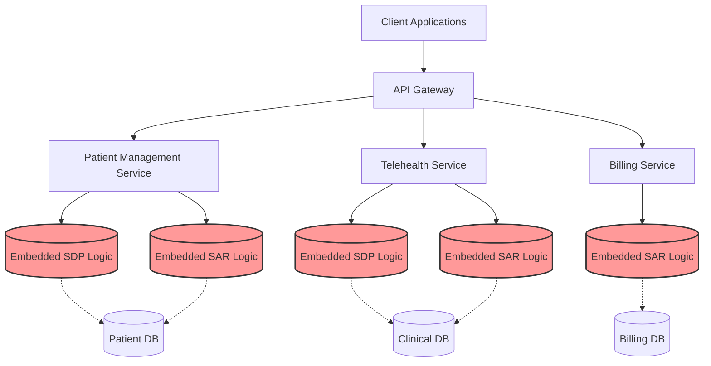
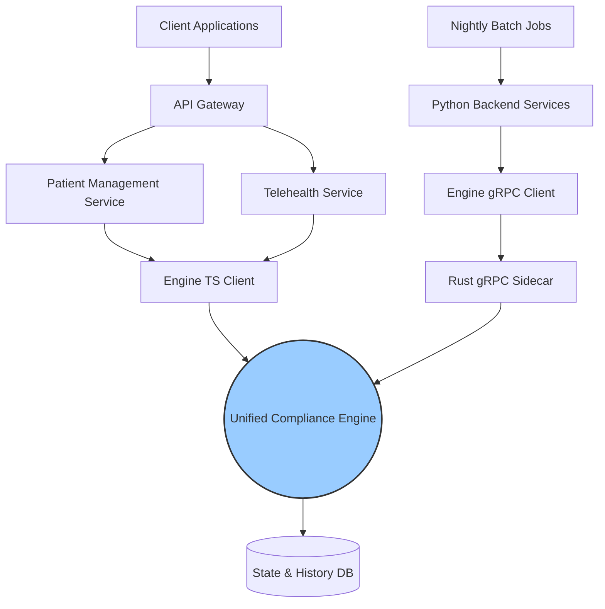

## Introduction: The Weight of Legacy Policy Logic

In the complex, ever-shifting landscape of healthcare technology, business logic is rarely static and almost never simple. At NeuroHub, our systems are bound by a vast array of regulatory and operational directives. Historically, these were encapsulated within two primary domains: Service Delivery Policies (SDP) and State Activity Rules (SAR). Over the years, as our platform scaled to support more nuanced care models, the implementation of these rules became increasingly fragmented. 

When a patient transitioned from one state of care to another, a web of SDP and SAR checks would fire asynchronously across multiple microservices. The logic for determining if a transition was compliant was not housed in a single, authoritative source. Instead, it was scattered across API gateways, backend services, and even frontend components. This architectural drift led to a scenario where a simple policy update—such as a new state mandate on telemedicine delivery—required surgical modifications across dozens of files in multiple repositories.

The cognitive load on our engineering team was immense. Testing the permutations of policy rules meant standing up full integration environments and hoping that edge cases wouldn't slip through. It became clear that to maintain our velocity and ensure absolute compliance, we needed to consolidate this fragmented logic into a centralized, authoritative system: the Unified Compliance Engine. However, the sheer volume of the code meant that manual refactoring was out of the question. We needed a different approach. We needed to leverage autonomous agents.

## The Original Architecture: A Distributed Nightmare

To understand the magnitude of the refactoring effort, we first have to look at the initial state of our architecture. The SDP and SAR systems were built at different times by different teams. SDP primarily handled the rules around *what* services could be delivered to a patient based on their current clinical state. SAR, on the other hand, governed the *how* and *where*—ensuring that the delivery mechanism complied with state-specific regulations and facility capabilities.



As illustrated above, the policy logic was deeply embedded within individual services. This tight coupling violated the Single Responsibility Principle and made it nearly impossible to gain a holistic view of the system's compliance posture. If an auditor asked for proof that a specific state rule was being enforced across all telehealth sessions, finding the exact code path was an exercise in extreme digital forensics.

Furthermore, this architecture suffered from critical race conditions. Because SAR and SDP checks were decoupled across different services, a patient's state could theoretically be updated by the Patient Management Service just milliseconds before the Telehealth Service queried the same patient's eligibility, leading to inconsistent compliance outcomes.

## The Theory of Compliance Engines

Before diving into the refactoring process, our architecture guild spent several weeks researching the theoretical underpinnings of policy enforcement. We evaluated several paradigms, ultimately settling on a model that combines aspects of a Finite State Machine (FSM) with a forward-chaining Rule Engine.

A Rule Engine evaluates a set of conditions against a known data payload (the context) to produce a boolean outcome or a set of actions. A State Machine governs the valid transitions between distinct states based on defined inputs. By marrying these two concepts, a Compliance Engine acts as the absolute gatekeeper for state transitions. It intercepts requests to change a patient's state, builds a comprehensive context of the patient's current situation, and evaluates that context against a unified rule graph.

The theoretical advantage of this approach is immense. It separates the *enforcement* of rules from the *definition* of rules. The business logic can be updated, versioned, and audited independently of the microservices that rely on it. It also guarantees transactional integrity; a state transition is either fully compliant and executed, or it is rejected with a detailed explanation of which policy rules failed.

## Alternative Approaches Considered and Rejected

During our design phase, we debated several architectural patterns. It's crucial to document not just what we built, but why we didn't build the alternatives.

### Alternative 1: Event Sourcing with CQRS
We considered moving the entire platform to an Event Sourced architecture where every compliance check and state change is appended to an immutable event log. The Command Query Responsibility Segregation (CQRS) pattern would allow us to build optimized read models for compliance reporting.

**Why we rejected it:** While elegant in theory, Event Sourcing introduces significant eventual consistency challenges. For healthcare compliance, we needed strict, synchronous validation before a state change occurred. The operational overhead of managing event stores, handling replay scenarios, and training the team on a completely new paradigm was deemed too high a risk for this specific problem domain.

### Alternative 2: Open Policy Agent (OPA)
We evaluated using an off-the-shelf engine like OPA, defining our SDP and SAR rules in Rego (OPA's query language). OPA is the industry standard for cloud-native policy enforcement.

**Why we rejected it:** OPA is phenomenal for infrastructure and access control policies. However, healthcare clinical rules often require deep, complex traversals of historical patient data and real-time external system queries (like checking a provider's active licensing status). While OPA supports external data integration, writing highly complex, domain-specific clinical algorithms in Rego proved to be incredibly difficult for our product engineers to maintain. We needed an engine that allowed rules to be written in a strongly typed, developer-friendly language (TypeScript/Python) while still providing the centralized enforcement benefits.

## Autonomous Orchestration with Antigravity

Once the architecture was finalized, the monumental task of migrating the scattered code remained. We estimated that manually untangling the logic, rewriting the rules into the new engine format, and refactoring the consuming services would take a senior engineering squad six months. This is where we leveraged our internal autonomous agent framework, Antigravity, specifically utilizing the `/teamwork` protocol.

The `/teamwork` protocol allows us to deploy a swarm of specialized AI agents to execute large-scale, cross-repository refactoring. However, autonomous agents without strict boundaries can easily introduce chaos, breaking builds and implementing non-standard patterns. To prevent this, we heavily relied on our `AGENTS.md` guidelines.

The `AGENTS.md` file acted as the constitutional law for the agent swarm. It defined:
1.  **The Engine Interface:** The strict TypeScript and Python interfaces that every new rule must adhere to.
2.  **State Machine Boundaries:** Rules dictating that agents could not modify the core state management logic, only the pre-transition validation hooks.
3.  **No Bloat Rule:** A strict mandate that agents must deduplicate logic. If an SDP rule and a SAR rule checked the same underlying data point, they had to be merged into a single, cohesive policy object.
4.  **Testing Mandate:** Every generated rule had to be accompanied by a comprehensive suite of unit tests covering both positive cases and critical edge cases.

With the boundaries set, we initiated the refactoring swarm.

## Building the Engine: TypeScript Deep Dive

The agents first targeted the Node.js microservices. Their goal was to extract the fragmented logic into our newly created `@neurohub/compliance-engine` internal package. 

Let's look at the core architecture the agents adhered to. The engine is built around the concept of an `EvaluationContext` and an array of `PolicyRule` objects.

```typescript
// @neurohub/compliance-engine/src/types.ts

export interface PatientContext {
  id: string;
  currentState: PatientState;
  clinicalHistory: ClinicalEvent[];
  demographics: PatientDemographics;
  insuranceProfiles: InsuranceProfile[];
}

export interface ProviderContext {
  id: string;
  licensureStates: string[];
  specialties: string[];
  activeSanctions: Sanction[];
}

export interface EvaluationContext {
  patient: PatientContext;
  provider: ProviderContext;
  proposedState: PatientState;
  metadata: Record<string, any>;
}

export enum RuleSeverity {
  INFO = 'INFO',
  WARNING = 'WARNING',
  CRITICAL_BLOCKER = 'CRITICAL_BLOCKER'
}

export interface RuleResult {
  passed: boolean;
  severity?: RuleSeverity;
  message?: string;
  remediationCode?: string;
}

export interface PolicyRule {
  ruleId: string;
  name: string;
  description: string;
  tags: string[]; // e.g., ['SDP', 'SAR', 'Telehealth', 'California']
  
  /**
   * Determines if this rule applies to the current context.
   * If false, the evaluate method is skipped.
   */
  isApplicable(context: EvaluationContext): boolean;
  
  /**
   * Evaluates the context against the business logic.
   */
  evaluate(context: EvaluationContext): Promise<RuleResult>;
}
```

The agents systematically analyzed the old codebases, identifying implicit rules and converting them into explicit `PolicyRule` implementations. For example, a deeply nested set of `if/else` statements in the Telehealth Service checking California-specific telehealth consent requirements was extracted into a discrete rule:

```typescript
// @neurohub/compliance-engine/src/rules/sar/CaliforniaTelehealthConsentRule.ts

import { PolicyRule, EvaluationContext, RuleResult, RuleSeverity } from '../../types';

export class CaliforniaTelehealthConsentRule implements PolicyRule {
  ruleId = 'SAR-CA-TELE-001';
  name = 'California Telehealth Consent Verification';
  description = 'Ensures documented patient consent exists before initiating a telehealth session in CA.';
  tags = ['SAR', 'Telehealth', 'Consent', 'California'];

  isApplicable(context: EvaluationContext): boolean {
    return context.proposedState === 'TELEHEALTH_SESSION_INITIATED' &&
           context.patient.demographics.stateOfResidence === 'CA';
  }

  async evaluate(context: EvaluationContext): Promise<RuleResult> {
    // Look through clinical history for a valid, unexpired consent form
    const hasValidConsent = context.patient.clinicalHistory.some(event => 
      event.type === 'CONSENT_SIGNED' && 
      event.details.consentType === 'TELEHEALTH_CA' &&
      this.isConsentUnexpired(event.date)
    );

    if (!hasValidConsent) {
      return {
        passed: false,
        severity: RuleSeverity.CRITICAL_BLOCKER,
        message: 'Missing or expired California telehealth consent form.',
        remediationCode: 'REQUIRE_NEW_CONSENT_FLOW'
      };
    }

    return { passed: true };
  }

  private isConsentUnexpired(dateStr: string): boolean {
    const oneYearAgo = new Date();
    oneYearAgo.setFullYear(oneYearAgo.getFullYear() - 1);
    return new Date(dateStr) > oneYearAgo;
  }
}
```

The unified engine then orchestrates these rules asynchronously, ensuring high performance even when evaluating dozens of complex policies:

```typescript
// @neurohub/compliance-engine/src/ComplianceEngine.ts

export class ComplianceEngine {
  constructor(private rules: PolicyRule[]) {}

  async evaluateTransition(context: EvaluationContext): Promise<EngineReport> {
    const applicableRules = this.rules.filter(rule => rule.isApplicable(context));
    
    // Evaluate all applicable rules concurrently
    const evaluations = await Promise.all(
      applicableRules.map(async rule => {
        try {
          const result = await rule.evaluate(context);
          return { ruleId: rule.ruleId, result };
        } catch (error) {
           // Fallback for rule execution failure - default to block
           return {
             ruleId: rule.ruleId,
             result: { 
               passed: false, 
               severity: RuleSeverity.CRITICAL_BLOCKER, 
               message: `Internal rule execution error: ${error.message}` 
             }
           };
        }
      })
    );

    const failures = evaluations.filter(e => !e.result.passed);
    const criticalFailures = failures.filter(e => e.result.severity === RuleSeverity.CRITICAL_BLOCKER);

    return {
      isCompliant: criticalFailures.length === 0,
      totalRulesEvaluated: applicableRules.length,
      failures: failures
    };
  }
}
```

## Backend Enforcement: Python Deep Dive

While the Node.js services handled user-facing transitions, our backend analytical and bulk-processing pipelines (written in Python) also needed to leverage the exact same policy logic to ensure data integrity during batch updates.

Rather than maintaining a dual implementation of the rules in Python, we built a highly efficient Rust-based sidecar that loaded the TypeScript engine via a V8 isolate. The Python backend communicates with this sidecar via gRPC. This guarantees that whether a state transition is initiated by a user in the React frontend or by a massive nightly batch job in Python, the exact same deterministic ruleset is applied.

The agents were tasked with refactoring the Python services to call the new gRPC client instead of relying on their legacy, often out-of-sync, local rule implementations.

```python
# backend_services/patient_pipeline/compliance_client.py

import grpc
import compliance_pb2
import compliance_pb2_grpc
from typing import Dict, Any, List

class ComplianceValidator:
    def __init__(self, grpc_endpoint: str):
        self.channel = grpc.insecure_channel(grpc_endpoint)
        self.stub = compliance_pb2_grpc.ComplianceEngineStub(self.channel)

    def validate_bulk_transition(self, patients: List[Dict[str, Any]], target_state: str) -> List[Dict[str, Any]]:
        """
        Validates state transitions for a batch of patients.
        Returns a list of results detailing compliance status.
        """
        requests = []
        for patient in patients:
            # Construct protobuf request from dictionary payload
            context = compliance_pb2.EvaluationContext(
                patient_id=patient['id'],
                current_state=patient['state'],
                proposed_state=target_state,
                payload_json=json.dumps(patient)
            )
            requests.append(compliance_pb2.ValidationRequest(context=context))
            
        try:
            # Stream requests to the gRPC sidecar
            response_iterator = self.stub.EvaluateBatch(iter(requests))
            
            results = []
            for response in response_iterator:
                results.append({
                    'patient_id': response.patient_id,
                    'is_compliant': response.is_compliant,
                    'failures': [
                        {'rule_id': f.rule_id, 'message': f.message} 
                        for f in response.failures
                    ]
                })
            return results
            
        except grpc.RpcError as e:
            logger.error(f"gRPC communication failed: {e.details()}")
            raise ComplianceEngineException("Failed to validate batch transition")
```

The agents systematically replaced thousands of lines of fragile Python logic with clean, resilient gRPC calls, drastically reducing the footprint of our backend services.

## The New Architecture: Centralized and Authoritative

With the rules extracted and the clients refactored, the resulting architecture is vastly superior.



This centralized model ensures that the Unified Compliance Engine acts as the single source of truth. The services are now completely agnostic to the specific rules of compliance; they only know how to ask the engine for permission to proceed.

## The Migration Execution and Validation

Executing a migration of this scale autonomously required a meticulously planned rollout strategy. We utilized a pattern known as the "Dark Read/Shadow Mode".

For the first two weeks, the autonomous agents deployed the code such that the legacy SDP and SAR logic continued to dictate the actual state transitions. However, alongside the legacy execution, the new Unified Compliance Engine was also invoked in the background. The results of the legacy systems and the new engine were compared and logged.

Whenever there was a discrepancy (e.g., the legacy system allowed a transition, but the new engine blocked it), an alert was fired to the engineering team. This allowed us to identify subtle edge cases and implicit rules that the agents might have missed during the static analysis phase. We found that in 99.8% of cases, the new engine perfectly mirrored the legacy behavior. In the remaining 0.2%, the new engine correctly identified compliance violations that the legacy system had been missing due to race conditions.

Once we achieved 100% confidence in the shadow data, we flipped the feature flags, deprecating the legacy code paths and routing all state transition authorizations exclusively through the new engine. The agents were then unleashed one final time to physically delete the dead legacy code across all repositories, removing tens of thousands of lines of technical debt.

## Conclusion

Migrating scattered, highly critical policy logic is traditionally one of the most dangerous and difficult tasks in software engineering. By utilizing the Antigravity `/teamwork` protocol and strictly enforcing boundaries via `AGENTS.md`, we successfully decoupled our SDP and SAR rules into a modern, centralized Compliance Engine.

The benefits have been immediate and profound. Our codebase is significantly leaner. State transitions are naturally guarded and mathematically provable. Most importantly, when the compliance team hands us a new state regulation, we no longer dread the refactoring effort. We simply write a new `PolicyRule`, add it to the graph, and the system inherently enforces it across the entire platform. This is the power of autonomous refactoring combined with solid architectural principles.
