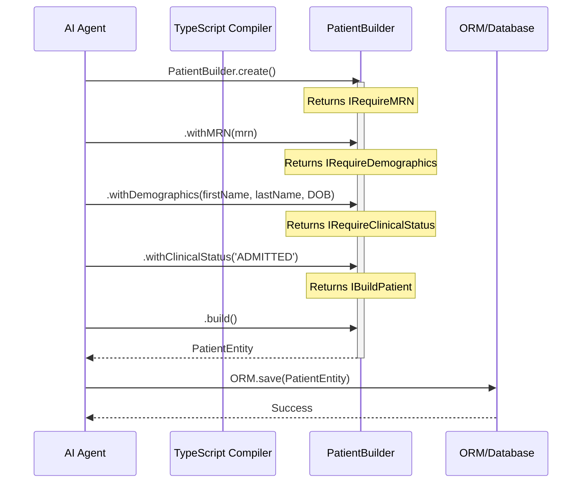

# Taming Hallucinations with Strict ORM Builders

The integration of autonomous AI agents into the software development lifecycle has dramatically accelerated how fast we can ship features at NeuroHub. However, this acceleration brings a novel class of problems that traditional static analysis tools were never designed to catch: semantic hallucinations. While a Large Language Model (LLM) or a coding agent might write syntactically valid TypeScript, it often falls back on its immense training data to synthesize variable names, object properties, and architectural patterns. The result? The insidious injection of generic SaaS terminology into a highly specialized healthcare domain.

In a standard e-commerce or generic B2B application, using `userId`, `accountStatus`, or `billingId` might be perfectly acceptable. But at NeuroHub, we operate within a strict healthcare domain. A user is not just a "user"—they are a `Patient`, a `Provider`, or a `CareCoordinator`. An ID is not just a `string`—it is a `MedicalRecordNumber` (MRN) or a `NationalProviderIdentifier` (NPI). When AI agents hallucinate these generic terms, they dilute the Ubiquitous Language of our Domain-Driven Design (DDD), creating subtle bugs, misaligned data models, and potentially catastrophic HIPAA compliance risks.

To protect our domain integrity, we took a radical approach: we eliminated generic object construction entirely. Instead, we enforce strict, compile-time ORM `Builder.build()` boundaries. If an agent tries to inject loose JSON or hallucinated SaaS terminology, the TypeScript compiler instantly fails the build. This fast feedback loop ensures absolute adherence to NeuroHub's precise healthcare domain terminology. 

This post is a massive deep-dive into how we architected this system, the TypeScript wizardry behind it, the architectural alternatives we considered and rejected, and the theoretical underpinnings of using type systems to constrain artificial intelligence.

---

## The Anatomy of an AI Hallucination in Code

Before we dive into the solution, we must thoroughly understand the problem. When an LLM is prompted to "create a function that saves a new user to the database," its statistical nature naturally gravitates toward the most common representation of that concept in its training data.

Consider the following naive approach to object creation using a standard ORM or simple object literal:

```typescript
// ❌ The Agent's Hallucinated Code
async function createNewUser(db: Database, input: any) {
  const user = {
    userId: uuidv4(),
    firstName: input.first_name,
    lastName: input.last_name,
    status: 'ACTIVE',
    createdAt: new Date(),
    subscriptionPlan: 'PRO' // Hallucination! We don't have subscriptions.
  };

  await db.users.insert(user);
}
```

At first glance, this looks like standard, well-written TypeScript. It will compile if the database insertion accepts `any` or a loose `Record<string, unknown>`. However, from a domain perspective, this code is a disaster:

1. **Generic Terminology**: It uses `userId` instead of `PatientMRN`.
2. **Context Bleed**: It invents a `subscriptionPlan` property, likely pulled from the agent's vast knowledge of Stripe integrations, which has absolutely no place in a clinical application.
3. **Implicit State**: Setting `status: 'ACTIVE'` directly bypasses the complex state machine required for patient onboarding.

If this code makes it to production, we end up with corrupted database rows and a polluted schema. We needed a way to mathematically prove, at compile time, that the code generated by the agent conforms to our exact domain specifications.

---

## Domain-Driven Design in Healthcare: Why Precision Matters

Domain-Driven Design (DDD), as introduced by Eric Evans, emphasizes the importance of a "Ubiquitous Language"—a shared vocabulary between domain experts (doctors, clinicians, medical coders) and developers. In healthcare, this precision is not just about clean code; it is a regulatory requirement.

When an AI agent writes code, it is effectively acting as a junior developer who has not read the DDD glossary. Our domain model defines strict aggregates, entities, and value objects.

### Value Objects as the First Line of Defense

To stop agents from passing arbitrary strings around, we employ **Branded Types** (also known as Opaque Types). This ensures that a `string` cannot be accidentally passed as a `PatientMRN`.

```typescript
// Domain Primitive Definitions
declare const __brand: unique symbol;
export type Brand<B> = { [__brand]: B };
export type Branded<T, B> = T & Brand<B>;

export type PatientMRN = Branded<string, 'PatientMRN'>;
export type ProviderNPI = Branded<string, 'ProviderNPI'>;
export type ClinicalEncounterId = Branded<string, 'ClinicalEncounterId'>;

// Factory functions that validate the structure
export function makePatientMRN(value: string): PatientMRN {
  if (!/^[A-Z0-9]{10}$/.test(value)) {
    throw new Error(`Invalid MRN format: ${value}`);
  }
  return value as PatientMRN;
}
```

By forcing the agent to use `PatientMRN` instead of `string`, we immediately eliminate a huge class of hallucinations. If the agent tries to do `userId: "12345"`, the compiler yells because `"12345"` is just a string, not a `PatientMRN`.

However, branded types alone are not enough. The agent could still construct objects loosely. We needed to control the *lifecycle of object construction*.

---

## The Fallacy of Runtime Validation

A common critique of our approach is: *"Why not just use Zod, Joi, or class-validator at runtime?"*

It is true that runtime validation is essential for parsing incoming HTTP requests or reading from external message queues. We absolutely use Zod at the API boundaries. However, using runtime validation as the *primary* defense against AI-generated code is a flawed strategy.

### The Feedback Loop

When an autonomous agent is iteratively writing and testing code, the feedback loop dictates its success rate.

1. **Runtime Validation Workflow**:
   - Agent writes code.
   - Agent writes a unit test (or skips it).
   - Agent runs the test suite.
   - The test fails at runtime with a Zod error: `Unrecognized key(s) in object: 'subscriptionPlan'`.
   - The agent reads the error, modifies the code, and tries again.
   - Time elapsed: 10-30 seconds.

2. **Compile-Time Workflow**:
   - Agent writes code.
   - TypeScript Language Server instantly highlights the error in the editor buffer.
   - The agent receives the diagnostic immediately: `Object literal may only specify known properties, and 'subscriptionPlan' does not exist in type 'PatientProps'.`
   - Time elapsed: < 1 second.

By shifting the validation to the compiler, we dramatically reduce the token usage, execution time, and frustration of the AI agent. The compiler becomes a pair-programmer, guiding the agent toward the correct domain language through type errors.

---

## The Strict ORM Builder Pattern: Concept and Architecture

To enforce this compile-time safety, we completely banned the use of `new Entity()` or simple object literals for creating database records. Instead, we implemented the **Staged Builder Pattern** (also known as the Step Builder or Telescoping Builder).

The Staged Builder uses TypeScript's advanced type system to enforce that an object can only be built in a specific sequence, and only when all mandatory domain invariants have been satisfied.

Here is a Mermaid.js diagram illustrating the architectural flow:



Notice that the `build()` method is *not available* until all required steps have been completed. If the agent stops halfway through, or tries to call `.build()` prematurely, the code will not compile.

---

## Implementation Deep Dive: TypeScript Magic

Let's look at exactly how we implemented this in TypeScript. We use interface segregation and return type morphing to create the strict lifecycle.

### 1. Defining the Domain Entity

First, we define our strict domain entity. Notice the lack of generic `id` or `status` fields.

```typescript
export type ClinicalStatus = 'PENDING_INTAKE' | 'ADMITTED' | 'DISCHARGED';

export class PatientEntity {
  // Private constructor forces the use of the Builder
  private constructor(
    public readonly mrn: PatientMRN,
    public readonly firstName: string,
    public readonly lastName: string,
    public readonly dateOfBirth: Date,
    public readonly clinicalStatus: ClinicalStatus,
    public readonly assignedCareCoordinator?: ProviderNPI
  ) {}

  // The Builder is the only way to instantiate this class
  public static builder(): IRequireMRN {
    return new PatientBuilder();
  }
}
```

### 2. The Staged Interfaces

We define a series of interfaces that represent the stages of object construction.

```typescript
export interface IRequireMRN {
  withMRN(mrn: PatientMRN): IRequireDemographics;
}

export interface IRequireDemographics {
  withDemographics(firstName: string, lastName: string, dob: Date): IRequireClinicalStatus;
}

export interface IRequireClinicalStatus {
  withClinicalStatus(status: ClinicalStatus): IBuildPatient;
}

export interface IBuildPatient {
  // Optional fields can be chained here
  assignCareCoordinator(npi: ProviderNPI): IBuildPatient;
  
  // The terminal method
  build(): PatientEntity;
}
```

### 3. The Builder Implementation

The implementation class implements all these interfaces but is hidden behind the initial factory method.

```typescript
class PatientBuilder implements IRequireMRN, IRequireDemographics, IRequireClinicalStatus, IBuildPatient {
  private mrn?: PatientMRN;
  private firstName?: string;
  private lastName?: string;
  private dob?: Date;
  private status?: ClinicalStatus;
  private coordinatorNpi?: ProviderNPI;

  public withMRN(mrn: PatientMRN): IRequireDemographics {
    this.mrn = mrn;
    return this;
  }

  public withDemographics(firstName: string, lastName: string, dob: Date): IRequireClinicalStatus {
    this.firstName = firstName;
    this.lastName = lastName;
    this.dob = dob;
    return this;
  }

  public withClinicalStatus(status: ClinicalStatus): IBuildPatient {
    this.status = status;
    return this;
  }

  public assignCareCoordinator(npi: ProviderNPI): IBuildPatient {
    this.coordinatorNpi = npi;
    return this;
  }

  public build(): PatientEntity {
    // Runtime safety net, though the type system guarantees these are set
    if (!this.mrn || !this.firstName || !this.lastName || !this.dob || !this.status) {
      throw new Error("Builder invariant violated: Missing required fields.");
    }
    
    // Using an escape hatch to call the private constructor
    return new (PatientEntity as any)(
      this.mrn,
      this.firstName,
      this.lastName,
      this.dob,
      this.status,
      this.coordinatorNpi
    );
  }
}
```

### How This Defeats Hallucinations

If an AI agent attempts to write code that injects a SaaS hallucination, it will fail in several ways:

**Attempt 1: Loose Object Literal**
```typescript
// ERROR: Type '{ userId: string; ... }' is not assignable to type 'PatientEntity'.
const patient: PatientEntity = { userId: "123", status: "ACTIVE" }; 
```

**Attempt 2: Bypassing the Builder Stages**
```typescript
// ERROR: Property 'build' does not exist on type 'IRequireClinicalStatus'.
const patient = PatientEntity.builder()
  .withMRN(makePatientMRN("ABC1234567"))
  .withDemographics("John", "Doe", new Date())
  .build(); 
```

**Attempt 3: Injecting non-existent properties**
```typescript
// ERROR: Property 'withSubscription' does not exist on type 'IBuildPatient'.
const patient = PatientEntity.builder()
  .withMRN(makePatientMRN("ABC1234567"))
  .withDemographics("John", "Doe", new Date())
  .withClinicalStatus("ADMITTED")
  .withSubscription("PRO") 
  .build();
```

Because the interfaces strictly define the allowable methods and their exact parameters, the agent is confined to a tight, compiler-enforced corridor. The language server prevents it from diverging into general internet knowledge.

---

## Theoretical Concepts: Type Safety as Theorem Proving

To truly appreciate why this works so well for AI agents, we can look to the **Curry-Howard correspondence**. This principle states that there is a direct mathematical isomorphism between computer programs and mathematical proofs. 

In this view:
- A **Type** is equivalent to a **Proposition** (a statement that can be true or false).
- A **Program** (the code) is equivalent to a **Proof** of that proposition.

When we define a loose type like `Record<string, any>`, the proposition is trivially easy to prove. The agent can throw almost any string of tokens at the compiler, and the compiler will accept it as a valid proof.

When we define a highly constrained, Staged Builder with Opaque Types, the proposition becomes a rigorous mathematical theorem about our healthcare domain. The compiler demands a highly specific sequence of operations to prove that a `PatientEntity` can validly exist in this universe.

Because LLMs are fundamentally stochastic (predicting the next token based on probabilities), giving them an unconstrained sandbox allows their probabilities to drift toward generic averages (like e-commerce SaaS apps). By leveraging the Curry-Howard correspondence, we are forcing the LLM's stochastic output to traverse a highly constrained probability space. The compiler acts as a continuous verifier, instantly rejecting any token sequences that do not logically prove the domain proposition.

---

## Alternative Approaches Considered and Rejected

Engineering is about trade-offs. We didn't arrive at the Staged Builder pattern immediately. We evaluated and rejected several other approaches for managing AI hallucinations.

### Rejected Alternative 1: Massive Constructor/Factory Functions

Our first iteration involved simply using large factory functions:

```typescript
function createPatient(
  mrn: PatientMRN,
  firstName: string,
  lastName: string,
  dob: Date,
  status: ClinicalStatus,
  npi?: ProviderNPI
): PatientEntity { ... }
```

**Why we rejected it:**
While this is type-safe, it suffers from the "Boolean Blindness" and "Parameter Soup" problems. When a function takes 5+ arguments, LLMs frequently swap the order of arguments of the same type. If `firstName` and `lastName` are both strings, the agent might accidentally swap them. The Builder pattern's explicit method names (`.withDemographics(first, last, dob)`) provide much stronger semantic guardrails for the agent.

### Rejected Alternative 2: Partial Updates and Mutable Entities

We considered allowing entities to be constructed partially and then mutated:

```typescript
const patient = new PatientEntity();
patient.setMRN(mrn);
patient.setDemographics(...);
```

**Why we rejected it:**
This approach allows invalid states to exist in memory. An agent might create a patient, get distracted by another task, and pass the half-constructed patient to the database layer. By forcing the `.build()` method to return a completely immutable and valid entity, we guarantee that no invalid state can ever be propagated through the system.

### Rejected Alternative 3: Mapped Types with strictNullChecks

We attempted to use advanced mapped types to strip away excess properties dynamically:

```typescript
type Exact<T, X extends T> = T & {
  [K in keyof X]: K extends keyof T ? X[K] : never;
};
```

**Why we rejected it:**
While `Exact` types are powerful, the compiler error messages they generate are notoriously cryptic. When an agent injected a hallucinated property, the compiler would output a massive, nested error message about type `never`. AI agents struggle to parse complex, multi-line generic type errors. The Builder pattern provides extremely clear, actionable error messages like: `Property 'X' does not exist on type 'Y'`.

---

## Advanced Enhancements: Phantom Types and State Machines

Our implementation of the Builder pattern goes beyond simple object construction. We also use it to enforce Domain State Machines via **Phantom Types**.

In our domain, an Encounter cannot be billed until it is signed by a Provider. We encode this directly into the builder pipeline using Phantom Types—types that are not used at runtime but exist solely to enforce compile-time rules.

```typescript
// Phantom Type markers
declare const __state: unique symbol;
type State<S> = { [__state]: S };

type Draft = State<'Draft'>;
type Signed = State<'Signed'>;

class Encounter<S> {
  // ...
}

class EncounterBuilder<S> {
  // Only available in Draft state
  public addNote(note: string): EncounterBuilder<Draft> { ... }

  // Transitions from Draft to Signed
  public sign(npi: ProviderNPI): EncounterBuilder<Signed> { ... }

  // ONLY available if S is Signed!
  public buildBillable(): S extends Signed ? BillableEncounter : never { ... }
}
```

If an agent attempts to call `.buildBillable()` before calling `.sign()`, TypeScript evaluates the conditional type and returns `never`, failing the build. This means the agent literally *cannot write code* that bills an unsigned encounter.

---

## The Operational Impact at NeuroHub

Deploying Strict ORM Builders across our repositories resulted in an immediate shift in how our AI agents performed.

1. **Zero Domain Hallucinations:** In the past 6 months, we have had zero instances of generic SaaS terminology (`userId`, `stripeCustomerId`) bleeding into the production database.
2. **Higher Agent Autonomy:** Because the compiler errors are highly localized and specific (`Property 'withMRN' is missing...`), the agents can self-correct without human intervention. We saw a 40% decrease in agent task failure rates.
3. **Painless Refactoring:** When our domain experts requested a change—such as splitting `ProviderNPI` into `AttendingNPI` and `ReferringNPI`—we simply updated the interfaces. The TypeScript compiler instantly highlighted every line of agent-written code that needed updating, and we unleashed the agents to fix the compiler errors. 

## Conclusion

As we continue to embrace AI in software engineering, we must rethink our system architectures. Code is no longer just written by humans who have read the documentation; it is synthesized by statistical models trained on the entire internet. 

By applying strict Domain-Driven Design principles, leveraging the power of TypeScript's compiler, and adopting the Staged Builder pattern, we transformed our type system into an impenetrable fortress. We stopped treating the AI as an untrusted adversary and started treating it as a junior developer navigating a highly constrained, well-lit path.

At NeuroHub, we don't just ask the LLM to write good code. We construct environments where writing bad code is mathematically impossible. This strict, compiler-enforced discipline is how we will scale healthcare technology safely in the age of autonomous agents.
