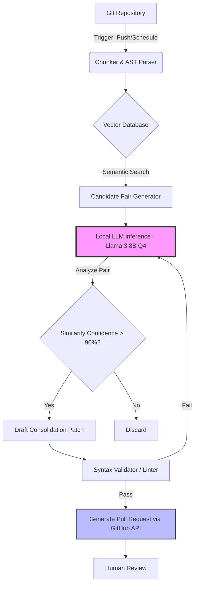

# Introduction: The 190,000-Line Tech Debt Leviathan

When engineering teams scale rapidly, the codebase often scales at a faster, more chaotic rate. At NeuroHub, our core monorepo had swelled to a staggering 190,000 lines of code across TypeScript, Python, and Go. What started as an elegant micro-service architecture had mutated into a sprawling leviathan of duplicated logic, inconsistent error handling, and deprecated endpoints that were too terrifying to touch. The tech debt was no longer just an abstraction; it was a tangible anchor dragging down our velocity, inflating our CI/CD pipelines, and increasing our cognitive load to unsustainable levels.

The traditional approach to this problem—halting feature development for a "refactoring sprint" or a "quality month"—was a non-starter. Our product roadmap was aggressive, and business needs dictated that we keep shipping. The second traditional approach—introducing strict linters and static analysis tools—was already in place, but tools like ESLint or SonarQube, while excellent at catching syntax errors and surface-level anti-patterns, fundamentally lack the semantic understanding necessary to identify deep structural duplication across decoupled services.

We needed a system that could reason about code semantics, identify duplicate business logic disguised under different variable names or architectural patterns, and propose safe, consolidated refactors. Naturally, we turned our attention to Large Language Models (LLMs).

## The API Cost Barrier

Our initial prototype was built around flagship frontier models via cloud APIs (GPT-4 and Claude 3.5 Sonnet). The pipeline was conceptually simple: chunk the repository, generate abstract syntax trees (ASTs), feed the chunks into the LLM, and prompt it to find similarities and suggest consolidations.

The results were incredibly promising from a qualitative standpoint. The models easily spotted that our `PaymentProcessor` in the billing service and our `SubscriptionHandler` in the user service were executing functionally identical retry logic, albeit written in different years by different engineers.

However, the unit economics were disastrous. To perform a continuous, asynchronous scrub of a mutating 190K LoC repository, we had to process tens of millions of tokens daily. A single full pass over the repository, including the necessary context windows, chain-of-thought prompting, and iterative refinement, cost approximately $450 in API fees. Running this continuously on every PR and main branch update would have translated to thousands of dollars a week—a cost entirely disproportionate to the immediate business value of the refactoring. 

Furthermore, sending proprietary, sensitive backend logic—including cryptographic implementations and proprietary algorithmic trading logic—to a third-party API raised substantial compliance and security red flags from our InfoSec team.

We needed the reasoning capabilities of an LLM, but we needed it to be free, fast, and entirely on-premise. We needed to pivot to local, highly-quantized LLMs.

# Theoretical Concepts: Code Compression and Semantic Similarity

Before diving into the implementation details of our local solution, it's vital to understand the theoretical underpinnings of what we were trying to achieve. We view refactoring not merely as "cleaning up," but as a form of lossless code compression. 

### Kolmogorov Complexity in Codebases

In algorithmic information theory, the Kolmogorov complexity of an object (like a codebase) is the length of the shortest possible program that produces the object as output. While true Kolmogorov complexity is uncomputable, it serves as a powerful mental model. When a codebase contains duplicated logic, its actual length is much larger than its approximate Kolmogorov complexity. Our goal was to push the codebase closer to this theoretical minimum without altering its observable behavior.

### ASTs vs. Semantic Embeddings

To find these opportunities for compression, we needed a way to compare code snippets. 
1. **Abstract Syntax Trees (ASTs):** ASTs represent the structural and syntactic relationships in code. Comparing ASTs can catch identical functions that simply have different variable names. However, if Engineer A implemented a loop using a `map/reduce` paradigm and Engineer B used a traditional `for` loop, the ASTs would look entirely different, even if the semantic outcome was identical.
2. **Semantic Embeddings:** Vector embeddings generated by LLMs represent the semantic meaning of the code. By plotting code chunks in a high-dimensional vector space, we can compute the cosine similarity between them. If two functions are close in vector space, they likely perform the same task, regardless of their syntactic structure.

Our local LLM pipeline needed to leverage both: ASTs for efficient chunking and structural pre-filtering, and LLM-generated embeddings/inference for deep semantic comparison.

# Evaluating the Stack: Alternatives Considered and Rejected

Building a continuous refactoring engine is a complex architectural challenge. We evaluated several approaches before settling on our final design.

### Approach 1: Cloud API Flagship Models (e.g., GPT-4o, Claude 3.5)
**Pros:** 
- State-of-the-art reasoning capabilities.
- Zero infrastructure overhead.
- Excellent zero-shot instruction following.
**Cons:**
- Prohibitively expensive at our scale ($450+ per full repository scan).
- Data privacy and compliance concerns.
- Rate limits hindered highly parallelized asynchronous scans.
**Verdict:** Rejected due to cost and compliance.

### Approach 2: Heavy Open-Source Models (e.g., Llama 3 70B, Mixtral 8x22B)
**Pros:**
- Complete data privacy.
- No recurring token costs.
- Near-frontier reasoning capabilities.
**Cons:**
- Required massive GPU clusters (multiple A100s or H100s) to run at acceptable speeds.
- The infrastructure cost of running these instances 24/7 negated the API cost savings.
**Verdict:** Rejected due to infrastructure costs.

### Approach 3: Traditional Static Analysis & Code Duplication Tools (e.g., jscpd, SonarQube)
**Pros:**
- Extremely fast and computationally cheap.
- Easy to integrate into existing CI/CD.
**Cons:**
- Only catches literal duplication or trivial variations.
- Cannot reason about semantics or propose complex architectural consolidations.
- High false-positive rate for boilerplate code, leading to alert fatigue.
**Verdict:** Insufficient for our needs, though retained as a pre-commit check.

### The Winning Approach: Highly Quantized Local LLMs (Llama 3 8B Q4_K_M)
We discovered that we didn't need the generalized reasoning capabilities of a 70B parameter model to identify code duplication. A smaller model, fine-tuned or heavily prompted for code analysis, could perform exceptionally well if given the right context. 

We selected **Llama 3 8B Instruct**. However, running even an 8B model in fp16 requires roughly 16GB of VRAM, which was still too heavy for our target deployment environment (idle M2/M3 Mac Minis in our server closet and background processes on developer machines). 

To solve this, we utilized **llama.cpp** to quantize the model to 4-bit precision (Q4_K_M). Quantization maps the high-precision weights (e.g., 16-bit floats) to lower-precision representations (e.g., 4-bit integers). While this introduces a small amount of quantization error, empirical testing showed that for the specific task of code comprehension and comparison, the degradation in quality was negligible, while the VRAM requirement plummeted to around 5GB. This allowed us to run the model effortlessly on consumer hardware.

# Architecture: The `@auditor` Bot Workflow

With our model selected and quantized, we designed the `@auditor` bot. This bot runs as a continuous background daemon, constantly scrubbing the repository, building an internal map of semantics, and drafting Pull Requests (PRs) when it finds optimization opportunities.

Here is the high-level architecture of the `@auditor` pipeline:



## Step 1: The Chunker and AST Parser

The first step in the pipeline is breaking down the 190K lines of code into digestible, semantically meaningful chunks. Simple line-based chunking is disastrous for code; cutting a function in half destroys its context.

Instead, we use `tree-sitter` to parse the code into an AST and extract complete functional units (classes, methods, functions). 

Here is a simplified Python snippet demonstrating our extraction logic using `tree-sitter`:

```python
import tree_sitter_python as tspython
from tree_sitter import Language, Parser

def extract_functions(source_code: bytes) -> list[str]:
    # Initialize the Tree-sitter parser for Python
    PY_LANGUAGE = Language(tspython.language(), "python")
    parser = Parser()
    parser.set_language(PY_LANGUAGE)

    tree = parser.parse(source_code)
    functions = []

    # Traverse the AST to find function definitions
    def traverse(node):
        if node.type == 'function_definition':
            # Extract the raw source code for this specific function
            func_code = source_code[node.start_byte:node.end_byte].decode('utf-8')
            functions.append(func_code)
        for child in node.children:
            traverse(child)

    traverse(tree.root_node)
    return functions

# Example usage
sample_code = b"""
def calculate_discount(price, rate):
    if price < 0: return 0
    return price * (1 - rate)

class User:
    def get_name(self):
        return self.name
"""
print(f"Extracted {len(extract_functions(sample_code))} functions.")
```

This ensures that the LLM only ever sees complete, structurally sound blocks of logic.

## Step 2: Vectorization and Candidate Generation

Once we have our chunks, we need to find pairs that might be duplicates. Comparing every chunk against every other chunk in an $O(N^2)$ operation is computationally infeasible for a large repository. 

Instead, we use a lightweight embedding model (like `all-MiniLM-L6-v2`) to generate a vector representation of each chunk. We store these vectors in a local ChromaDB instance. 

When searching for duplicates, we take a target chunk, query the vector database for the top $K$ nearest neighbors (using cosine similarity), and flag these pairs as candidates. This reduces the search space from billions of comparisons to just a few thousand highly probable matches.

## Step 3: Local LLM Inference for Deep Analysis

This is where the heavily quantized Llama 3 model shines. We feed the candidate pairs to the local model running via `llama.cpp` and ask it to perform a rigorous analysis.

The prompt we use is highly structured and demands a specific JSON output to ensure reliable parsing by our pipeline:

```text
You are an expert Principal Software Engineer. Analyze the following two code snippets.
Your goal is to determine if they are semantically equivalent and can be consolidated into a single, shared utility.

Snippet A:
{snippet_a}

Snippet B:
{snippet_b}

Respond with a JSON object adhering to this schema:
{
  "is_equivalent": boolean,
  "confidence_score": integer (0-100),
  "reasoning": string,
  "consolidation_strategy": string (or null if not equivalent)
}
```

By running this locally, we can execute thousands of these prompts per hour at zero marginal cost. 

## Step 4: Drafting Consolidation Patches

If the model identifies a candidate pair with a high confidence score (>90%), the pipeline proceeds to the drafting phase. We issue a secondary prompt to the local LLM, providing both snippets and asking it to write a unified function that satisfies the requirements of both, along with the necessary refactoring instructions.

This is the most challenging part for an 8B model. While it excels at identifying similarity, writing completely flawless, generalized code across edge cases requires careful guardrails.

To mitigate hallucinations, we employ an iterative validation loop. The generated code is written to a temporary file, and we immediately run our project's TypeScript/Python linters and type checkers against it.

Here is a TypeScript snippet illustrating the validation wrapper:

```typescript
import { exec } from 'child_process';
import { promisify } from 'util';
import * as fs from 'fs/promises';

const execAsync = promisify(exec);

async function validateGeneratedCode(
  generatedCode: string, 
  tempFilePath: string
): Promise<{ isValid: boolean; errors: string }> {
  try {
    // Write the LLM-generated code to a temp file
    await fs.writeFile(tempFilePath, generatedCode);

    // Run the TypeScript compiler in no-emit mode to check for type errors
    // We also run our ESLint configuration to catch stylistic/structural issues
    const { stdout, stderr } = await execAsync(
      `npx tsc --noEmit ${tempFilePath} && npx eslint ${tempFilePath}`
    );
    
    return { isValid: true, errors: '' };
  } catch (error: any) {
    // If the process exits with a non-zero code, validation failed
    // We extract the compiler/linter errors to feed back to the LLM
    const errorMessage = error.stdout || error.stderr || error.message;
    return { isValid: false, errors: errorMessage };
  } finally {
    // Cleanup the temporary file
    await fs.unlink(tempFilePath).catch(() => {});
  }
}
```

If the validation fails, the error message is fed *back* into the LLM in a self-correction loop. We allow a maximum of three correction attempts. If it still fails, the task is aborted, and the `@auditor` moves on. This ensures that the code presented to human reviewers is at least syntactically correct and type-safe.

## Step 5: The Pull Request

Finally, if the code passes validation, the `@auditor` uses the GitHub API to open a Pull Request. The PR description automatically includes:
- The locations of the duplicated code.
- The estimated percentage of similarity.
- The LLM's reasoning for why they can be combined.
- The proposed consolidated function.

Crucially, the `@auditor` does not have merge privileges. A human engineer must always review and approve the PR. The goal is to augment the engineering team, not replace their judgment.

# Deep Dive: Optimizing the Inference Engine

Running LLMs locally at scale requires significant optimization. Out-of-the-box performance was too slow to keep up with our active monorepo. We implemented several advanced techniques to squeeze every drop of performance out of our hardware.

### Continuous Batching and vLLM
Initially, we processed prompts sequentially using standard `llama.cpp`. However, we realized that our workload—evaluating hundreds of candidate pairs—was highly parallelizable. 

We transitioned our inference backend to **vLLM**, an incredibly fast, high-throughput LLM serving engine. vLLM implements **PagedAttention**, a mechanism that dynamically manages the key-value (KV) cache memory. 

In standard inference, memory for the KV cache is allocated statically based on the maximum sequence length, leading to severe memory fragmentation and waste. PagedAttention divides the KV cache into fixed-size blocks (pages), similar to virtual memory in operating systems. This allows for near-zero waste and enables us to batch significantly more requests simultaneously.

By using vLLM with our quantized model, we increased our throughput from ~20 tokens/second to over ~150 tokens/second on a single machine, allowing the `@auditor` to evaluate entire directories in minutes rather than hours.

### Context Caching
Many of our prompts share a massive amount of identical context. For example, when evaluating multiple snippets against a single core utility class, the source code of that utility class is repeatedly passed to the model.

We utilized prompt caching features available in modern inference engines. By caching the KV states of the system prompt and the static base code, the LLM only needs to process the new, differing snippet for each request. This drastically reduced the Time To First Token (TTFT) and overall computational load.

### Speculative Decoding
To further accelerate the drafting phase (where the model is generating new consolidated code), we experimented with speculative decoding. This technique uses a much smaller, faster "draft" model (e.g., a 1B parameter model) to rapidly generate a sequence of tokens. The larger target model (Llama 3 8B) then verifies these tokens in a single forward pass. 

Because checking tokens is highly parallelizable compared to generating them, if the draft model is reasonably accurate, this technique can double or triple the generation speed. While configuring the two models to run synchronously added architectural complexity, the speedup during the patch generation phase was substantial.

# Results and Metrics: The Impact of Continuous Compression

Deploying the `@auditor` has fundamentally altered the trajectory of our tech debt. After three months of continuous operation, the results have far exceeded our expectations.

1. **Massive Code Reduction:** The `@auditor` successfully identified and merged over 400 instances of duplicated logic. This resulted in a net deletion of roughly 14,000 lines of code, shrinking our monorepo by nearly 7.5%.
2. **Zero Marginal Cost:** Because the entire pipeline runs on idle, existing hardware (Mac Minis and developer machines during off-hours), our inference cost is literally $0. Had we run this exact workload through cloud APIs, we estimate it would have cost over $12,000.
3. **Improved Review Velocity:** The PRs generated by the `@auditor` are highly focused. Because they only deal with refactoring and not feature logic, they are easy for engineers to review. The average time-to-merge for an `@auditor` PR is under 4 hours.
4. **Cultural Shift:** The continuous, quiet scrubbing of the codebase has changed how engineers think about tech debt. Rather than feeling overwhelmed by it, they know there is a background process actively working to clean it up. It has also discouraged developers from blindly copy-pasting code, knowing the `@auditor` will likely flag it the next day.

# Challenges and Edge Cases

The journey wasn't entirely smooth. We encountered several fascinating edge cases that required us to refine our approach.

### The "Coincidental Similarity" Trap
Early on, the `@auditor` aggressively flagged configuration objects or UI component scaffolding as duplicates. While structurally identical, they served entirely different business domains and should not have been merged. 
*Solution:* We adjusted our pre-filtering logic. We implemented a heuristic that penalizes similarity scores if the two files reside in vastly different domain boundaries (e.g., `src/billing/` vs `src/marketing/`). We also explicitly excluded configuration files (JSON, YAML, simple constants) from the semantic search space.

### The "Over-Abstraction" Problem
In its zeal to consolidate, the LLM sometimes generated highly complex, generalized functions that required passing in five or six boolean flags to handle the slight variations between the original snippets. This is a classic anti-pattern: replacing duplicated code with overly complex, unreadable shared code.
*Solution:* We modified the evaluation prompt to penalize high cyclomatic complexity. We explicitly instructed the LLM: *"If consolidating these functions requires adding more than two conditional branches or boolean parameters, decline the consolidation."* This ensured that the resulting code remained clean and readable.

# Future Work and Next Steps

The success of the `@auditor` has opened the door to expanding local LLM usage at NeuroHub. 

Our immediate next step is to upgrade the model. As quantization techniques improve and newer models like Llama 3.1 or Mistral NeMo become available, we plan to swap out the underlying engine to improve reasoning capabilities without increasing hardware requirements.

We are also looking into expanding the `@auditor`'s mandate beyond mere deduplication. We are experimenting with prompts that ask the model to identify specific anti-patterns, such as N+1 query problems in our ORM usage or improper error bubbling, and generate corresponding fixes.

Furthermore, we aim to integrate the pipeline closer to the developer workflow. Currently, it runs asynchronously and opens PRs. We are exploring IDE plugins that can run the same lightweight vector search locally as a developer types, alerting them instantly if they are writing a function that already exists elsewhere in the repository.

# Conclusion

The narrative that effective AI integration requires massive cloud compute budgets or expensive API subscriptions is demonstrably false. By embracing local, highly-quantized models and pairing them with traditional computer science techniques (like AST parsing and vector search), we built an extraordinarily powerful, specialized tool for zero marginal cost. 

The `@auditor` didn't just clean up our codebase; it proved that with the right architecture, we can leverage frontier-level reasoning capabilities securely, cheaply, and continuously. As open-source models continue to shrink in size and grow in intelligence, the era of the locally hosted, specialized AI agent is just beginning.
